# Multimodal RAG production project plan

> Living delivery plan — updated 2026-08-29

This is the version-controlled planning source of truth for the journey from the
preserved prototype through the enterprise platform. It defines sequence, scope,
deliverables, dependencies, acceptance gates, risks, and current status for
Phases 1–9.

Use the [architecture handbook](architecture/ARCHITECTURE.md) for component
boundaries and data flows. Use the active private phase context document for
local operations, sensitive implementation history, and detailed decision rationale.

## Planning conventions

| Status | Meaning |
| --- | --- |
| **Completed** | Acceptance evidence exists and the work is published |
| **In progress** | Approved work is actively being implemented or accepted |
| **Planned** | Scope is understood but work has not started |
| **Proposed** | Scope or technology still needs an explicit decision |
| **Blocked** | A named dependency prevents useful progress |

Rules:

- Status is evidence-based; merged code alone does not complete a phase.
- Each milestone must be demonstrable, tested, documented, and safely reversible.
- Technologies labeled **TBD** remain proposals until an ADR accepts them.
- Dates and effort estimates are added only after scope and dependencies are approved.
- Security, tenant isolation, accessibility, observability, and recovery are
  acceptance concerns—not cleanup tasks.
- V1 remains immutable while later phases evolve independently.

## Current snapshot

| Item | Status |
| --- | --- |
| Active branch | `phase-2/mm-rag-production` |
| Phase 1 | Completed and frozen at `mm-rag-v1.0.0` |
| Phase 2 | In progress |
| Phase 2 infrastructure foundation | Completed in `5db9dd5` |
| Architecture handbook | Published in `299a0ad` |
| Phase 2.1 implementation foundation | Published in `33bc54d` |
| Phase 2.1 remaining gate | Live Auth0 tenant/browser acceptance |
| Next unstarted milestone | Phase 2.2 multi-document library and tenant-safe retrieval |
| Phases 3–9 | Planned |

## Delivery sequence and gates

```mermaid
flowchart LR
    p1["Phase 1<br/>Prototype proof"] -->|"working RAG baseline"| p2["Phase 2<br/>Secure product foundation"]
    p2 -->|"users, workspaces, documents, chat"| p3["Phase 3<br/>Durable async ingestion"]
    p3 -->|"durable objects and jobs"| p4["Phase 4<br/>Governance and fine-grained policy"]
    p4 -->|"provable isolation"| p5["Phase 5<br/>Hybrid retrieval"]
    p5 -->|"measured retrieval baseline"| p6["Phase 6<br/>Visual/table intelligence"]
    p6 -->|"multimodal quality baseline"| p7["Phase 7<br/>Evaluation and observability"]
    p7 -->|"SLO and quality evidence"| p8["Phase 8<br/>Scalable production platform"]
    p8 -->|"operational production base"| p9["Phase 9<br/>Enterprise/commercial platform"]
```

Later-phase discovery may run early, but implementation must not bypass the
security and data-integrity gates on which it depends.

## Roadmap summary

| Phase | Outcome | Primary gate | Status |
| --- | --- | --- | --- |
| 1 | Working multimodal RAG proof | Reproducible parse-index-retrieve-answer flow | Completed |
| 2 | Secure, persistent multi-document product | Authenticated tenant-safe product demonstration | In progress |
| 3 | Durable asynchronous ingestion | Retryable jobs survive service failure | Planned |
| 4 | Fine-grained governance | Automated evidence of cross-tenant isolation | Planned |
| 5 | High-quality hybrid retrieval | Evaluated improvement over dense-only baseline | Planned |
| 6 | First-class image and table intelligence | Accurate visual/numerical evidence with citations | Planned |
| 7 | Measurable quality and operations | SLOs, traces, evaluations, alerts, and release gates | Planned |
| 8 | Scalable production deployment | Load, recovery, and reversible-release evidence | Planned |
| 9 | Enterprise and commercial controls | Governed connectors, provisioning, metering, and audit | Planned |

## Phase 1 — working prototype

**Status:** Completed and frozen.

### Objective

Prove that PDFs containing text, OCR, tables, and images can be parsed, indexed,
retrieved, and used to produce grounded multimodal answers with citations.

### Delivered

- Streamlit upload, processing, inspection, and chat flow.
- PyMuPDF, pdfplumber, Tesseract, and Pillow parsing.
- LangChain document construction and OpenAI embeddings/generation.
- Qdrant dense retrieval with document/content/page filters.
- Source/page citations and saved parse artifacts.
- Immutable recovery tag `mm-rag-v1.0.0`.

### Exit evidence

- Representative PDFs complete the end-to-end workflow.
- Saved artifacts and vector-index reuse work.
- Known limitations are documented and V1 is recoverable.

## Phase 2 — secure product foundation

**Status:** In progress.

### Objective

Turn the prototype into a secure, persistent, workspace-aware, multi-document
product with an API boundary and a presentation-quality Streamlit experience.

### Milestones

| Milestone | Deliverable | Status | Completion gate |
| --- | --- | --- | --- |
| 2.0.0 | Preserve V1; isolate branch, worktree, and `2.0` copy | Completed | V1 tag/worktree recovery verified |
| 2.0.1 | Python 3.12/uv environment, secrets boundary, Docker PostgreSQL/Qdrant | Completed | Reproducible isolated startup |
| 2.0.2 | FastAPI, logging, database layer, Alembic, health/readiness | Completed | API/service tests and live dependency checks |
| 2.1 | Auth0 identity, users, workspaces, memberships, storage boundary | In progress | Live browser login/provision/logout and negative auth tests |
| 2.2 | Document library, collections, versioning, scoped Qdrant payloads | Planned | Two users cannot list or retrieve each other's documents |
| 2.3 | Persistent conversations and backend-mediated RAG | Planned | Chat survives logout/restart and citations remain authorized |
| 2.4 | Polished multipage Streamlit and evidence viewer | Planned | Principal flows pass accessibility and presentation review |
| 2.5 | CI, broader tests, activity/audit surface, demo hardening | Planned | Automated release gates and reproducible demonstration |

### Milestone 2.1 remaining work

1. Create/configure an Auth0 Regular Web Application and API.
2. Configure local callback, logout, origin, issuer, audience, client ID, and
   ignored secrets.
3. Validate browser login and API access-token delivery.
4. Confirm first login provisions exactly one user and personal owner workspace.
5. Confirm repeated login is idempotent and profile claims refresh safely.
6. Validate logout, expiry, malformed token, wrong issuer, and wrong audience.
7. Record acceptance evidence and mark 2.1 completed.

### Milestone 2.2 planned work

- Define `documents`, `document_versions`, `collections`, and
  `collection_documents` schemas and migrations.
- Use stable UUIDs and content/config fingerprints for version identity.
- Add authorized upload metadata, document list/detail, archive, and collection APIs.
- Define ingestion state without introducing the Phase 3 worker system prematurely.
- Add mandatory `tenant_id`, `workspace_id`, `document_id`, and
  `document_version_id` Qdrant payload and indexes.
- Construct Qdrant filters exclusively from authenticated backend context.
- Add positive and negative multi-user integration tests.

### Phase 2 completion gate

- OIDC login/logout works in the presentation environment.
- Workspace membership protects every product API and retrieval operation.
- Multiple documents and collections are persistent and tenant-safe.
- Conversations persist across logout and backend restart.
- RAG execution is mediated by FastAPI and returns inspectable citations.
- The Streamlit experience is cohesive, accessible, and presentation-ready.
- CI runs principal unit, integration, authorization, migration, and UI tests.
- V1 remains unchanged and recoverable.

## Phase 3 — asynchronous ingestion and object storage

**Status:** Planned.

### Objective

Make document processing durable, retryable, observable, and independently
scalable while moving original and derived binaries to object storage.

### Proposed milestones

| Milestone | Deliverable | Dependency |
| --- | --- | --- |
| 3.0 | Queue/broker and object-storage ADRs; job state contract | Phase 2 document/version model |
| 3.1 | S3-compatible object-storage adapter and immutable object keys | Storage protocol from Phase 2.1 |
| 3.2 | Durable jobs, attempts, idempotency, and transactional outbox | PostgreSQL/Alembic foundation |
| 3.3 | Worker process, retry/backoff, heartbeat, cancellation, dead-letter handling | Accepted queue technology |
| 3.4 | Upload/status API and progress UX | Job and worker contracts |
| 3.5 | Failure, recovery, load, and operations hardening | End-to-end async flow |

### Completion gate

- API requests return promptly with a job identifier.
- Originals are durable before jobs are dispatched.
- Duplicate requests do not duplicate document versions or vector points.
- Jobs survive API and worker restart and expose safe, accurate state.
- Retry exhaustion becomes inspectable failed/dead-letter state.
- Reprocessing is versioned; prior successful indexes are not silently mutated.
- Backup/restore and representative large-document tests pass.

## Phase 4 — fine-grained authorization and governance

**Status:** Planned.

### Objective

Extend workspace membership into consistent resource-level policy, defense in
depth, auditable administration, and lifecycle governance.

### Proposed milestones

| Milestone | Deliverable |
| --- | --- |
| 4.0 | Action/resource policy matrix and threat-model update |
| 4.1 | Central role/ACL policy service and reusable authorization dependencies |
| 4.2 | PostgreSQL row-level-security defense and mandatory Qdrant scope enforcement |
| 4.3 | Authorized signed-object access and connector permission propagation contract |
| 4.4 | Append-only audit events, activity views, and compliance export |
| 4.5 | Retention, deletion, encryption/key, and incident-response controls |

### Completion gate

- Policy is consistent across SQL, vectors, objects, jobs, chat, and citations.
- Cross-tenant attempts fail in automated unit and real-service integration tests.
- Administrators can explain who performed an action, on what resource, and when.
- Retention/deletion workflows remove all governed copies without orphaning indexes.
- Sensitive data and credentials are absent from logs and audit payloads.

## Phase 5 — hybrid retrieval, fusion, and reranking

**Status:** Planned.

### Objective

Improve retrieval quality measurably by combining semantic and lexical evidence,
then reranking a bounded candidate set.

### Proposed milestones

| Milestone | Deliverable |
| --- | --- |
| 5.0 | Versioned retrieval evaluation dataset and dense-only baseline |
| 5.1 | Sparse-engine evaluation and ADR |
| 5.2 | Parallel dense/sparse retrieval with identical authorization filters |
| 5.3 | Deterministic RRF/fusion, deduplication, and source diversification |
| 5.4 | Bounded reranker selection and token-budgeted evidence assembly |
| 5.5 | Quality/latency/cost tuning, rollout controls, and regression gates |

### Completion gate

- Hybrid retrieval beats the approved dense baseline on agreed metrics.
- Authorization filters apply before every retrieval path.
- Recall@k, MRR/nDCG, groundedness, citations, latency, and cost are reported.
- Degraded sparse/reranker dependencies fail safely without leaking data.
- Retrieval configuration is versioned and reproducible.

## Phase 6 — visual and table intelligence

**Status:** Planned.

### Objective

Make figures, diagrams, charts, and tables first-class searchable evidence instead
of depending mainly on OCR text and Markdown representations.

### Proposed milestones

| Milestone | Deliverable |
| --- | --- |
| 6.0 | Visual/table corpus, questions, and baseline quality measures |
| 6.1 | Versioned visual crops, provenance, captions, OCR, and summaries |
| 6.2 | Multimodal image embeddings and modality-aware retrieval |
| 6.3 | Table structure reconstruction, typing, validation, and normalized storage |
| 6.4 | Query routing for semantic retrieval versus safe exact calculation |
| 6.5 | Evidence viewer for page region, figure, table, and calculation provenance |

### Completion gate

- Visual and table Recall@k improves over OCR/Markdown-only baselines.
- Every result maps to document version, page, region, and extraction version.
- Numerical answers use validated structure and pass accuracy tests.
- Users can inspect the exact figure/table evidence used in an answer.
- Model, storage, latency, and cost tradeoffs are measured and documented.

## Phase 7 — evaluation and observability

**Status:** Planned.

### Objective

Make product quality, reliability, latency, cost, and failure behavior measurable
enough to support release decisions and production operations.

### Proposed milestones

| Milestone | Deliverable |
| --- | --- |
| 7.0 | Signal taxonomy, privacy policy, SLI/SLO proposal, and observability ADR |
| 7.1 | Correlated structured logs, metrics, and distributed traces |
| 7.2 | Versioned parsing/retrieval/answer evaluation harness and datasets |
| 7.3 | User feedback capture and privacy-controlled review workflow |
| 7.4 | Reliability, quality, latency, failure, and cost dashboards |
| 7.5 | Actionable alerts, runbooks, incident learning, and CI quality gates |

### Completion gate

- One correlation ID traces frontend, API, job, retrieval, model, and persistence.
- Defined SLOs have owners, dashboards, alerts, and runbooks.
- Candidate RAG changes are evaluated before promotion.
- Production feedback can become reviewed regression cases.
- Telemetry excludes secrets, tokens, and uncontrolled document content.

## Phase 8 — scalable production platform

**Status:** Planned.

### Objective

Deploy a secure, recoverable platform whose frontend, API, and ingestion workers
can scale independently under representative production load.

### Proposed milestones

| Milestone | Deliverable |
| --- | --- |
| 8.0 | Cloud/orchestration, managed-service, and dedicated-frontend ADRs |
| 8.1 | Environment promotion, immutable artifacts, secrets, and migration-aware CI/CD |
| 8.2 | Dedicated frontend and gateway/WAF/rate-limit boundary |
| 8.3 | Horizontally scaled stateless API and autoscaled workers |
| 8.4 | Managed PostgreSQL, Qdrant, queue, object storage, backup, and restore |
| 8.5 | Load, resilience, disaster-recovery, security, and release validation |

### Completion gate

- Representative load meets approved latency, throughput, error, and cost targets.
- Deployments and migrations are reversible without tenant-data loss.
- Dependency failure triggers timeouts, backpressure, and safe degradation.
- Backups restore successfully in an exercised recovery procedure.
- Production security review and operational readiness review pass.

## Phase 9 — enterprise integrations and commercial controls

**Status:** Planned.

### Objective

Support governed enterprise content, identity lifecycle, usage controls,
commercial accounting, and compliance-grade administration.

### Proposed milestones

| Milestone | Deliverable |
| --- | --- |
| 9.0 | Enterprise requirements, threat model, and provider/connector priorities |
| 9.1 | Connector SDK plus first demand-validated enterprise source |
| 9.2 | Incremental sync, checkpoints, source ACL/deletion propagation, and operations |
| 9.3 | Enterprise SSO/SCIM provisioning and group/role mapping |
| 9.4 | Immutable usage ledger, quotas, entitlements, and rate limits |
| 9.5 | Billing/subscription integration and reconciliation |
| 9.6 | Retention, legal hold, export/deletion, compliance reporting, and audit review |

### Completion gate

- Connector credentials are least-privilege, tenant-isolated, rotated, and revocable.
- Source permission and deletion changes propagate into searchable content.
- Identity provisioning/deprovisioning produces predictable access changes.
- Metering is immutable and quota enforcement remains correct under concurrency.
- Billing reconciliation and administrative reports agree with the usage ledger.
- Enterprise lifecycle workflows produce reviewable evidence.

## Cross-phase workstreams

| Workstream | Continuous responsibility |
| --- | --- |
| Security | Threat modeling, dependency review, secrets, authorization, negative tests |
| Data | Stable IDs, versioning, migrations, retention, backup, restore, deletion |
| Quality | Unit/integration/UI/evaluation coverage and regression prevention |
| UX/accessibility | Calm visual system, responsive states, keyboard/contrast review |
| Operations | Health, telemetry, SLOs, runbooks, capacity, cost, incident learning |
| Delivery | Small commits, reproducible environments, CI/CD, rollback, documentation |
| Governance | ADRs, decision ownership, auditability, privacy, compliance evidence |

## Principal risks

| Risk | Impact | Planned treatment | Review phase |
| --- | --- | --- | --- |
| Cross-tenant SQL/vector/object access | Critical confidentiality failure | Backend context, mandatory filters, negative tests, RLS defense | Every phase; deepen in 4 |
| Stale or ambiguous document/index version | Incorrect answers or source mismatch | Content/config fingerprinting and immutable version IDs | 2.2–3 |
| Long synchronous ingestion | Timeouts and poor recovery | Durable jobs, outbox, workers, retries | 3 |
| Retrieval quality changes without evidence | Regressions and unreliable demos | Versioned evaluations and baseline comparisons | 5–7 |
| Visual/table hallucination | Incorrect visual or numerical claims | Provenance, structured validation, targeted evaluation | 6 |
| Provider outage or quota exhaustion | User-facing failure and cascading retries | Timeouts, backpressure, budgets, degradation, alerts | 7–8 |
| Premature service decomposition | Operational complexity and slower delivery | Modular monolith until measured evidence exists | 2–8 |
| Secrets or private data entering Git/logs | Security and compliance incident | Templates, ignore rules, scanning, redaction, reviews | Every phase |
| Unexercised recovery plan | Extended data loss/outage | Automated backups plus restore/DR exercises | 3, 8 |
| Vendor lock-in | Cost and migration constraints | Standards and repository/gateway interfaces; ADR review | Every selection |

## Decision backlog

| Decision | Needed by | Status |
| --- | --- | --- |
| Auth0/OIDC provider | 2.1 | Accepted — ADR 0001 |
| Initial workspace roles | 2.1 | Accepted — ADR 0002 |
| Local Phase 2 storage adapter | 2.1 | Accepted — ADR 0003 |
| Document/version identity and temporary ingestion state | 2.2 | Proposed |
| Queue/broker | 3.0 | TBD |
| S3-compatible storage implementation/vendor | 3.0 | TBD |
| Fine-grained policy representation | 4.0 | TBD |
| Sparse-search engine | 5.1 | TBD |
| Reranker | 5.4 | TBD |
| Vision embedding/enrichment models | 6.1–6.2 | TBD |
| Structured-table execution approach | 6.3–6.4 | TBD |
| Observability/evaluation backend | 7.0 | TBD |
| Cloud/orchestration and managed services | 8.0 | TBD |
| Dedicated frontend framework | 8.0 | TBD |
| First enterprise connector and billing provider | 9.0 | TBD |

## Immediate next actions

| Priority | Action | Completion evidence |
| --- | --- | --- |
| 1 | Configure the Auth0 tenant, application, and API locally | Browser callback succeeds and API receives correct JWT audience |
| 2 | Execute the Phase 2.1 live acceptance checklist | Login/provision/relogin/logout/expiry/negative cases recorded |
| 3 | Mark 2.1 completed and update plan, architecture, README, and context | Status and evidence agree across documents |
| 4 | Produce the 2.2 document/version data model and API contract for review | Approved schema, endpoints, security invariants, and migration plan |
| 5 | Implement 2.2 as one tenant-safe document-library vertical slice | Multi-user negative tests and scoped Qdrant evidence pass |

## Update protocol

Update this document in the same work session when any of the following changes:

- Phase or milestone status.
- Scope, dependency, sequence, completion gate, or risk.
- An architecture decision is accepted, superseded, or rejected.
- Validation reveals a new constraint or removes an assumption.
- A milestone is committed, published, paused, or blocked.

For every update:

1. Change the current snapshot and affected phase/milestone.
2. Add or update completion evidence rather than only changing a label.
3. Synchronize the architecture handbook when components or flows changed.
4. Synchronize the active private context document with detailed implementation history.
5. Keep secrets, private local paths, customer data, and credentials out of this file.
6. Run link, formatting, and Git-scope checks before committing.
