# Multimodal RAG architecture handbook

> Living architecture baseline — updated 2026-08-29

This document is the version-controlled architecture source of truth for the
complete system and Phases 1–9. Update it whenever a component, boundary, data
flow, technology decision, or phase status changes.

## Status legend

| Status | Meaning |
| --- | --- |
| Implemented | Present and verified in V1 or on the active Phase 2 branch |
| Planned | Intended capability or boundary that is not implemented yet |
| Proposed / TBD | Candidate design or technology requiring a decision |

The diagrams describe both current and target states. A displayed component is
not necessarily implemented; each phase states its status explicitly.

## Whole-system target architecture

```mermaid
flowchart LR
    user["End user"]
    admin["Workspace / platform admin"]
    sources["PDFs and enterprise sources"]

    subgraph access["Experience and access"]
        web["Web application<br/>Streamlit now; dedicated UI later"]
        edge["Gateway / load balancer<br/>Phase 8"]
        api["Versioned FastAPI API"]
        oidc["Auth0<br/>Managed OIDC identity provider"]
    end

    subgraph product["Identity, policy, and product services"]
        identity["JWT validation and identity mapping"]
        policy["Workspace RBAC / ACL policy"]
        documents["Documents and collections"]
        conversations["Conversations and RAG chat"]
        enterprise["Connectors, usage, quota, billing, audit"]
    end

    subgraph ingestion["Asynchronous ingestion"]
        intake["Upload / connector intake"]
        jobs["Durable job orchestration"]
        queue["Queue / broker<br/>TBD"]
        workers["Ingestion workers"]
        parse["PyMuPDF + pdfplumber<br/>Tesseract + Pillow"]
        enrich["Text, table, and visual enrichment"]
        indexer["Embedding and index writer"]
    end

    subgraph rag["Retrieval and generation"]
        query["Authorized query orchestration"]
        dense["Dense / multimodal search"]
        sparse["Sparse / lexical search<br/>TBD"]
        fusion["RRF / score fusion"]
        rerank["Reranking"]
        context["Evidence and citation builder"]
        model["OpenAI / governed model provider"]
    end

    subgraph stores["Persistent data services"]
        pg[("PostgreSQL<br/>identity, metadata, jobs, chat, audit")]
        qdrant[("Qdrant<br/>vectors + tenant-scoped payload")]
        objects[("S3-compatible object storage<br/>originals + derived artifacts")]
    end

    subgraph ops["Quality, security, and operations"]
        telemetry["Logs, metrics, traces, cost"]
        evaluation["Datasets, feedback, evaluations"]
        cicd["CI/CD, migrations, security gates"]
        dashboards["SLO dashboards, alerts, runbooks"]
    end

    user -->|"sign in, upload, search, chat"| web
    admin -->|"members, policy, operations"| web
    web <-->|"OIDC authorization-code flow"| oidc
    web -->|"access token + request"| edge
    edge --> api
    api -->|"validate token"| identity
    identity --> oidc
    identity --> policy
    policy <-->|"trusted user/workspace context"| pg
    api --> documents
    api --> conversations
    api --> enterprise
    sources --> enterprise
    enterprise --> intake
    web -->|"upload"| intake
    intake -->|"store immutable original"| objects
    intake -->|"create document version + job"| jobs
    jobs <-->|"state, attempt, idempotency"| pg
    jobs --> queue
    queue --> workers
    workers --> parse
    parse --> enrich
    enrich -->|"derived visual/table artifacts"| objects
    enrich --> indexer
    indexer -->|"scoped vectors"| qdrant
    indexer -->|"version and index status"| pg
    conversations -->|"authorized scope"| query
    query --> policy
    query --> dense
    query --> sparse
    dense --> qdrant
    dense --> fusion
    sparse --> fusion
    fusion --> rerank
    rerank --> context
    context -->|"permitted grounded evidence"| model
    model -->|"streamed answer"| conversations
    conversations -->|"messages, citations, feedback"| pg
    conversations -->|"answer + source/page evidence"| api
    documents <-->|"metadata and lifecycle"| pg
    documents <-->|"authorized artifact access"| objects
    enterprise --> pg
    api -.-> telemetry
    workers -.-> telemetry
    model -.-> telemetry
    telemetry --> dashboards
    pg --> evaluation
    telemetry --> evaluation
    evaluation -->|"quality and release gates"| cicd
    cicd -->|"deploy and migrate"| api
    cicd -->|"deploy"| workers
```

### End-to-end actions and data flows

1. **Authenticate:** the frontend completes OIDC login and sends an access token;
   FastAPI validates it and resolves trusted user, workspace, and role context.
2. **Ingest:** upload or connector intake stores an immutable original, creates an
   idempotent job, parses and enriches content, and writes versioned metadata to
   PostgreSQL and scoped vectors to Qdrant.
3. **Answer:** FastAPI authorizes scope, runs dense and later sparse retrieval,
   fuses and reranks evidence, sends permitted context to the model, and persists
   the grounded answer and citations.
4. **Govern:** authorization, audit, quota, retention, and observability apply to
   both ingestion and query paths rather than being frontend-only checks.
5. **Improve:** traces, feedback, and curated datasets feed repeatable evaluation
   and CI/CD release gates.

## Phase map

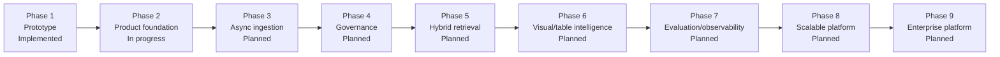

| Phase | Capability | Main technologies/components | Stores | Status |
| --- | --- | --- | --- | --- |
| 1 | Working multimodal RAG prototype | Streamlit, LangChain, PyMuPDF, Tesseract, pdfplumber, OpenAI | Qdrant, local files | Implemented and frozen |
| 2 | Backend, identity, workspaces, multi-document product | FastAPI, Pydantic, SQLAlchemy, psycopg, Alembic, Auth0/OIDC, Streamlit | PostgreSQL, Qdrant, temporary files | Backend and identity/workspace foundation implemented; product slices planned |
| 3 | Durable asynchronous processing | Job API, queue/broker TBD, workers, S3-compatible storage | PostgreSQL, object storage, Qdrant | Planned |
| 4 | Fine-grained isolation and governance | JWT validation, RBAC/ACL, RLS defense, audit | PostgreSQL, Qdrant, object storage | Planned |
| 5 | Higher-quality retrieval | Dense search, sparse search TBD, RRF, reranker | Qdrant, sparse index TBD | Planned |
| 6 | Native image and table understanding | Vision enrichment, multimodal vectors, structured tables | Qdrant, PostgreSQL, object storage | Planned |
| 7 | Measurable quality and reliability | OpenTelemetry-compatible boundary, eval harness, dashboards | Telemetry/eval stores TBD | Planned |
| 8 | Independently scalable deployment | Gateway, API/workers, dedicated frontend TBD, managed services | Managed PostgreSQL, Qdrant, object storage | Planned |
| 9 | Enterprise and commercial controls | Connectors, metering, billing, SSO/SCIM, compliance | PostgreSQL and provider systems | Planned |

## Phase 1 — working prototype

**Status:** Implemented, tagged, and frozen as the V1 recovery baseline.

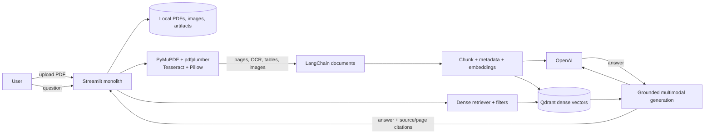

Actions: parse text/OCR/tables/images, index dense vectors, retrieve by filters,
generate an answer, and show citations. Constraints: the UI directly orchestrates
the pipeline; identity, relational metadata, durable chat, jobs, and production
telemetry do not exist. Phase 2 preserves the proven RAG behavior while adding
product and security boundaries.

## Phase 2 — secure product foundation

**Status:** In progress. Milestones 2.0.0–2.0.2 and the Phase 2.1
identity/workspace foundation are implemented. Live Auth0 tenant configuration,
multi-document features, persistent chat, and the polished UI remain.

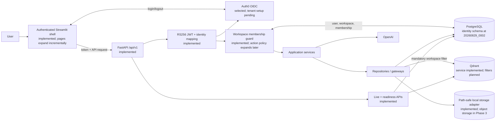

Phase actions: preserve/isolate V1; establish Python/Docker/configuration; add
FastAPI, logs, database pooling, Alembic, health APIs, Auth0/OIDC users and
workspaces; then add multi-document metadata and scoped vectors, backend-mediated RAG,
persistent conversations, multipage Streamlit, CI, negative tenant tests, and
demo hardening.

## Phase 3 — asynchronous ingestion and object storage

**Status:** Planned. Queue/broker and storage vendor are TBD.

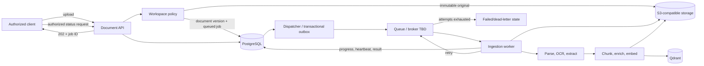

The API acknowledges quickly; the original is durable before dispatch; jobs use
idempotency keys, explicit state, retries/backoff, cancellation, safe errors, and
versioned outputs. Exit: processing survives API/worker failure, scales
independently, and every job is traceable and safely retryable.

## Phase 4 — fine-grained authorization and governance

**Status:** Planned. Phase 2 starts isolation; this phase deepens it.

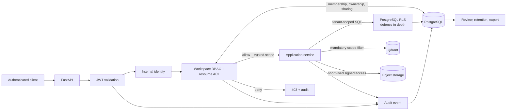

Backend-resolved identity and policy govern SQL, vectors, objects, citations,
conversations, and jobs. Negative tests must prove cross-tenant access fails.
Audit events record actor, action, resource, workspace, result, correlation ID,
and time without storing secrets or sensitive content.

## Phase 5 — hybrid retrieval, fusion, and reranking

**Status:** Planned. Sparse and reranking technologies require evaluation.

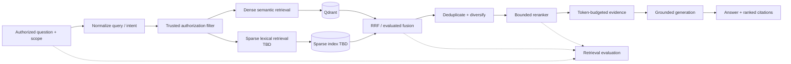

Authorization applies before every search. Evaluate Recall@k, MRR/nDCG,
groundedness, citation correctness, latency, and cost. Exit: the hybrid pipeline
measurably beats dense-only retrieval without weakening isolation or citations.

## Phase 6 — visual and table intelligence

**Status:** Planned. Models and structured-table technology are TBD.

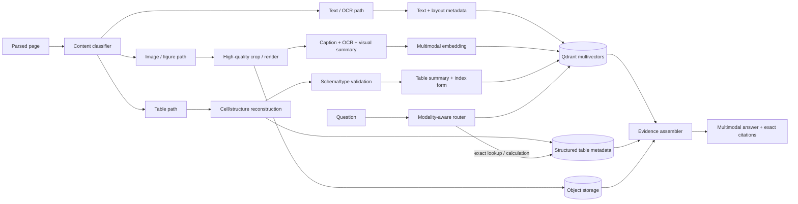

Every crop, cell, summary, and vector retains document-version, page, bounding
box, content ID, and extractor-version provenance. Exact calculations use
validated structure, not generated prose. Exit: figures and tables become
first-class retrievable, inspectable, and correctly cited evidence.

## Phase 7 — evaluation and observability

**Status:** Planned. Use a vendor-neutral telemetry boundary where practical.

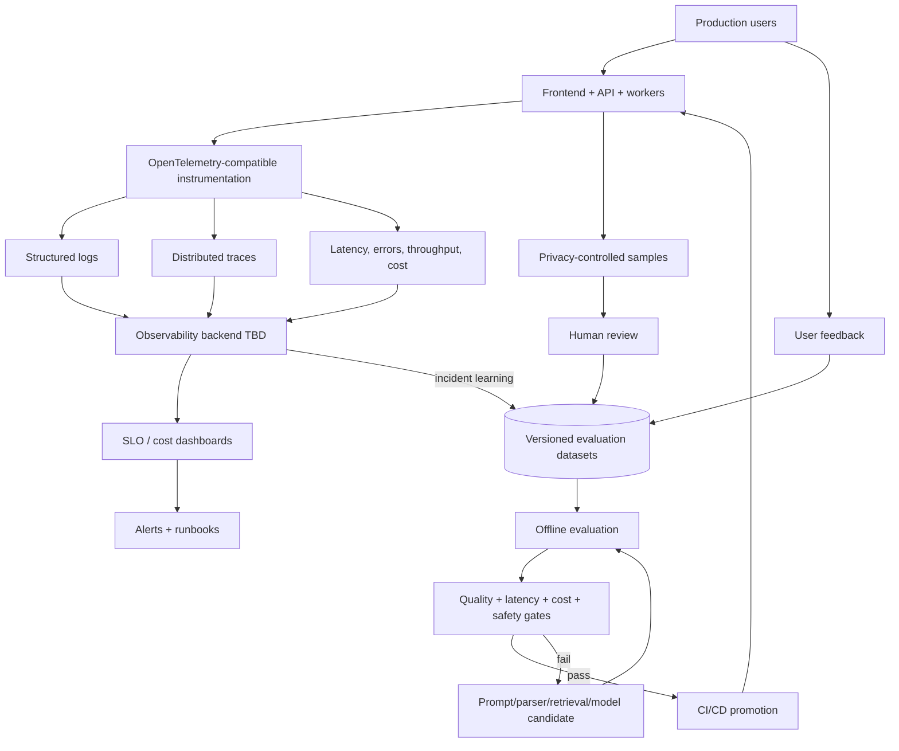

Propagate a correlation/trace ID across UI, API, jobs, retrieval, models, and
stores. Do not log tokens, secrets, raw documents, or unreviewed sensitive
content. Exit: the team can explain requests, detect failures, compare RAG
changes before release, and manage reliability, quality, latency, and cost.

## Phase 8 — scalable production platform

**Status:** Planned. Cloud, orchestration, and frontend framework are TBD.

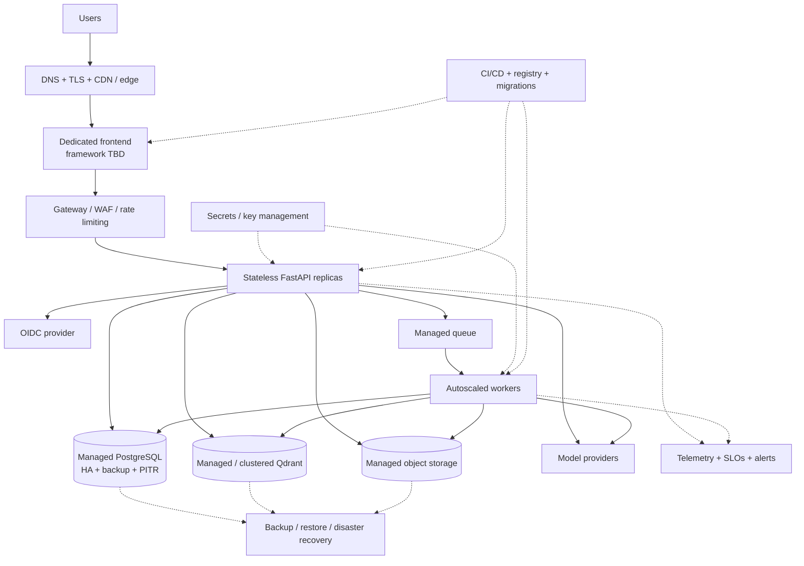

Frontend, API, and workers deploy and scale independently; durable state remains
in managed services. Timeouts, backpressure, graceful shutdown, reversible
releases, and tested restoration are mandatory. Microservices or multi-region
deployment require measured scale, reliability, ownership, or regulatory need.

## Phase 9 — enterprise integrations and commercial controls

**Status:** Planned. Connector and billing providers are TBD.

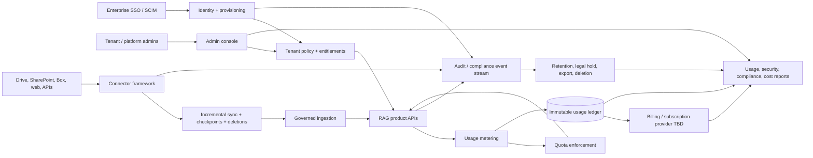

Connector credentials are tenant-isolated, least-privilege, rotated, and
revocable. Source permissions and deletions propagate into search. Metering is
immutable and quota enforcement is concurrency-safe. Subscription, entitlement,
and usage accounting remain separate. Exit: enterprises can provision users,
connect governed sources, control/audit usage, apply lifecycle policy, and
reconcile commercial usage.

## Architecture invariants

- FastAPI, never the frontend, is the authorization boundary.
- Tenant/workspace filters come only from authenticated backend context.
- PostgreSQL owns relational truth; Qdrant owns vectors/search payload; object
  storage owns original and derived binaries.
- Stable UUIDs and explicit document/index versions replace filenames as identity.
- Ingestion is idempotent, retryable, observable, and safe to resume.
- Repository/gateway interfaces isolate databases, storage, search, identity,
  and model providers from application services.
- Every answer is traceable to authorized source/page evidence.
- Alembic versions database schema; versioned routes protect API evolution.
- Security, accessibility, testing, telemetry, cost, and failure behavior apply
  in every phase.
- A modular monolith remains the default until evidence justifies another service.

## Open technology decisions

| Topic | Current position |
| --- | --- |
| Phase 2 UI | Streamlit multipage application |
| Dedicated Phase 8 UI | Candidate only; framework not selected |
| Queue / broker | Required interface; technology not selected |
| Object storage | S3-compatible interface; vendor not selected |
| Sparse search | Required in Phase 5; engine not selected |
| Observability backend | OpenTelemetry-compatible boundary; vendor not selected |
| Deployment platform | Containerized and horizontally scalable; provider not selected |

Accepted Phase 2 decisions are recorded in
[`docs/architecture/decisions`](decisions/): Auth0/OIDC, the initial workspace
roles, and the local-storage adapter boundary.

## Maintenance checklist

1. Update the affected phase, diagram, status, and technology table.
2. Update the whole-system diagram when a cross-phase boundary or flow changes.
3. Record consequential decisions and rationale in `Phase2_context.md` or the
   future active phase context document.
4. Keep unapproved technologies labeled **Proposed / TBD**.
5. Verify Mermaid fences and links before committing.
6. Never place credentials, tokens, private URLs, customer data, or other secrets
   in this version-controlled document.
