# Multimodal RAG production project plan

> Living delivery plan — updated 2026-09-01

This is the version-controlled planning source of truth for the journey from the
preserved prototype through the enterprise platform. It defines sequence, scope,
deliverables, dependencies, acceptance gates, risks, and current status for
Phases 1–9.

Use the [architecture handbook](architecture/ARCHITECTURE.md) for component
boundaries and data flows. Use the active private phase context document for
local operations, sensitive implementation history, and detailed decision rationale.

## Planning conventions

| Status | Meaning |
| --- | --- |
| **Completed** | Acceptance evidence exists and the work is published |
| **In progress** | Approved work is actively being implemented or accepted |
| **Planned** | Scope is understood but work has not started |
| **Proposed** | Scope or technology still needs an explicit decision |
| **Blocked** | A named dependency prevents useful progress |

Rules:

- Status is evidence-based; merged code alone does not complete a phase.
- Each milestone must be demonstrable, tested, documented, and safely reversible.
- Technologies labeled **TBD** remain proposals until an ADR accepts them.
- Dates and effort estimates are added only after scope and dependencies are approved.
- Security, tenant isolation, accessibility, observability, and recovery are
  acceptance concerns—not cleanup tasks.
- V1 remains immutable while later phases evolve independently.

## Current snapshot

| Item | Status |
| --- | --- |
| Phase 4 source branch | `phase-4/mm-rag-governance` — preserved |
| Phase 5 decision branch | `codex/phase5-hybrid-retrieval` from accepted Phase 4 release |
| Phase 1 | Completed and frozen at `mm-rag-v1.0.0` |
| Phase 2 | Completed and accepted — implementation, live-model, security, and visual gates pass |
| Phase 2 release | Squash-merged at `52d4cfa`; tagged `mm-rag-v2.0.0` |
| Phase 2 infrastructure foundation | Completed in `5db9dd5` |
| Architecture handbook | Published in `299a0ad` |
| Phase 2.1 implementation foundation | Published in `33bc54d` |
| Phase 2.1 acceptance | Completed with live Auth0 browser evidence in `f992dce` |
| Phase 2.2 | Completed and published in `fb0fc86` |
| Active milestone | Phase 5.5 benchmark remediation and release acceptance |
| Phase 3 | Completed and accepted — Milestones 3.0–3.5 and ADRs 0007–0012 verified end to end |
| Phase 3 merge | PR #2 merged into `main` at `228ce63`; source branch preserved |
| Phase 3 release | Tagged `mm-rag-v3.0.0` at `9ebe767`; tag is immutable |
| Phase 3 quality gate | 110 deterministic tests pass with four opt-in integration skips; all 114 tests pass in the free live-service gate; CI-equivalent coverage is 81.39% against the 70% threshold; one explicitly approved signed-in real-OpenAI async promotion/retrieval proof passed |
| Phase 4 | Completed and accepted — Milestones 4.0–4.5 squash-merged through PR #3 |
| Phase 4 merge | PR #3 squash-merged into `main` at `57ee453`; source branch preserved |
| Phase 4 release | Annotated `mm-rag-v4.0.0` at closure commit `996898e`; immutable |
| Phase 5 | Hybrid implementation complete; accepted ADR 0022 v2 remediation in progress |
| Phases 6–9 | Planned |

## Delivery sequence and gates

```mermaid
flowchart LR
    p1["Phase 1<br/>Prototype proof"] -->|"working RAG baseline"| p2["Phase 2<br/>Secure product foundation"]
    p2 -->|"users, workspaces, documents, chat"| p3["Phase 3<br/>Durable async ingestion"]
    p3 -->|"durable objects and jobs"| p4["Phase 4<br/>Governance and fine-grained policy"]
    p4 -->|"provable isolation"| p5["Phase 5<br/>Hybrid retrieval"]
    p5 -->|"measured retrieval baseline"| p6["Phase 6<br/>Visual/table intelligence"]
    p6 -->|"multimodal quality baseline"| p7["Phase 7<br/>Evaluation and observability"]
    p7 -->|"SLO and quality evidence"| p8["Phase 8<br/>Scalable production platform"]
    p8 -->|"operational production base"| p9["Phase 9<br/>Enterprise/commercial platform"]
```

Later-phase discovery may run early, but implementation must not bypass the
security and data-integrity gates on which it depends.

## Roadmap summary

| Phase | Outcome | Primary gate | Status |
| --- | --- | --- | --- |
| 1 | Working multimodal RAG proof | Reproducible parse-index-retrieve-answer flow | Completed |
| 2 | Secure, persistent multi-document product | Authenticated tenant-safe product demonstration | Completed and accepted |
| 3 | Durable asynchronous ingestion | Retryable jobs survive service failure | Completed and accepted |
| 4 | Fine-grained governance | Automated evidence of cross-tenant isolation | Completed and accepted |
| 5 | High-quality hybrid retrieval | Evaluated improvement over dense-only baseline | In progress |
| 6 | First-class image and table intelligence | Accurate visual/numerical evidence with citations | Planned |
| 7 | Measurable quality and operations | SLOs, traces, evaluations, alerts, and release gates | Planned |
| 8 | Scalable production deployment | Load, recovery, and reversible-release evidence | Planned |
| 9 | Enterprise and commercial controls | Governed connectors, provisioning, metering, and audit | Planned |

## Phase 1 — working prototype

**Status:** Completed and frozen.

### Objective

Prove that PDFs containing text, OCR, tables, and images can be parsed, indexed,
retrieved, and used to produce grounded multimodal answers with citations.

### Delivered

- Streamlit upload, processing, inspection, and chat flow.
- PyMuPDF, pdfplumber, Tesseract, and Pillow parsing.
- LangChain document construction and OpenAI embeddings/generation.
- Qdrant dense retrieval with document/content/page filters.
- Source/page citations and saved parse artifacts.
- Immutable recovery tag `mm-rag-v1.0.0`.

### Exit evidence

- Representative PDFs complete the end-to-end workflow.
- Saved artifacts and vector-index reuse work.
- Known limitations are documented and V1 is recoverable.

## Phase 2 — secure product foundation

**Status:** Completed and accepted. Implementation, live-model, tenant-isolation,
authenticated workflow, responsive layout, and light/dark visual gates pass.

### Objective

Turn the prototype into a secure, persistent, workspace-aware, multi-document
product with an API boundary and a presentation-quality Streamlit experience.

### Milestones

| Milestone | Deliverable | Status | Completion gate |
| --- | --- | --- | --- |
| 2.0.0 | Preserve V1; isolate branch, worktree, and `2.0` copy | Completed | V1 tag/worktree recovery verified |
| 2.0.1 | Python 3.12/uv environment, secrets boundary, Docker PostgreSQL/Qdrant | Completed | Reproducible isolated startup |
| 2.0.2 | FastAPI, logging, database layer, Alembic, health/readiness | Completed | API/service tests and live dependency checks |
| 2.1 | Auth0 identity, users, workspaces, memberships, storage boundary | Completed | Live login/logout/re-login, expiry rejection, and idempotent provisioning verified |
| 2.2 | Document library, collections, versioning, scoped Qdrant payloads | Completed | Cross-user API tests, real migration cycle, and mandatory vector scope checks pass |
| 2.3 | Persistent conversations and backend-mediated RAG | Completed | Restart-persistence, citation authorization, migration, and safe-failure tests pass |
| 2.4 | Polished multipage Streamlit and evidence viewer | Completed and accepted | Authenticated principal flow, responsive layout, both themes, identity, and safe Activity presentation verified |
| 2.5 | CI, broader tests, activity/audit surface, demo hardening | Completed | Local and GitHub release gates pass |

### Milestone 2.1 acceptance status

Completed:

- Auth0 Regular Web Application, custom API, callbacks, origins, issuer, JWKS,
  audience, client ID, and ignored local secrets are configured.
- Live browser login succeeds and delivers an RS256 access token for the custom
  API audience; the protected `/users/me` request returns HTTP 200.
- First login provisioned exactly one user, one personal workspace, and one
  `owner` membership without exposing identity data during verification.
- Automated checks reject expired tokens, malformed or missing credentials,
  wrong issuer, and wrong audience.
- Live expiry handling rejected the prior access token with HTTP 401; browser
  logout/re-login then produced a fresh token accepted with HTTP 200.
- Re-login and refresh remained idempotent: PostgreSQL still contained exactly
  one user, one personal workspace, and one `owner` membership.

### Milestone 2.2 acceptance status

Completed:

- Added `documents`, immutable `document_versions`, `collections`, and
  workspace-consistent `collection_documents` with migration `20260830_0003`.
- Added bounded multipart uploads, version fingerprints, duplicate detection,
  archive semantics, path-safe object keys, and storage rollback compensation.
- Added workspace-scoped list/detail/version/archive and collection APIs with
  owner/admin/member writes, owner/admin archive, viewer reads, and hidden
  unauthorized resources.
- Added mandatory `tenant_id`, `workspace_id`, `document_id`, and
  `document_version_id` vector payload/filter helpers plus keyword-index setup.
- Cross-user and read-only-role tests prove another authenticated user cannot
  list, read, upload, or archive outside authorized policy. The full suite passes
  with 58 tests.
- PostgreSQL upgraded to `20260830_0003`, reported no drift, downgraded safely
  while the new tables were verified empty, and returned to head.

### Milestone 2.3 acceptance status

Completed:

- Added migration `20260830_0004` for durable conversations, explicit document
  targets, ordered messages, model metadata, and structured citations.
- Added workspace-, collection-, and explicit-document conversation targets. Only
  active documents and their latest READY versions enter a retrieval request.
- Added synchronous text/PDF/DOCX extraction and image description, chunking,
  OpenAI embeddings, scoped Qdrant upserts, and retry-safe version status changes
  behind a replaceable indexing protocol.
- Added backend-only OpenAI/Qdrant retrieval and generation with mandatory
  tenant/workspace/document/version filters and post-generation citation validation.
- Deterministic acceptance tests prove persistence across application restart,
  ordered message/citation storage, cross-user hiding, unsafe-citation rejection,
  and safe behavior when model services are unconfigured.
- PostgreSQL migration upgraded, downgraded only after all new tables were proven
  empty, and restored successfully to head `20260830_0004`.

### Milestone 2.4 acceptance status

Implemented:

- Replaced the one-page authenticated shell with native `st.navigation` pages for
  Overview, Library, Ask, Activity, and Settings plus a shared authorized workspace selector.
- Added complete document upload, index/re-index, download, collection creation,
  collection membership, conversation creation, resume, and message workflows.
- Added structured citation cards and an evidence dialog with source/page/excerpt,
  retrieval score, and authorized original-source download.
- Added deliberate empty/loading/error/success states, sentence-case copy, Material
  Symbols, accessible widget labels, responsive native containers, and no custom CSS.
- Added coordinated WCAG-oriented light/dark theme tokens in `config.toml`.
- The authenticated desktop review successfully exercised upload/index, grounded
  Ask with citations, Activity, Settings, and service readiness.
- Review feedback added a direct first-document CTA, consistent Auth0 profile display,
  concise retrieval-scope guidance, and presentation-safe Activity details. It also
  fixes audit message IDs that were recorded before UUID assignment.
- The full gate passes with 76 tests, Ruff and Mypy across 81 source files,
  migration head/no-drift checks, and live PostgreSQL/Qdrant/API/Streamlit readiness.
- Final authenticated screenshots verify the narrow Overview layout, light/dark
  contrast, Auth0 identity in the sidebar and Settings, and presentation-safe
  Activity rows. Milestone 2.4 and Phase 2 are accepted on 2026-08-30.

### Milestone 2.5 implementation status

Implemented:

- Added append-only workspace/actor/action/resource activity records with migration
  `20260830_0005`, atomic instrumentation for principal product mutations, a bounded
  membership-scoped API, and an Activity page with safe filtering.
- Added negative tests for cross-tenant activity discovery and API client handling
  of expired sessions, safe backend errors, and non-disclosing network failures.
- Added GitHub Actions with locked sync, Ruff, Mypy, PostgreSQL/Qdrant services,
  Alembic head validation, full tests, 70% coverage threshold, and diff hygiene.
- Added a Makefile, executable verification script, and presentation runbook.
- Local coverage gate passes at 84%; audit, frontend-adapter, migration, and UI smoke
  tests pass. Migration downgrade/upgrade validation returns PostgreSQL to head.
- Published in commit `71e65ef`; GitHub Actions run `33323110305` completed
  successfully across every release-gate step.

### Live-model release acceptance

Completed:

- Added `make check-acceptance` and an isolated acceptance harness that creates
  temporary SQL/files and a unique Qdrant collection, then removes them.
- Real OpenAI requests validated text ingestion, image understanding, embeddings,
  authorized vector retrieval, grounded generation, two-source citations, token
  metadata, persisted chat, audit events, and cross-tenant hiding.
- Hardened blank OpenAI model settings to use supported defaults and added regression
  coverage after the live check exposed an empty `.env` model value.
- Corrected conversation `updated_at` behavior so recent-chat ordering advances when
  a message is persisted, with regression coverage.
- Final combined gate: 73 tests; Ruff and Mypy across 80 source files; Alembic at
  `20260830_0005` with no drift; live PostgreSQL, Qdrant, FastAPI, and Streamlit ready.

### Phase 2 completion gate

- OIDC login/logout works in the presentation environment.
- Workspace membership protects every product API and retrieval operation.
- Multiple documents and collections are persistent and tenant-safe.
- Conversations persist across logout and backend restart.
- RAG execution is mediated by FastAPI and returns inspectable citations.
- The Streamlit experience is cohesive, accessible, and presentation-ready.
- CI runs principal unit, integration, authorization, migration, and UI tests.
- V1 remains unchanged and recoverable.

## Phase 3 — asynchronous ingestion and object storage

**Status:** Completed and accepted. The
isolated `3.0` tree now connects the accepted ADR 0007–0012 contracts end to end:
streamed immutable upload, job/outbox commit, confirmed RabbitMQ publication, fenced
worker execution, immutable generation promotion, active-generation retrieval, safe
status/control UX, and operational recovery. Alembic revision `20260830_0008` is the
current head. The signed-in paid acceptance proof completed upload, first-attempt
promotion, grounded retrieval, citation, and persistence. Production hosting/provider
choices remain deferred to Phase 8.

### Objective

Make document processing durable, retryable, observable, and independently
scalable while moving original and derived binaries to object storage.

### Milestones

| Milestone | Deliverable | Status |
| --- | --- | --- |
| 3.0 | Job/attempt and idempotency contracts; outbox, queue/broker, object-storage, and worker-runtime ADRs | Completed |
| 3.1 | S3-compatible object-storage adapter and immutable object keys | Completed |
| 3.2 | Transactional outbox schema/repository and atomic job dispatch intent | Completed |
| 3.3 | Worker process, retry/backoff, heartbeat, cancellation, dead-letter handling | Completed and accepted |
| 3.4 | Upload/status API and progress UX | Completed and authenticated-browser verified |
| 3.5 | Failure, recovery, load, and operations hardening | Completed and accepted |

### Milestone 3.0 implementation status

Implemented:

- Added workspace-constrained `ingestion_jobs` and `ingestion_attempts` with
  Alembic revision `20260830_0006`, including one-running-attempt enforcement,
  retry schedules, cancellation metadata, progress, leases, and fencing tokens.
- Added a caller-transaction-owned state machine for idempotent job creation,
  authorized self/admin control, queued/running/retry/failed/cancelled transitions,
  three-attempt exhaustion, heartbeats, cancellation races, and expired-lease recovery.
- Added safe creation/cancellation audit events and regression coverage for tenant
  hiding, requester-bound replay, immutable terminal history, stale workers,
  progress retention, retry validation, and cancellation precedence.
- Applied the migration to local Phase 3 PostgreSQL and verified its empty-table
  downgrade/upgrade cycle. The deterministic gate passes with 81 tests and one
  skip; the live gate passes 82 tests plus PostgreSQL/Qdrant/API/Streamlit readiness;
  Alembic is restored to head with no model/schema drift.

Accepted decisions:

- ADR 0009 atomically records each dispatch intent with its job in
  PostgreSQL, then publishing outside the API request with leased, at-least-once
  delivery. Its retry, alert, retention, per-job ordering, operational replay, and
  recovery recommendations are accepted.
- ADR 0010 selects open-source RabbitMQ as the free local/CI wake-up broker, with
  publisher confirms, manual acknowledgements, prefetch `1`, a durable quorum
  queue, and an operational dead-letter queue.
- ADR 0011 selects an S3-compatible Python adapter with open-source SeaweedFS for
  free local/CI object storage. Amazon S3 remains an unprovisioned, usage-priced
  future production option.
- ADR 0012 selects separate purpose-built Python dispatcher and worker processes,
  including initial lease, heartbeat, concurrency, and graceful-shutdown defaults.

Not yet implemented:

- async upload/status endpoints, RabbitMQ topology and publication, dispatcher and
  worker processes, immutable output generations, or promotion;
- the existing synchronous indexing and retrieval behavior remains active.

### Milestone 3.1 implementation status

Implemented and validated:

- Added a provider-neutral object contract with streamed create/read, head metadata,
  SHA-256 and byte-size verification, conditional write-once creation, idempotent
  same-content replay, safe conflicts, and non-disclosing provider errors.
- Added opaque trusted key builders for originals, attempt artifacts, and promoted
  generation artifacts. New document originals no longer include user filenames in keys.
- Added a Boto3 S3 adapter, configuration factory, secret-safe settings validation,
  and conditional object-storage readiness when the S3 backend is active.
- Added the open-source SeaweedFS `4.43` local Compose service with isolated storage,
  localhost-only S3 exposure, pre-created private-intent buckets, and health checks.
- Expanded the local fallback to the same checksum/size/conditional-create contract
  while keeping existing Phase 3 databases on local storage until migration is explicit.
- The deterministic gate passes 97 tests with two integration skips. The live gate
  passes 99 tests, including the SeaweedFS provider contract. A manual restart check
  verified object persistence and removed its test object afterward.

Deferred from this slice:

- Existing local objects are not migrated and the current ignored environment remains
  on the local adapter, preventing silent loss of access to prior documents.
- Multipart upload is unnecessary under the current 250 MiB maximum and remains
  required before raising the application limit into provider multipart territory.
- The artifacts bucket and promotion keys are defined but remain unused until the
  worker/output-promotion milestone.

### Milestone 3.2 implementation status

Implemented and validated:

- Added migration `20260830_0007` and a provider-neutral outbox model containing
  stable event/job identity, per-job dispatch sequence, minimal versioned JSON,
  due time, publication-attempt evidence, expiring leases, acknowledgement,
  discard, safe failure, and audit timestamps.
- New jobs atomically create dispatch sequence `1`. Retryable attempt failure and
  expired-lease recovery atomically create exactly one later sequence at
  `next_attempt_at`; transaction rollback removes both the job mutation and event.
- Added bounded `FOR UPDATE SKIP LOCKED` claims with strict per-job ordering,
  lease ownership/expiry checks, explicit publication-start recording, safe
  backoff metadata, idempotent acknowledgement, and conditional job transition
  from `pending` or due `retry_scheduled` to `queued`.
- Cancellation and terminal transitions discard only unpublished events while
  leaving already published evidence immutable. Messages remain minimal wake-up
  hints and contain no workspace claims, filenames, object keys, content, or secrets.
- Deterministic tests prove rollback atomicity, replay uniqueness, ordered retry
  events, lease fencing, backoff, acknowledgement, and cancellation. A real
  PostgreSQL concurrency test proves concurrent same-key requests create one job
  and one initial event and two dispatchers cannot lease the same event.
- The local migration upgraded, downgraded while all durable-ingestion tables were
  empty, and returned to head without schema drift. The deterministic gate passes
  100 tests with three integration skips; the live gate passes all 103 tests.

Deferred from this slice:

- No RabbitMQ connection, topology, broker publication, long-running dispatcher,
  worker process, asynchronous endpoint, or UI behavior is implemented.
- Retention deletion and alerting remain operational Milestone 3.5 work; the schema
  retains terminal rows and the future dispatcher can expose the accepted age and
  failure thresholds without changing the event contract.

### Milestone 3.3 implementation status

Implemented and validated:

- Added the accepted durable direct exchange, quorum main queue, dead-letter exchange
  and quorum DLQ, persistent minimal messages, mandatory confirmed publication,
  manual acknowledgement, and prefetch `1`.
- Added a leased outbox dispatcher with stable event identity, safe publication
  backoff, confirm-before-queued semantics, duplicate recovery, and process health.
- Added a separately packaged worker with fenced claims, one in-flight job, 60-second
  leases, 15-second heartbeat, cooperative cancellation, three-attempt retry,
  expired-lease recovery, safe failure classes, and graceful shutdown.
- Added migration `20260830_0008`, attempt-scoped immutable generation manifests,
  generation-aware deterministic Qdrant points, validation, and one fenced
  PostgreSQL active-generation promotion transaction.
- Real local RabbitMQ tests verify the quorum topology, publisher confirmation,
  strict message contract, and manual acknowledgement. Dispatcher and worker
  containers build independently and report healthy through the explicit runtime profile.

### Milestone 3.4 implementation status

Implemented:

- Added streamed asynchronous upload with required `Idempotency-Key`; the immutable
  original is verified before the document/version/job/outbox transaction commits,
  and successful intake returns HTTP 202 with a stable job ID.
- Added membership-scoped list/status, cooperative cancel, and terminal successor-
  retry APIs with non-enumerating 404 behavior and safe stage/unit/error responses.
- Updated Library to display durable state, attempt progress, retry time, safe error,
  refresh, cancellation, and successor retry while retaining the idempotency key
  across an ambiguous client failure.
- Retrieval now resolves and requires the authorized document version's active
  generation, preventing invisible or abandoned vectors from entering evidence.

Acceptance evidence:

- On 2026-08-30, one explicitly approved signed-in text upload returned a durable
  job, reached `succeeded` on attempt 1, promoted a READY generation, and remained
  ready after navigation.
- One grounded question returned the expected answer with the promoted document as
  its supporting citation; the two persisted messages and citation reloaded after
  navigation. No second paid acceptance run was started.
- The browser-discovered terminal-stage presentation drift was corrected so a
  succeeded job displays `Completed` rather than its stale last active stage.

### Milestone 3.5 implementation status

Implemented and validated:

- Added aggregate non-disclosing backlog health and alert thresholds for a 15-minute
  oldest due event, 10 publication attempts, expired leases, and inactive generations.
- Added preview-first 30-day cleanup for published/discarded outbox rows belonging to
  terminal jobs; pending events and authoritative job/attempt/audit history are protected.
- Kept destructive inactive-generation cleanup disabled because ADR 0008 requires a
  separate retention-window approval. The aggregate count remains inspectable.
- Added deterministic worker/dispatcher fault, duplicate, cancellation, retry,
  immutable-promotion, operations-retention, and 10 MiB streamed-upload coverage.
- Added an operations runbook and private logical PostgreSQL backup; restore into a
  generated temporary database verified migration `20260830_0008` and durable tables,
  then removed only the temporary database.

### Completion gate

- API requests return promptly with a job identifier.
- Originals are durable before jobs are dispatched.
- Duplicate requests do not duplicate document versions or vector points.
- Jobs survive API and worker restart and expose safe, accurate state.
- Retry exhaustion becomes inspectable failed/dead-letter state.
- Reprocessing is versioned; prior successful indexes are not silently mutated.
- Backup/restore and representative large-document tests pass.

## Phase 4 — fine-grained authorization and governance

**Status:** Completed and accepted — Milestones 4.0–4.5 are published through the
PR #3 squash commit `57ee453`. The accepted policy
matrix now has a central default-deny service, tenant-constrained ACL persistence,
PostgreSQL RLS defense, mandatory Qdrant scope enforcement, backend-mediated object
resolution, a future connector permission-envelope contract, safe append-only
security review, checksummed compliance export, and durable lifecycle controls.
The approved source tree matches the squash commit. Annotated tag `mm-rag-v4.0.0`
preserves the documentation-closure commit `996898e` as the immutable V4 checkpoint.

### Objective

Extend workspace membership into consistent resource-level policy, defense in
depth, auditable administration, and lifecycle governance.

### Milestones

| Milestone | Deliverable | Status |
| --- | --- | --- |
| 4.0 | Action/resource policy matrix, threat-model update, and ADR sequence | Completed — ADRs 0013–0017 accepted |
| 4.1 | Central role/ACL policy service and reusable authorization dependencies | Completed at `20260831_0009` |
| 4.2 | PostgreSQL row-level-security defense and mandatory Qdrant scope enforcement | Completed at `20260831_0010` |
| 4.3 | Authorized object access and connector permission propagation contract | Completed at `20260831_0011` |
| 4.4 | Append-only audit events, activity views, and compliance export | Completed at `20260831_0012` |
| 4.5 | Retention, deletion, encryption/key, and incident-response controls | Completed at `20260831_0013` |

Milestone 4.0 review material:

- [Phase 4 policy matrix and threat model](architecture/PHASE4_POLICY_THREAT_MODEL.md)
- ADR 0013 — central RBAC and optional resource ACLs.
- ADR 0014 — PostgreSQL RLS defense and runtime database roles.
- ADR 0015 — authorized Qdrant/object/worker boundaries.
- ADR 0016 — security audit and compliance export.
- ADR 0017 — governed retention, deletion, encryption, and incident response.

### Milestone 4.1 implementation status

- Added one typed, default-deny policy service with stable action codes, preserved
  role ceilings, non-enumerating decisions, and request-scoped evaluation.
- Added workspace/restricted visibility to documents, collections, and conversations.
  Migration `20260831_0009` preserves existing resources as workspace-visible while
  new conversations default to creator-private restricted visibility.
- Added positive user ACL persistence with same-workspace composite foreign keys.
  Grantees must be current members and grants never bypass role ceilings.
- Document, collection, conversation, job, citation-scope, indexing, and backend-
  streamed download paths now consume the shared policy decision.
- Focused policy and compatibility evidence passes 35 tests. The full deterministic
  gate passes 119 tests with four opt-in skips, clean Ruff/Mypy, migration head
  `20260831_0009`, and no schema drift.

### Milestone 4.2 implementation status

- Added migration `20260831_0010` with non-owner API, worker, dispatcher, and
  controlled-operations effective roles, reviewed RLS policies, fixed-search-path
  security-definer helpers, and least-privilege table grants.
- Added transaction-local purpose, principal, workspace, and job context. API policy
  decisions set tenant context; workers reload trusted job scope; dispatcher and
  operations paths use their distinct effective roles.
- Mandatory Qdrant filters now require bounded document/version/generation identities,
  and every returned point is revalidated before it can become a citation.
- Live PostgreSQL evidence proves unscoped and pooled queries remain tenant-isolated,
  the API role cannot disable RLS, and the dispatcher cannot read documents. Live
  Qdrant evidence proves cross-tenant vectors are excluded.
- A full free live gate passes 127 tests with migration downgrade/upgrade, Alembic
  no-drift, PostgreSQL, Qdrant, SeaweedFS, RabbitMQ, FastAPI, and Streamlit checks.
  No paid OpenAI acceptance run was invoked because model behavior did not change.

### Milestone 4.3 implementation status

- Added one canonical original-object resolver shared by downloads, synchronous
  indexing, and asynchronous workers. It rejects mismatched tenant/document/version
  keys or object size/hash/media identity before content use.
- Downloads remain backend-mediated and now stream from private storage with safe
  headers. Client object-key input is ignored and provider coordinates remain absent
  from public schemas, errors, links, and headers.
- Added migration `20260831_0011` for append-only, versioned source permission
  snapshots and resolved internal principals. The contract stores only hashed source
  item identity and does not choose or implement a connector.
- Unsupported semantics, unresolved or non-member principals, stale evidence,
  fingerprint tampering, and cross-workspace RLS access fail closed.
- Membership removal immediately hides jobs from the former member while accepted
  workspace-owned processing remains recoverable and can complete safely.
- The full deterministic gate passes 129 tests with eight opt-in skips; the free live
  gate passes all 137 tests, including PostgreSQL and SeaweedFS isolation evidence,
  migration reversal, and no schema drift. No paid model call was invoked.

### Milestone 4.4 implementation status

- Extended activity into a versioned security event contract with user/service
  actors, explicit result, policy revision, request/job correlation, and strict
  allowlisted details that reject secrets, content, unknown fields, and oversize values.
- Privileged ACL changes remain transaction-coupled to required audit writes; policy
  denials stay denied if best-effort evidence fails. PostgreSQL records discoverable
  denials independently without exposing outsider resource existence.
- PostgreSQL runtime roles cannot update or delete audit rows. Owner/admin receive a
  separate bounded security view; members receive 403 and outsiders 404.
- Added durable, private, schema-versioned JSON compliance exports with a 31-day/
  5,000-event bound, deterministic idempotent replay, SHA-256 checksum, authorized
  backend download, and audited creation/download.
- Migration `20260831_0012` is reversible with no schema drift. The deterministic
  gate passes 138 tests with nine opt-in skips; the complete free live gate passes
  all 147 tests. No paid OpenAI call was invoked.

### Milestone 4.5 implementation status

- Added reversible migration `20260831_0013` with recoverable document/conversation
  tombstones, durable checkpointed deletion plans, retention holds, and private
  orphan-object evidence. Tenant RLS and least-privilege grants cover every new table.
- Tombstoned resources disappear immediately from product reads. Worker claim and
  final-promotion fences make deletion win races with asynchronous ingestion.
- Owner-authorized retention uses bounded preview and exact SHA-256 apply tokens.
  Scope drift, holds, live work, provider uncertainty, or reconciliation failure
  blocks deletion rather than widening or guessing scope.
- Cross-store purge removes generation-scoped Qdrant points and trusted object
  references before SQL metadata, checkpoints every step, and resumes idempotently
  after partial failure. Orphan cleanup requires aged inventory evidence plus a
  fresh key/hash/size recheck.
- Local S3-compatible storage supports bounded inventory and optional server-side
  encryption headers. Non-local production configuration requires TLS and an
  explicit encryption mode; provider/KMS selection remains a Phase 8 decision.
- The Phase 4 governance operations runbook covers preview/apply, blocked recovery,
  encryption posture, incident containment/evidence/recovery, and backup/restore.
- The deterministic gate passes 147 tests with ten opt-in skips; the full free live
  gate passes all 157 tests across PostgreSQL, Qdrant, SeaweedFS, RabbitMQ, FastAPI,
  Streamlit, migration reversal, schema drift, and cross-store lifecycle evidence.
  An isolated PostgreSQL restore verified migration `20260831_0013`. No paid OpenAI
  test was invoked because model behavior did not change.

### Completion gate

- Policy is consistent across SQL, vectors, objects, jobs, chat, and citations.
- Cross-tenant attempts fail in automated unit and real-service integration tests.
- Administrators can explain who performed an action, on what resource, and when.
- Retention/deletion workflows remove all governed copies without orphaning indexes.
- Sensitive data and credentials are absent from logs and audit payloads.

## Phase 5 — hybrid retrieval, fusion, and reranking

**Status:** Hybrid implementation complete but not accepted. The first paid candidate failed
the quality gate because the v1 corpus saturated dense Recall@10; benchmark remediation
is accepted in ADR 0022 and being implemented with free/local checks.

### Objective

Improve retrieval quality measurably by combining semantic and lexical evidence,
then reranking a bounded candidate set.

### Milestones

| Milestone | Deliverable | Status |
| --- | --- | --- |
| 5.0 | Versioned retrieval evaluation dataset and dense-only baseline | V1 measured but saturated; accepted v2 remediation in progress |
| 5.1 | Sparse-engine evaluation and ADR | Completed — ADR 0019 implemented |
| 5.2 | Parallel dense/sparse retrieval with identical authorization filters | Completed and live-tested |
| 5.3 | Deterministic RRF/fusion, deduplication, and source diversification | Completed and deterministic |
| 5.4 | Bounded reranker selection and token-budgeted evidence assembly | Completed; reranker remains opt-in |
| 5.5 | Quality/latency/cost tuning, rollout controls, and regression gates | ADR 0022 free remediation in progress; fresh paid proof deferred |

### Accepted implementation contract

- Establish a versioned 50-query benchmark before changing retrieval behavior.
- Keep required gates deterministic; any paid embedding/generation baseline run
  remains explicit and opt-in.
- Add free, locally generated `Qdrant/bm25` sparse vectors to the existing Qdrant
  point identity so dense and sparse legs share the exact authorization filter.
- Fuse bounded candidate lists with application-owned RRF before optional local
  cross-encoder reranking; every stage revalidates tenant/document/version/generation.
- Preserve dense-only fallback and use versioned rollout configuration. Do not make
  a provider score, reranker score, or client input an authorization signal.

### Implementation evidence

- Reviewable implementation commit `5ab4837` contains the Phase 5 runtime, fixtures,
  tests, model lifecycle, rollout controls, and acceptance tooling.
- A hashed synthetic benchmark contains 24 stable chunks and 50 balanced judged
  queries with a frozen 60/20/20 split and workspace/narrow-scope negatives.
- New immutable generations write dense and `sparse-bm25-v1` vectors together;
  owner/admin successor reindexing preserves the prior active generation until
  checksum and count validation complete.
- Dense and sparse searches reuse the same backend-built tenant/workspace/document/
  version/generation filter, then revalidate candidates before deterministic RRF,
  deduplication, diversification, optional reranking, and citation assembly.
- Pinned FastEmbed model revisions and tree checksums are provisioned before runtime.
  Missing sparse/reranker artifacts fail to dense/fused order without downloading.
- `dense-v1`, `hybrid-v1`, and `hybrid-rerank-v1` are explicit rollout profiles;
  `hybrid-v1` is the default and reranking remains disabled pending measured benefit.
- The deterministic gate passes 167 tests with 11 expected opt-in skips, migration
  head `20260831_0013`, no schema drift, and no paid model call. The complete free
  live gate passes all 178 tests with PostgreSQL, Qdrant, SeaweedFS, RabbitMQ,
  FastAPI, and Streamlit ready. Rebuilt dispatcher and worker containers load pinned
  models and report healthy. The idle lease-recovery cycle refreshes worker readiness
  so an empty queue cannot age a healthy process out of Docker health.
- The explicitly approved 2026-09-01 candidate used one batched embedding request
  for 878 tokens at an estimated `$0.00001756`. Dense and hybrid validation
  Recall@10 were both `1.0000`; nDCG@10 moved from `0.9507` to `0.9516`, below the
  accepted relative gates. Authorization identities and latency passed. The command
  stopped before the paid end-to-end proof and no retry ran.
- Accepted ADR 0022 requires a larger confounder corpus, rotated validation/holdout,
  validation-before-holdout execution, and separate authorization/abstention metrics
  while preserving the accepted quality thresholds.

### Completion gate

- Hybrid retrieval beats the approved dense baseline on agreed metrics.
- Authorization filters apply before every retrieval path.
- Recall@k, MRR/nDCG, groundedness, citations, latency, and cost are reported.
- Degraded sparse/reranker dependencies fail safely without leaking data.
- Retrieval configuration is versioned and reproducible.

## Phase 6 — visual and table intelligence

**Status:** Planned.

### Objective

Make figures, diagrams, charts, and tables first-class searchable evidence instead
of depending mainly on OCR text and Markdown representations.

### Proposed milestones

| Milestone | Deliverable |
| --- | --- |
| 6.0 | Visual/table corpus, questions, and baseline quality measures |
| 6.1 | Versioned visual crops, provenance, captions, OCR, and summaries |
| 6.2 | Multimodal image embeddings and modality-aware retrieval |
| 6.3 | Table structure reconstruction, typing, validation, and normalized storage |
| 6.4 | Query routing for semantic retrieval versus safe exact calculation |
| 6.5 | Evidence viewer for page region, figure, table, and calculation provenance |

### Completion gate

- Visual and table Recall@k improves over OCR/Markdown-only baselines.
- Every result maps to document version, page, region, and extraction version.
- Numerical answers use validated structure and pass accuracy tests.
- Users can inspect the exact figure/table evidence used in an answer.
- Model, storage, latency, and cost tradeoffs are measured and documented.

## Phase 7 — evaluation and observability

**Status:** Planned.

### Objective

Make product quality, reliability, latency, cost, and failure behavior measurable
enough to support release decisions and production operations.

### Proposed milestones

| Milestone | Deliverable |
| --- | --- |
| 7.0 | Signal taxonomy, privacy policy, SLI/SLO proposal, and observability ADR |
| 7.1 | Correlated structured logs, metrics, and distributed traces |
| 7.2 | Versioned parsing/retrieval/answer evaluation harness and datasets |
| 7.3 | User feedback capture and privacy-controlled review workflow |
| 7.4 | Reliability, quality, latency, failure, and cost dashboards |
| 7.5 | Actionable alerts, runbooks, incident learning, and CI quality gates |

### Completion gate

- One correlation ID traces frontend, API, job, retrieval, model, and persistence.
- Defined SLOs have owners, dashboards, alerts, and runbooks.
- Candidate RAG changes are evaluated before promotion.
- Production feedback can become reviewed regression cases.
- Telemetry excludes secrets, tokens, and uncontrolled document content.

## Phase 8 — scalable production platform

**Status:** Planned.

### Objective

Deploy a secure, recoverable platform whose frontend, API, and ingestion workers
can scale independently under representative production load.

### Proposed milestones

| Milestone | Deliverable |
| --- | --- |
| 8.0 | Cloud/orchestration, managed-service, and dedicated-frontend ADRs |
| 8.1 | Environment promotion, immutable artifacts, secrets, and migration-aware CI/CD |
| 8.2 | Dedicated frontend and gateway/WAF/rate-limit boundary |
| 8.3 | Horizontally scaled stateless API and autoscaled workers |
| 8.4 | Managed PostgreSQL, Qdrant, queue, object storage, backup, and restore |
| 8.5 | Load, resilience, disaster-recovery, security, and release validation |

### Completion gate

- Representative load meets approved latency, throughput, error, and cost targets.
- Deployments and migrations are reversible without tenant-data loss.
- Dependency failure triggers timeouts, backpressure, and safe degradation.
- Backups restore successfully in an exercised recovery procedure.
- Production security review and operational readiness review pass.

## Phase 9 — enterprise integrations and commercial controls

**Status:** Planned.

### Objective

Support governed enterprise content, identity lifecycle, usage controls,
commercial accounting, and compliance-grade administration.

### Proposed milestones

| Milestone | Deliverable |
| --- | --- |
| 9.0 | Enterprise requirements, threat model, and provider/connector priorities |
| 9.1 | Connector SDK plus first demand-validated enterprise source |
| 9.2 | Incremental sync, checkpoints, source ACL/deletion propagation, and operations |
| 9.3 | Enterprise SSO/SCIM provisioning and group/role mapping |
| 9.4 | Immutable usage ledger, quotas, entitlements, and rate limits |
| 9.5 | Billing/subscription integration and reconciliation |
| 9.6 | Retention, legal hold, export/deletion, compliance reporting, and audit review |

### Completion gate

- Connector credentials are least-privilege, tenant-isolated, rotated, and revocable.
- Source permission and deletion changes propagate into searchable content.
- Identity provisioning/deprovisioning produces predictable access changes.
- Metering is immutable and quota enforcement remains correct under concurrency.
- Billing reconciliation and administrative reports agree with the usage ledger.
- Enterprise lifecycle workflows produce reviewable evidence.

## Cross-phase workstreams

| Workstream | Continuous responsibility |
| --- | --- |
| Security | Threat modeling, dependency review, secrets, authorization, negative tests |
| Data | Stable IDs, versioning, migrations, retention, backup, restore, deletion |
| Quality | Unit/integration/UI/evaluation coverage and regression prevention |
| UX/accessibility | Calm visual system, responsive states, keyboard/contrast review |
| Operations | Health, telemetry, SLOs, runbooks, capacity, cost, incident learning |
| Delivery | Small commits, reproducible environments, CI/CD, rollback, documentation |
| Governance | ADRs, decision ownership, auditability, privacy, compliance evidence |

## Principal risks

| Risk | Impact | Planned treatment | Review phase |
| --- | --- | --- | --- |
| Cross-tenant SQL/vector/object access | Critical confidentiality failure | Backend context, mandatory filters, negative tests, RLS defense | Every phase; deepen in 4 |
| Stale or ambiguous document/index version | Incorrect answers or source mismatch | Content/config fingerprinting and immutable version IDs | 2.2–3 |
| Long synchronous ingestion | Timeouts and poor recovery | Durable jobs, outbox, workers, retries | 3 |
| Retrieval quality changes without evidence | Regressions and unreliable demos | Versioned evaluations and baseline comparisons | 5–7 |
| Visual/table hallucination | Incorrect visual or numerical claims | Provenance, structured validation, targeted evaluation | 6 |
| Provider outage or quota exhaustion | User-facing failure and cascading retries | Timeouts, backpressure, budgets, degradation, alerts | 7–8 |
| Premature service decomposition | Operational complexity and slower delivery | Modular monolith until measured evidence exists | 2–8 |
| Secrets or private data entering Git/logs | Security and compliance incident | Templates, ignore rules, scanning, redaction, reviews | Every phase |
| Unexercised recovery plan | Extended data loss/outage | Automated backups plus restore/DR exercises | 3, 8 |
| Vendor lock-in | Cost and migration constraints | Standards and repository/gateway interfaces; ADR review | Every selection |

## Decision backlog

| Decision | Needed by | Status |
| --- | --- | --- |
| Auth0/OIDC provider | 2.1 | Accepted — ADR 0001 |
| Initial workspace roles | 2.1 | Accepted — ADR 0002 |
| Local Phase 2 storage adapter | 2.1 | Accepted — ADR 0003 |
| Document/version identity and temporary ingestion state | 2.2 | Accepted — ADR 0004 |
| Durable ingestion job and attempt contract | 3.0 | Accepted — ADR 0007 |
| Idempotency and immutable output promotion | 3.0 | Accepted — ADR 0008 |
| Transactional outbox boundary | 3.0 | Accepted — ADR 0009 |
| Queue/broker | 3.0 | Accepted — RabbitMQ in ADR 0010 |
| S3-compatible storage implementation/vendor | 3.0 | Accepted — SeaweedFS for local/CI in ADR 0011; production provider deferred |
| Worker runtime and operating model | 3.0–3.3 | Accepted — purpose-built Python dispatcher/worker in ADR 0012 |
| Fine-grained policy representation | 4.0 | Accepted — central RBAC ceiling plus optional positive user ACLs in ADR 0013 |
| PostgreSQL tenant defense | 4.0–4.2 | Accepted — RLS beneath application policy in ADR 0014 |
| Vector/object/async authorization | 4.0–4.3 | Accepted — trusted PostgreSQL scope compilation in ADR 0015 |
| Security audit and compliance export | 4.0–4.4 | Accepted — append-only PostgreSQL contract in ADR 0016 |
| Retention and deletion policy | 4.0–4.5 | Accepted — tombstone-first durable lifecycle in ADR 0017 |
| Retrieval evaluation dataset and dense baseline | 5.0 | Accepted — ADR 0018 |
| Sparse-search engine | 5.1 | Accepted — Qdrant sparse BM25 in ADR 0019 |
| Fusion, deduplication, and diversification | 5.3 | Accepted — application-owned RRF in ADR 0020 |
| Reranker | 5.4 | Accepted — bounded local FastEmbed cross-encoder in ADR 0021 |
| Phase 5 benchmark remediation and negative-query contract | 5.0–5.5 | Accepted — ADR 0022 |
| Vision embedding/enrichment models | 6.1–6.2 | TBD |
| Structured-table execution approach | 6.3–6.4 | TBD |
| Observability/evaluation backend | 7.0 | TBD |
| Cloud/orchestration and managed services | 8.0 | TBD |
| Dedicated frontend framework | 8.0 | TBD |
| First enterprise connector and billing provider | 9.0 | TBD |

## Immediate next actions

| Priority | Action | Completion evidence |
| --- | --- | --- |
| 1 | Implement and validate the accepted v2 fixture and holdout sequencing without paid calls | Deterministic v2 evidence and clean free gates |
| 2 | Obtain fresh approval for one v2 paid acceptance run | Prior approval remains consumed; no implicit retry |
| 3 | If ADR 0018 passes on v2, publish a reviewable Phase 5 PR | Aggregate quality evidence, clean branch, and successful CI |
| 4 | After explicit PR approval, squash-merge and create the immutable Phase 5 release checkpoint | Accepted squash commit and annotated release tag |

## Update protocol

Update this document in the same work session when any of the following changes:

- Phase or milestone status.
- Scope, dependency, sequence, completion gate, or risk.
- An architecture decision is accepted, superseded, or rejected.
- Validation reveals a new constraint or removes an assumption.
- A milestone is committed, published, paused, or blocked.

For every update:

1. Change the current snapshot and affected phase/milestone.
2. Add or update completion evidence rather than only changing a label.
3. Synchronize the architecture handbook when components or flows changed.
4. Synchronize the active private context document with detailed implementation history.
5. Keep secrets, private local paths, customer data, and credentials out of this file.
6. Run link, formatting, and Git-scope checks before committing.
