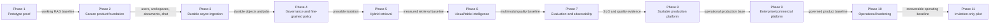

# Multimodal RAG production project plan

> Living delivery plan — updated 2026-09-20

This is the version-controlled planning source of truth for the journey from the
preserved prototype through an operationally hardened learning platform. It defines sequence, scope,
deliverables, dependencies, acceptance gates, risks, and current status for
Phases 1–11.

Use the [architecture handbook](architecture/ARCHITECTURE.md) for component
boundaries and data flows. Use the active private phase context document for
local operations, sensitive implementation history, and detailed decision rationale.

## Planning conventions

| Status | Meaning |
| --- | --- |
| **Completed** | Acceptance evidence exists and the work is published |
| **In progress** | Approved work is actively being implemented or accepted |
| **Planned** | Scope is understood but work has not started |
| **Proposed** | Scope or technology still needs an explicit decision |
| **Blocked** | A named dependency prevents useful progress |
| **Closed without acceptance** | Implementation ended without satisfying the phase gate or promoting its candidate |

Rules:

- Status is evidence-based; merged code alone does not complete a phase.
- Each milestone must be demonstrable, tested, documented, and safely reversible.
- Technologies labeled **TBD** remain proposals until an ADR accepts them.
- Dates and effort estimates are added only after scope and dependencies are approved.
- Security, tenant isolation, accessibility, observability, and recovery are
  acceptance concerns—not cleanup tasks.
- V1 remains immutable while later phases evolve independently.

## Current snapshot

| Item | Status |
| --- | --- |
| Phase 4 source branch | `phase-4/mm-rag-governance` — preserved |
| Phase 5 source branch | `codex/phase5-hybrid-retrieval` — preserved after squash merge |
| Phase 5 merge | PR #5 squash-merged into `main` at `5436614`; source and merged trees match |
| Phase 6 kickoff branch | `codex/phase6-visual-table-intelligence` — preserved after PR #6 squash merge |
| Phase 6 kickoff merge | PR #6 squash-merged into `main` at `95d18b3`; source and merged trees match |
| Phase 6 implementation branch | `codex/phase6-visual-table-implementation` from merged kickoff |
| Phase 1 | Completed and frozen at `mm-rag-v1.0.0` |
| Phase 2 | Completed and accepted — implementation, live-model, security, and visual gates pass |
| Phase 2 release | Squash-merged at `52d4cfa`; tagged `mm-rag-v2.0.0` |
| Phase 2 infrastructure foundation | Completed in `5db9dd5` |
| Architecture handbook | Published in `299a0ad` |
| Phase 2.1 implementation foundation | Published in `33bc54d` |
| Phase 2.1 acceptance | Completed with live Auth0 browser evidence in `f992dce` |
| Phase 2.2 | Completed and published in `fb0fc86` |
| Active milestone | Phase 11.5 independent-human staged pilot |
| Phase 3 | Completed and accepted — Milestones 3.0–3.5 and ADRs 0007–0012 verified end to end |
| Phase 3 merge | PR #2 merged into `main` at `228ce63`; source branch preserved |
| Phase 3 release | Tagged `mm-rag-v3.0.0` at `9ebe767`; tag is immutable |
| Phase 3 quality gate | 110 deterministic tests pass with four opt-in integration skips; all 114 tests pass in the free live-service gate; CI-equivalent coverage is 81.39% against the 70% threshold; one explicitly approved signed-in real-OpenAI async promotion/retrieval proof passed |
| Phase 4 | Completed and accepted — Milestones 4.0–4.5 squash-merged through PR #3 |
| Phase 4 merge | PR #3 squash-merged into `main` at `57ee453`; source branch preserved |
| Phase 4 release | Annotated `mm-rag-v4.0.0` at closure commit `996898e`; immutable |
| Phase 5 | Closed without acceptance — implementation complete and merged, nDCG gate missed, no candidate promoted or release tag created |
| Phase 6 | Completed and accepted — Milestones 6.0–6.5 and representative visual/table/calculation proof pass; `visual-table-v1` promoted |
| Phase 6 release | Annotated `mm-rag-v6.0.0` at verified closure commit `d97e8e8`; immutable |
| Phase 7 | Completed and accepted — Milestones 7.0–7.5, seven-day post-fix baseline, numeric pilot SLOs, and final free gate pass |
| Phase 8 | Completed and accepted — OCI Streamlit deployment, authenticated data path, progressive capacity, resilience, encrypted backup/restore, rollback, and all ten evidence scenarios pass; Next.js remains deferred and unpromoted |
| Phase 9 | Completed and accepted — ADRs 0043–0050, provider-neutral milestones 9.0–9.6, and bounded Google Drive OAuth/propagation proofs pass |
| Phase 9 closure | PR #17 squash-merged into `main` at `ad4e7fb`; source and merged trees match |
| Phase 9 release | Annotated `mm-rag-v9.0.0` identifies the verified documentation-kickoff closure commit and is immutable |
| Phase 10 | Completed and accepted — all eight evidence scenarios pass |
| Phase 10 release | Annotated `mm-rag-v10.0.0` peels to accepted merge `a2d200b`; immutable |
| Phase 11 | In progress — technical rehearsal passes; independent participant enrolled, canary paused pending bounded retry controls and formal workflow evidence |

## Delivery sequence and gates

```mermaid
flowchart LR
    p1["Phase 1<br/>Prototype proof"] -->|"working RAG baseline"| p2["Phase 2<br/>Secure product foundation"]
    p2 -->|"users, workspaces, documents, chat"| p3["Phase 3<br/>Durable async ingestion"]
    p3 -->|"durable objects and jobs"| p4["Phase 4<br/>Governance and fine-grained policy"]
    p4 -->|"provable isolation"| p5["Phase 5<br/>Hybrid retrieval"]
    p5 -->|"measured retrieval baseline"| p6["Phase 6<br/>Visual/table intelligence"]
    p6 -->|"multimodal quality baseline"| p7["Phase 7<br/>Evaluation and observability"]
    p7 -->|"SLO and quality evidence"| p8["Phase 8<br/>Scalable production platform"]
    p8 -->|"operational production base"| p9["Phase 9<br/>Enterprise/commercial platform"]
    p9 -->|"governed product baseline"| p10["Phase 10<br/>Operational hardening"]
    p10 -->|"recoverable operating baseline"| p11["Phase 11<br/>Invitation-only pilot"]
```

Later-phase discovery may run early, but implementation must not bypass the
security and data-integrity gates on which it depends.

## Roadmap summary

| Phase | Outcome | Primary gate | Status |
| --- | --- | --- | --- |
| 1 | Working multimodal RAG proof | Reproducible parse-index-retrieve-answer flow | Completed |
| 2 | Secure, persistent multi-document product | Authenticated tenant-safe product demonstration | Completed and accepted |
| 3 | Durable asynchronous ingestion | Retryable jobs survive service failure | Completed and accepted |
| 4 | Fine-grained governance | Automated evidence of cross-tenant isolation | Completed and accepted |
| 5 | High-quality hybrid retrieval | Evaluated improvement over dense-only baseline | Closed without acceptance |
| 6 | First-class image and table intelligence | Accurate visual/numerical evidence with citations | Completed and accepted; `visual-table-v1` promoted with explicit rollback |
| 7 | Measurable quality and operations | SLOs, traces, evaluations, alerts, and release gates | Completed and accepted |
| 8 | Scalable production deployment | Load, recovery, and reversible-release evidence | Completed and accepted on the free-first Phoenix learning deployment |
| 9 | Enterprise and commercial controls | Governed connectors, provisioning, metering, and audit | Completed and accepted |
| 10 | Operational hardening and lifecycle operations | Repeatable maintenance, recovery, retention, and cost-control evidence | Completed and accepted; released as `mm-rag-v10.0.0` |
| 11 | Invitation-only product pilot | New users complete core workflows safely within privacy, reliability, support, and cost bounds | In progress; two-account technical rehearsal passes, formal user validation blocked pending a second independent human |

## Phase 1 — working prototype

**Status:** Completed and frozen.

### Objective

Prove that PDFs containing text, OCR, tables, and images can be parsed, indexed,
retrieved, and used to produce grounded multimodal answers with citations.

### Delivered

- Streamlit upload, processing, inspection, and chat flow.
- PyMuPDF, pdfplumber, Tesseract, and Pillow parsing.
- LangChain document construction and OpenAI embeddings/generation.
- Qdrant dense retrieval with document/content/page filters.
- Source/page citations and saved parse artifacts.
- Immutable recovery tag `mm-rag-v1.0.0`.

### Exit evidence

- Representative PDFs complete the end-to-end workflow.
- Saved artifacts and vector-index reuse work.
- Known limitations are documented and V1 is recoverable.

## Phase 2 — secure product foundation

**Status:** Completed and accepted. Implementation, live-model, tenant-isolation,
authenticated workflow, responsive layout, and light/dark visual gates pass.

### Objective

Turn the prototype into a secure, persistent, workspace-aware, multi-document
product with an API boundary and a presentation-quality Streamlit experience.

### Milestones

| Milestone | Deliverable | Status | Completion gate |
| --- | --- | --- | --- |
| 2.0.0 | Preserve V1; isolate branch, worktree, and `2.0` copy | Completed | V1 tag/worktree recovery verified |
| 2.0.1 | Python 3.12/uv environment, secrets boundary, Docker PostgreSQL/Qdrant | Completed | Reproducible isolated startup |
| 2.0.2 | FastAPI, logging, database layer, Alembic, health/readiness | Completed | API/service tests and live dependency checks |
| 2.1 | Auth0 identity, users, workspaces, memberships, storage boundary | Completed | Live login/logout/re-login, expiry rejection, and idempotent provisioning verified |
| 2.2 | Document library, collections, versioning, scoped Qdrant payloads | Completed | Cross-user API tests, real migration cycle, and mandatory vector scope checks pass |
| 2.3 | Persistent conversations and backend-mediated RAG | Completed | Restart-persistence, citation authorization, migration, and safe-failure tests pass |
| 2.4 | Polished multipage Streamlit and evidence viewer | Completed and accepted | Authenticated principal flow, responsive layout, both themes, identity, and safe Activity presentation verified |
| 2.5 | CI, broader tests, activity/audit surface, demo hardening | Completed | Local and GitHub release gates pass |

### Milestone 2.1 acceptance status

Completed:

- Auth0 Regular Web Application, custom API, callbacks, origins, issuer, JWKS,
  audience, client ID, and ignored local secrets are configured.
- Live browser login succeeds and delivers an RS256 access token for the custom
  API audience; the protected `/users/me` request returns HTTP 200.
- First login provisioned exactly one user, one personal workspace, and one
  `owner` membership without exposing identity data during verification.
- Automated checks reject expired tokens, malformed or missing credentials,
  wrong issuer, and wrong audience.
- Live expiry handling rejected the prior access token with HTTP 401; browser
  logout/re-login then produced a fresh token accepted with HTTP 200.
- Re-login and refresh remained idempotent: PostgreSQL still contained exactly
  one user, one personal workspace, and one `owner` membership.

### Milestone 2.2 acceptance status

Completed:

- Added `documents`, immutable `document_versions`, `collections`, and
  workspace-consistent `collection_documents` with migration `20260830_0003`.
- Added bounded multipart uploads, version fingerprints, duplicate detection,
  archive semantics, path-safe object keys, and storage rollback compensation.
- Added workspace-scoped list/detail/version/archive and collection APIs with
  owner/admin/member writes, owner/admin archive, viewer reads, and hidden
  unauthorized resources.
- Added mandatory `tenant_id`, `workspace_id`, `document_id`, and
  `document_version_id` vector payload/filter helpers plus keyword-index setup.
- Cross-user and read-only-role tests prove another authenticated user cannot
  list, read, upload, or archive outside authorized policy. The full suite passes
  with 58 tests.
- PostgreSQL upgraded to `20260830_0003`, reported no drift, downgraded safely
  while the new tables were verified empty, and returned to head.

### Milestone 2.3 acceptance status

Completed:

- Added migration `20260830_0004` for durable conversations, explicit document
  targets, ordered messages, model metadata, and structured citations.
- Added workspace-, collection-, and explicit-document conversation targets. Only
  active documents and their latest READY versions enter a retrieval request.
- Added synchronous text/PDF/DOCX extraction and image description, chunking,
  OpenAI embeddings, scoped Qdrant upserts, and retry-safe version status changes
  behind a replaceable indexing protocol.
- Added backend-only OpenAI/Qdrant retrieval and generation with mandatory
  tenant/workspace/document/version filters and post-generation citation validation.
- Deterministic acceptance tests prove persistence across application restart,
  ordered message/citation storage, cross-user hiding, unsafe-citation rejection,
  and safe behavior when model services are unconfigured.
- PostgreSQL migration upgraded, downgraded only after all new tables were proven
  empty, and restored successfully to head `20260830_0004`.

### Milestone 2.4 acceptance status

Implemented:

- Replaced the one-page authenticated shell with native `st.navigation` pages for
  Overview, Library, Ask, Activity, and Settings plus a shared authorized workspace selector.
- Added complete document upload, index/re-index, download, collection creation,
  collection membership, conversation creation, resume, and message workflows.
- Added structured citation cards and an evidence dialog with source/page/excerpt,
  retrieval score, and authorized original-source download.
- Added deliberate empty/loading/error/success states, sentence-case copy, Material
  Symbols, accessible widget labels, responsive native containers, and no custom CSS.
- Added coordinated WCAG-oriented light/dark theme tokens in `config.toml`.
- The authenticated desktop review successfully exercised upload/index, grounded
  Ask with citations, Activity, Settings, and service readiness.
- Review feedback added a direct first-document CTA, consistent Auth0 profile display,
  concise retrieval-scope guidance, and presentation-safe Activity details. It also
  fixes audit message IDs that were recorded before UUID assignment.
- The full gate passes with 76 tests, Ruff and Mypy across 81 source files,
  migration head/no-drift checks, and live PostgreSQL/Qdrant/API/Streamlit readiness.
- Final authenticated screenshots verify the narrow Overview layout, light/dark
  contrast, Auth0 identity in the sidebar and Settings, and presentation-safe
  Activity rows. Milestone 2.4 and Phase 2 are accepted on 2026-08-30.

### Milestone 2.5 implementation status

Implemented:

- Added append-only workspace/actor/action/resource activity records with migration
  `20260830_0005`, atomic instrumentation for principal product mutations, a bounded
  membership-scoped API, and an Activity page with safe filtering.
- Added negative tests for cross-tenant activity discovery and API client handling
  of expired sessions, safe backend errors, and non-disclosing network failures.
- Added GitHub Actions with locked sync, Ruff, Mypy, PostgreSQL/Qdrant services,
  Alembic head validation, full tests, 70% coverage threshold, and diff hygiene.
- Added a Makefile, executable verification script, and presentation runbook.
- Local coverage gate passes at 84%; audit, frontend-adapter, migration, and UI smoke
  tests pass. Migration downgrade/upgrade validation returns PostgreSQL to head.
- Published in commit `71e65ef`; GitHub Actions run `33323110305` completed
  successfully across every release-gate step.

### Live-model release acceptance

Completed:

- Added `make check-acceptance` and an isolated acceptance harness that creates
  temporary SQL/files and a unique Qdrant collection, then removes them.
- Real OpenAI requests validated text ingestion, image understanding, embeddings,
  authorized vector retrieval, grounded generation, two-source citations, token
  metadata, persisted chat, audit events, and cross-tenant hiding.
- Hardened blank OpenAI model settings to use supported defaults and added regression
  coverage after the live check exposed an empty `.env` model value.
- Corrected conversation `updated_at` behavior so recent-chat ordering advances when
  a message is persisted, with regression coverage.
- Final combined gate: 73 tests; Ruff and Mypy across 80 source files; Alembic at
  `20260830_0005` with no drift; live PostgreSQL, Qdrant, FastAPI, and Streamlit ready.

### Phase 2 completion gate

- OIDC login/logout works in the presentation environment.
- Workspace membership protects every product API and retrieval operation.
- Multiple documents and collections are persistent and tenant-safe.
- Conversations persist across logout and backend restart.
- RAG execution is mediated by FastAPI and returns inspectable citations.
- The Streamlit experience is cohesive, accessible, and presentation-ready.
- CI runs principal unit, integration, authorization, migration, and UI tests.
- V1 remains unchanged and recoverable.

## Phase 3 — asynchronous ingestion and object storage

**Status:** Completed and accepted. The
isolated `3.0` tree now connects the accepted ADR 0007–0012 contracts end to end:
streamed immutable upload, job/outbox commit, confirmed RabbitMQ publication, fenced
worker execution, immutable generation promotion, active-generation retrieval, safe
status/control UX, and operational recovery. Alembic revision `20260830_0008` is the
current head. The signed-in paid acceptance proof completed upload, first-attempt
promotion, grounded retrieval, citation, and persistence. Production hosting/provider
choices remain deferred to Phase 8.

### Objective

Make document processing durable, retryable, observable, and independently
scalable while moving original and derived binaries to object storage.

### Milestones

| Milestone | Deliverable | Status |
| --- | --- | --- |
| 3.0 | Job/attempt and idempotency contracts; outbox, queue/broker, object-storage, and worker-runtime ADRs | Completed |
| 3.1 | S3-compatible object-storage adapter and immutable object keys | Completed |
| 3.2 | Transactional outbox schema/repository and atomic job dispatch intent | Completed |
| 3.3 | Worker process, retry/backoff, heartbeat, cancellation, dead-letter handling | Completed and accepted |
| 3.4 | Upload/status API and progress UX | Completed and authenticated-browser verified |
| 3.5 | Failure, recovery, load, and operations hardening | Completed and accepted |

### Milestone 3.0 implementation status

Implemented:

- Added workspace-constrained `ingestion_jobs` and `ingestion_attempts` with
  Alembic revision `20260830_0006`, including one-running-attempt enforcement,
  retry schedules, cancellation metadata, progress, leases, and fencing tokens.
- Added a caller-transaction-owned state machine for idempotent job creation,
  authorized self/admin control, queued/running/retry/failed/cancelled transitions,
  three-attempt exhaustion, heartbeats, cancellation races, and expired-lease recovery.
- Added safe creation/cancellation audit events and regression coverage for tenant
  hiding, requester-bound replay, immutable terminal history, stale workers,
  progress retention, retry validation, and cancellation precedence.
- Applied the migration to local Phase 3 PostgreSQL and verified its empty-table
  downgrade/upgrade cycle. The deterministic gate passes with 81 tests and one
  skip; the live gate passes 82 tests plus PostgreSQL/Qdrant/API/Streamlit readiness;
  Alembic is restored to head with no model/schema drift.

Accepted decisions:

- ADR 0009 atomically records each dispatch intent with its job in
  PostgreSQL, then publishing outside the API request with leased, at-least-once
  delivery. Its retry, alert, retention, per-job ordering, operational replay, and
  recovery recommendations are accepted.
- ADR 0010 selects open-source RabbitMQ as the free local/CI wake-up broker, with
  publisher confirms, manual acknowledgements, prefetch `1`, a durable quorum
  queue, and an operational dead-letter queue.
- ADR 0011 selects an S3-compatible Python adapter with open-source SeaweedFS for
  free local/CI object storage. Amazon S3 remains an unprovisioned, usage-priced
  future production option.
- ADR 0012 selects separate purpose-built Python dispatcher and worker processes,
  including initial lease, heartbeat, concurrency, and graceful-shutdown defaults.

Not yet implemented:

- async upload/status endpoints, RabbitMQ topology and publication, dispatcher and
  worker processes, immutable output generations, or promotion;
- the existing synchronous indexing and retrieval behavior remains active.

### Milestone 3.1 implementation status

Implemented and validated:

- Added a provider-neutral object contract with streamed create/read, head metadata,
  SHA-256 and byte-size verification, conditional write-once creation, idempotent
  same-content replay, safe conflicts, and non-disclosing provider errors.
- Added opaque trusted key builders for originals, attempt artifacts, and promoted
  generation artifacts. New document originals no longer include user filenames in keys.
- Added a Boto3 S3 adapter, configuration factory, secret-safe settings validation,
  and conditional object-storage readiness when the S3 backend is active.
- Added the open-source SeaweedFS `4.43` local Compose service with isolated storage,
  localhost-only S3 exposure, pre-created private-intent buckets, and health checks.
- Expanded the local fallback to the same checksum/size/conditional-create contract
  while keeping existing Phase 3 databases on local storage until migration is explicit.
- The deterministic gate passes 97 tests with two integration skips. The live gate
  passes 99 tests, including the SeaweedFS provider contract. A manual restart check
  verified object persistence and removed its test object afterward.

Deferred from this slice:

- Existing local objects are not migrated and the current ignored environment remains
  on the local adapter, preventing silent loss of access to prior documents.
- Multipart upload is unnecessary under the current 250 MiB maximum and remains
  required before raising the application limit into provider multipart territory.
- The artifacts bucket and promotion keys are defined but remain unused until the
  worker/output-promotion milestone.

### Milestone 3.2 implementation status

Implemented and validated:

- Added migration `20260830_0007` and a provider-neutral outbox model containing
  stable event/job identity, per-job dispatch sequence, minimal versioned JSON,
  due time, publication-attempt evidence, expiring leases, acknowledgement,
  discard, safe failure, and audit timestamps.
- New jobs atomically create dispatch sequence `1`. Retryable attempt failure and
  expired-lease recovery atomically create exactly one later sequence at
  `next_attempt_at`; transaction rollback removes both the job mutation and event.
- Added bounded `FOR UPDATE SKIP LOCKED` claims with strict per-job ordering,
  lease ownership/expiry checks, explicit publication-start recording, safe
  backoff metadata, idempotent acknowledgement, and conditional job transition
  from `pending` or due `retry_scheduled` to `queued`.
- Cancellation and terminal transitions discard only unpublished events while
  leaving already published evidence immutable. Messages remain minimal wake-up
  hints and contain no workspace claims, filenames, object keys, content, or secrets.
- Deterministic tests prove rollback atomicity, replay uniqueness, ordered retry
  events, lease fencing, backoff, acknowledgement, and cancellation. A real
  PostgreSQL concurrency test proves concurrent same-key requests create one job
  and one initial event and two dispatchers cannot lease the same event.
- The local migration upgraded, downgraded while all durable-ingestion tables were
  empty, and returned to head without schema drift. The deterministic gate passes
  100 tests with three integration skips; the live gate passes all 103 tests.

Deferred from this slice:

- No RabbitMQ connection, topology, broker publication, long-running dispatcher,
  worker process, asynchronous endpoint, or UI behavior is implemented.
- Retention deletion and alerting remain operational Milestone 3.5 work; the schema
  retains terminal rows and the future dispatcher can expose the accepted age and
  failure thresholds without changing the event contract.

### Milestone 3.3 implementation status

Implemented and validated:

- Added the accepted durable direct exchange, quorum main queue, dead-letter exchange
  and quorum DLQ, persistent minimal messages, mandatory confirmed publication,
  manual acknowledgement, and prefetch `1`.
- Added a leased outbox dispatcher with stable event identity, safe publication
  backoff, confirm-before-queued semantics, duplicate recovery, and process health.
- Added a separately packaged worker with fenced claims, one in-flight job, 60-second
  leases, 15-second heartbeat, cooperative cancellation, three-attempt retry,
  expired-lease recovery, safe failure classes, and graceful shutdown.
- Added migration `20260830_0008`, attempt-scoped immutable generation manifests,
  generation-aware deterministic Qdrant points, validation, and one fenced
  PostgreSQL active-generation promotion transaction.
- Real local RabbitMQ tests verify the quorum topology, publisher confirmation,
  strict message contract, and manual acknowledgement. Dispatcher and worker
  containers build independently and report healthy through the explicit runtime profile.

### Milestone 3.4 implementation status

Implemented:

- Added streamed asynchronous upload with required `Idempotency-Key`; the immutable
  original is verified before the document/version/job/outbox transaction commits,
  and successful intake returns HTTP 202 with a stable job ID.
- Added membership-scoped list/status, cooperative cancel, and terminal successor-
  retry APIs with non-enumerating 404 behavior and safe stage/unit/error responses.
- Updated Library to display durable state, attempt progress, retry time, safe error,
  refresh, cancellation, and successor retry while retaining the idempotency key
  across an ambiguous client failure.
- Retrieval now resolves and requires the authorized document version's active
  generation, preventing invisible or abandoned vectors from entering evidence.

Acceptance evidence:

- On 2026-08-30, one explicitly approved signed-in text upload returned a durable
  job, reached `succeeded` on attempt 1, promoted a READY generation, and remained
  ready after navigation.
- One grounded question returned the expected answer with the promoted document as
  its supporting citation; the two persisted messages and citation reloaded after
  navigation. No second paid acceptance run was started.
- The browser-discovered terminal-stage presentation drift was corrected so a
  succeeded job displays `Completed` rather than its stale last active stage.

### Milestone 3.5 implementation status

Implemented and validated:

- Added aggregate non-disclosing backlog health and alert thresholds for a 15-minute
  oldest due event, 10 publication attempts, expired leases, and inactive generations.
- Added preview-first 30-day cleanup for published/discarded outbox rows belonging to
  terminal jobs; pending events and authoritative job/attempt/audit history are protected.
- Kept destructive inactive-generation cleanup disabled because ADR 0008 requires a
  separate retention-window approval. The aggregate count remains inspectable.
- Added deterministic worker/dispatcher fault, duplicate, cancellation, retry,
  immutable-promotion, operations-retention, and 10 MiB streamed-upload coverage.
- Added an operations runbook and private logical PostgreSQL backup; restore into a
  generated temporary database verified migration `20260830_0008` and durable tables,
  then removed only the temporary database.

### Completion gate

- API requests return promptly with a job identifier.
- Originals are durable before jobs are dispatched.
- Duplicate requests do not duplicate document versions or vector points.
- Jobs survive API and worker restart and expose safe, accurate state.
- Retry exhaustion becomes inspectable failed/dead-letter state.
- Reprocessing is versioned; prior successful indexes are not silently mutated.
- Backup/restore and representative large-document tests pass.

## Phase 4 — fine-grained authorization and governance

**Status:** Completed and accepted — Milestones 4.0–4.5 are published through the
PR #3 squash commit `57ee453`. The accepted policy
matrix now has a central default-deny service, tenant-constrained ACL persistence,
PostgreSQL RLS defense, mandatory Qdrant scope enforcement, backend-mediated object
resolution, a future connector permission-envelope contract, safe append-only
security review, checksummed compliance export, and durable lifecycle controls.
The approved source tree matches the squash commit. Annotated tag `mm-rag-v4.0.0`
preserves the documentation-closure commit `996898e` as the immutable V4 checkpoint.

### Objective

Extend workspace membership into consistent resource-level policy, defense in
depth, auditable administration, and lifecycle governance.

### Milestones

| Milestone | Deliverable | Status |
| --- | --- | --- |
| 4.0 | Action/resource policy matrix, threat-model update, and ADR sequence | Completed — ADRs 0013–0017 accepted |
| 4.1 | Central role/ACL policy service and reusable authorization dependencies | Completed at `20260831_0009` |
| 4.2 | PostgreSQL row-level-security defense and mandatory Qdrant scope enforcement | Completed at `20260831_0010` |
| 4.3 | Authorized object access and connector permission propagation contract | Completed at `20260831_0011` |
| 4.4 | Append-only audit events, activity views, and compliance export | Completed at `20260831_0012` |
| 4.5 | Retention, deletion, encryption/key, and incident-response controls | Completed at `20260831_0013` |

Milestone 4.0 review material:

- [Phase 4 policy matrix and threat model](architecture/PHASE4_POLICY_THREAT_MODEL.md)
- ADR 0013 — central RBAC and optional resource ACLs.
- ADR 0014 — PostgreSQL RLS defense and runtime database roles.
- ADR 0015 — authorized Qdrant/object/worker boundaries.
- ADR 0016 — security audit and compliance export.
- ADR 0017 — governed retention, deletion, encryption, and incident response.

### Milestone 4.1 implementation status

- Added one typed, default-deny policy service with stable action codes, preserved
  role ceilings, non-enumerating decisions, and request-scoped evaluation.
- Added workspace/restricted visibility to documents, collections, and conversations.
  Migration `20260831_0009` preserves existing resources as workspace-visible while
  new conversations default to creator-private restricted visibility.
- Added positive user ACL persistence with same-workspace composite foreign keys.
  Grantees must be current members and grants never bypass role ceilings.
- Document, collection, conversation, job, citation-scope, indexing, and backend-
  streamed download paths now consume the shared policy decision.
- Focused policy and compatibility evidence passes 35 tests. The full deterministic
  gate passes 119 tests with four opt-in skips, clean Ruff/Mypy, migration head
  `20260831_0009`, and no schema drift.

### Milestone 4.2 implementation status

- Added migration `20260831_0010` with non-owner API, worker, dispatcher, and
  controlled-operations effective roles, reviewed RLS policies, fixed-search-path
  security-definer helpers, and least-privilege table grants.
- Added transaction-local purpose, principal, workspace, and job context. API policy
  decisions set tenant context; workers reload trusted job scope; dispatcher and
  operations paths use their distinct effective roles.
- Mandatory Qdrant filters now require bounded document/version/generation identities,
  and every returned point is revalidated before it can become a citation.
- Live PostgreSQL evidence proves unscoped and pooled queries remain tenant-isolated,
  the API role cannot disable RLS, and the dispatcher cannot read documents. Live
  Qdrant evidence proves cross-tenant vectors are excluded.
- A full free live gate passes 127 tests with migration downgrade/upgrade, Alembic
  no-drift, PostgreSQL, Qdrant, SeaweedFS, RabbitMQ, FastAPI, and Streamlit checks.
  No paid OpenAI acceptance run was invoked because model behavior did not change.

### Milestone 4.3 implementation status

- Added one canonical original-object resolver shared by downloads, synchronous
  indexing, and asynchronous workers. It rejects mismatched tenant/document/version
  keys or object size/hash/media identity before content use.
- Downloads remain backend-mediated and now stream from private storage with safe
  headers. Client object-key input is ignored and provider coordinates remain absent
  from public schemas, errors, links, and headers.
- Added migration `20260831_0011` for append-only, versioned source permission
  snapshots and resolved internal principals. The contract stores only hashed source
  item identity and does not choose or implement a connector.
- Unsupported semantics, unresolved or non-member principals, stale evidence,
  fingerprint tampering, and cross-workspace RLS access fail closed.
- Membership removal immediately hides jobs from the former member while accepted
  workspace-owned processing remains recoverable and can complete safely.
- The full deterministic gate passes 129 tests with eight opt-in skips; the free live
  gate passes all 137 tests, including PostgreSQL and SeaweedFS isolation evidence,
  migration reversal, and no schema drift. No paid model call was invoked.

### Milestone 4.4 implementation status

- Extended activity into a versioned security event contract with user/service
  actors, explicit result, policy revision, request/job correlation, and strict
  allowlisted details that reject secrets, content, unknown fields, and oversize values.
- Privileged ACL changes remain transaction-coupled to required audit writes; policy
  denials stay denied if best-effort evidence fails. PostgreSQL records discoverable
  denials independently without exposing outsider resource existence.
- PostgreSQL runtime roles cannot update or delete audit rows. Owner/admin receive a
  separate bounded security view; members receive 403 and outsiders 404.
- Added durable, private, schema-versioned JSON compliance exports with a 31-day/
  5,000-event bound, deterministic idempotent replay, SHA-256 checksum, authorized
  backend download, and audited creation/download.
- Migration `20260831_0012` is reversible with no schema drift. The deterministic
  gate passes 138 tests with nine opt-in skips; the complete free live gate passes
  all 147 tests. No paid OpenAI call was invoked.

### Milestone 4.5 implementation status

- Added reversible migration `20260831_0013` with recoverable document/conversation
  tombstones, durable checkpointed deletion plans, retention holds, and private
  orphan-object evidence. Tenant RLS and least-privilege grants cover every new table.
- Tombstoned resources disappear immediately from product reads. Worker claim and
  final-promotion fences make deletion win races with asynchronous ingestion.
- Owner-authorized retention uses bounded preview and exact SHA-256 apply tokens.
  Scope drift, holds, live work, provider uncertainty, or reconciliation failure
  blocks deletion rather than widening or guessing scope.
- Cross-store purge removes generation-scoped Qdrant points and trusted object
  references before SQL metadata, checkpoints every step, and resumes idempotently
  after partial failure. Orphan cleanup requires aged inventory evidence plus a
  fresh key/hash/size recheck.
- Local S3-compatible storage supports bounded inventory and optional server-side
  encryption headers. Non-local production configuration requires TLS and an
  explicit encryption mode; provider/KMS selection remains a Phase 8 decision.
- The Phase 4 governance operations runbook covers preview/apply, blocked recovery,
  encryption posture, incident containment/evidence/recovery, and backup/restore.
- The deterministic gate passes 147 tests with ten opt-in skips; the full free live
  gate passes all 157 tests across PostgreSQL, Qdrant, SeaweedFS, RabbitMQ, FastAPI,
  Streamlit, migration reversal, schema drift, and cross-store lifecycle evidence.
  An isolated PostgreSQL restore verified migration `20260831_0013`. No paid OpenAI
  test was invoked because model behavior did not change.

### Completion gate

- Policy is consistent across SQL, vectors, objects, jobs, chat, and citations.
- Cross-tenant attempts fail in automated unit and real-service integration tests.
- Administrators can explain who performed an action, on what resource, and when.
- Retention/deletion workflows remove all governed copies without orphaning indexes.
- Sensitive data and credentials are absent from logs and audit payloads.

## Phase 5 — hybrid retrieval, fusion, and reranking

**Status:** Closed without acceptance. Hybrid implementation and ADR 0024 remediation
are complete, but the single approved v4 attempt passed every evaluated validation
gate except nDCG@10: `hybrid-v3` improved 2.28% against the required 5%. Holdout and
the product proof were withheld. The user approved ending Phase 5 without promotion
or another remediation cycle; `hybrid-v1` remains default and `dense-v1` remains
rollback.

### Objective

Improve retrieval quality measurably by combining semantic and lexical evidence,
then reranking a bounded candidate set.

### Milestones

| Milestone | Deliverable | Status |
| --- | --- | --- |
| 5.0 | Versioned retrieval evaluation dataset and dense-only baseline | V2 measured; dense Recall@10 remains above the feasible range for a 10% relative gain |
| 5.1 | Sparse-engine evaluation and ADR | Completed — ADR 0019 implemented |
| 5.2 | Parallel dense/sparse retrieval with identical authorization filters | Completed and live-tested |
| 5.3 | Deterministic RRF/fusion, deduplication, and source diversification | Completed and deterministic |
| 5.4 | Bounded reranker selection and token-budgeted evidence assembly | Completed; reranker remains opt-in |
| 5.5 | Quality/latency/cost tuning, rollout controls, and regression gates | Closed without acceptance; v4 nDCG gate missed; no promotion |

### Accepted implementation contract

- Use the frozen hashed 80-query v4 benchmark with 48/16/16 splits and protected
  semantic, identifier, multi-document, unanswerable, and unauthorized-scope cases.
- Keep required gates deterministic; any paid embedding/generation baseline run
  remains explicit and opt-in.
- Add free, locally generated `Qdrant/bm25` sparse vectors to the existing Qdrant
  point identity so dense and sparse legs share the exact authorization filter.
- Preserve equal-weight `hybrid-v1`; evaluate fingerprinted `hybrid-v3` using dense
  order for ordinary query syntax and balanced RRF plus the pinned local
  cross-encoder for exact or multi-intent syntax. Every hybrid stage revalidates
  tenant/document/version/generation.
- Preserve dense-only fallback and use versioned rollout configuration. Do not make
  a provider score, reranker score, or client input an authorization signal.

### Implementation evidence

- Reviewable implementation commit `5ab4837` contains the Phase 5 runtime, fixtures,
  tests, model lifecycle, rollout controls, and acceptance tooling.
- The v1 24-chunk corpus remains diagnostic history. The accepted reproducible v2
  benchmark contains 120 hashed chunks and 50 balanced judged queries with a frozen
  60/20/20 split, semantic/identifier/multi-document confounders, rotated protected
  splits, and workspace/narrow-scope negatives.
- New immutable generations write dense and `sparse-bm25-v1` vectors together;
  owner/admin successor reindexing preserves the prior active generation until
  checksum and count validation complete.
- Dense and sparse searches reuse the same backend-built tenant/workspace/document/
  version/generation filter, then revalidate candidates before deterministic RRF,
  deduplication, diversification, optional reranking, and citation assembly.
- Pinned FastEmbed model revisions and tree checksums are provisioned before runtime.
  Missing sparse/reranker artifacts fail to dense/fused order without downloading.
- `dense-v1`, `hybrid-v1`, and `hybrid-rerank-v1` are explicit rollout profiles;
  `hybrid-v1` is the default and reranking remains disabled pending measured benefit.
- The deterministic gate passes 171 tests with 11 expected opt-in skips, migration
  head `20260831_0013`, no schema drift, and no paid model call. The complete free
  live gate passes all 182 tests with PostgreSQL, Qdrant, SeaweedFS, RabbitMQ,
  FastAPI, and Streamlit ready. Rebuilt dispatcher and worker containers load pinned
  models and report healthy. The idle lease-recovery cycle refreshes worker readiness
  so an empty queue cannot age a healthy process out of Docker health.
- The explicitly approved 2026-09-01 candidate used one batched embedding request
  for 878 tokens at an estimated `$0.00001756`. Dense and hybrid validation
  Recall@10 were both `1.0000`; nDCG@10 moved from `0.9507` to `0.9516`, below the
  accepted relative gates. Authorization identities and latency passed. The command
  stopped before the paid end-to-end proof and no retry ran.
- ADR 0022 is implemented: quality queries enforce a 50-candidate minimum; duplicate,
  distribution, hash, and split-isolation checks are deterministic; validation failure
  emits no holdout metrics or output; excluded/out-of-scope/unknown identities are hard
  failures; retrieval emptiness is descriptive; and grounded abstention returns no citation.
- The single approved v2 attempt on 2026-09-02 used one 2,262-token embedding
  request at an estimated `$0.00004524`. Validation dense/hybrid Recall@10 was
  `0.9375`/`0.9375`, nDCG@10 was `0.8585`/`0.8572`, and MRR@10 was
  `0.8750`/`0.8542`. Identity counts stayed zero and hybrid p95 was `38.6 ms`.
  Validation failed all three quality conditions; no holdout or product proof ran.
- ADR 0023 remediation adds the frozen `phase5-quality-v2` ceiling-aware Recall@10
  formula, answerable-class non-regression floors, and a reproducible v3 fixture with
  120 chunks and 80 queries split 48/16/16. Each protected split includes four
  semantic, four exact-identifier, four multi-document, and four negative queries;
  both negative kinds are represented.
- `hybrid-v2` selects a fingerprinted dense-favoring or balanced RRF policy only from
  deterministic query syntax. It cannot consume labels, expected answers, client
  ranking authority, or a model call. `hybrid-v1` remains the default and `dense-v1`
  remains rollback until paid evidence is accepted.
- The current deterministic gate passes 183 tests with 11 opt-in skips; the live gate
  passes all 194 tests with PostgreSQL, Qdrant, SeaweedFS, RabbitMQ, FastAPI, and
  Streamlit ready. Fixture hashes/reproduction, lint, typing, migration head, schema
  drift, selector fingerprints, class gates, and holdout withholding pass without a
  paid provider call.
- The single approved v3 attempt on 2026-09-02 ran after all 194 free live tests,
  pinned-model checks, and fixture checks passed. One `text-embedding-3-small` batch
  embedded 2,516 tokens at an estimated `$0.00005032`. Validation dense/`hybrid-v2`
  Recall@10 was `0.9167`/`0.9583`, nDCG@10 was `0.8667`/`0.9026`, and MRR@10 was
  `0.9167`/`0.9583`; hybrid p95 was `61.1 ms`. The candidate passed every evaluated
  validation gate except the required 5% relative nDCG improvement, achieving 4.14%.
  Identity counts stayed
  zero. The runner wrote only 64 tune/validation rows per profile, removed its
  temporary collection, and emitted no holdout metrics/output or product proof.
- Accepted ADR 0024 retains `phase5-quality-v2` unchanged. Tune-only v3 evidence
  selected `hybrid-v3-selector-v1`: ordinary syntax follows dense order; frozen
  exact or multi-intent syntax selects balanced 1:1 RRF and the checksum-pinned
  local reranker. Tune Recall@10 was `0.9722`, nDCG@10 was `0.8368` versus dense
  `0.7848` (`+6.62%`), and MRR@10 was `0.8449`; identity counts were zero, provider
  calls did not increase, and latency remained inside the accepted bound.
- The reproducible `phase5-retrieval-v4` fixture keeps the 120-chunk/80-query
  48/16/16 shape, reuses only v3 tuning evidence under new identities, and contains
  fresh validation and holdout query text, judgments, and IDs. Its manifest binds
  both protected-query hashes and rejects overlap with v3 protected evidence.
- Product code recognizes `hybrid-v3` but leaves `hybrid-v1` as default. Ordinary
  queries skip sparse retrieval and reranking; signaled queries reuse the identical
  trusted dense/sparse filter and fail safely to dense or fused authorized order.
  Another paid attempt, product proof, acceptance, and rollout each remain separate
  approval gates.
- The ADR 0024 deterministic gate passes 198 tests with 11 expected opt-in skips;
  the complete free live gate passes all 209 tests with PostgreSQL, Qdrant,
  SeaweedFS, RabbitMQ, FastAPI, and Streamlit ready. Both pinned local model trees,
  migration head, schema drift, v4 fixture reproduction, protected-query isolation,
  and diff hygiene pass without a paid provider call.
- The single approved v4 attempt on 2026-09-02 ran after the complete free preflight.
  One `text-embedding-3-small` batch embedded 2,545 tokens at an estimated
  `$0.00005090`. Validation dense/`hybrid-v3` Recall@10 was `1.0000`/`1.0000`,
  nDCG@10 was `0.8439`/`0.8632`, and MRR@10 was `0.8500`/`0.8500`; candidate p95
  latency was `191.6 ms`, and excluded, unauthorized, and unknown candidate counts
  were zero. The 2.28% relative nDCG gain missed the required 5%, so the runner
  wrote only 64 tune/validation rows per ignored profile, withheld holdout and the
  product proof, removed its temporary collection, and did not retry.
- The user approved closing Phase 5 without promoting `hybrid-v3` or pursuing another
  paid remediation cycle. The implementation and measured evidence remain preserved;
  the phase must not be described as quality-accepted, and no `mm-rag-v5.0.0` release
  tag is authorized by this closure.

### Completion gate

- Hybrid retrieval beats the approved dense baseline on agreed metrics.
- Authorization filters apply before every retrieval path.
- Recall@k, MRR/nDCG, groundedness, citations, latency, and cost are reported.
- Degraded sparse/reranker dependencies fail safely without leaking data.
- Retrieval configuration is versioned and reproducible.

## Phase 6 — visual and table intelligence

**Status:** Completed and accepted. ADRs 0025–0030, Milestones 6.0–6.5, free and
live-service gates, signed-in application-shell checks, corrected representative
visual retrieval, exact region/table evidence, safe abstention, and immutable numeric
calculation all pass. On 2026-09-07 the user promoted `visual-table-v1` as the
accepted default with `disabled` retained as explicit rollback. PR #7 was
squash-merged into `main` at `0eb0d16`; its tree matches accepted source commit
`b888a5d`. Release tagging remains a separate gate.
A single bounded paid candidate attempt was authorized and executed on 2026-09-07,
but it stopped before visual/table processing and therefore is not acceptance evidence.

### Objective

Make figures, diagrams, charts, and tables first-class searchable evidence instead
of depending mainly on OCR text and Markdown representations.

### Milestones

| Milestone | Deliverable | Decision status |
| --- | --- | --- |
| 6.0 | Visual/table corpus, questions, and baseline quality measures | Completed — 40 regions, 80 questions, protected splits, reproducible free baseline and gates |
| 6.1 | Versioned visual crops, provenance, captions, OCR, and summaries | Completed — migration `20260903_0014`, immutable objects, Docling/Tesseract/TableFormer local profile |
| 6.2 | Multimodal image embeddings and modality-aware retrieval | Completed — pinned local CLIP pair, isolated scoped index, deterministic router/RRF, text fallback |
| 6.3 | Table structure reconstruction, typing, validation, and normalized storage | Implemented — migrations `20260907_0015`/`0016`, immutable JSON/CSV, composite scope and RLS |
| 6.4 | Query routing for semantic retrieval versus safe exact calculation | Implemented — closed typed executor, deterministic routing, safe ambiguity/unsupported abstention |
| 6.5 | Evidence viewer for page region, figure, table, and calculation provenance | Implemented — `evidence-v1` API, integrity-checked streams, region/cell/calculation viewer; browser proof pending |

### Accepted decision sequence

1. Implement the accepted corpus, split, metrics, and release gates before changing runtime
   behavior (ADR 0025).
2. Implement immutable region/artifact identity and lineage before adding extractors
   or indexes (ADR 0026).
3. Implement the local-first extraction/enrichment contract and explicit provider gate
   (ADR 0027).
4. Implement visual embeddings, index isolation, authorization, routing, and fusion
   (ADR 0028).
5. Implement normalized table storage and the closed safe-calculation allowlist
   (ADR 0029).
6. Implement the evidence API/viewer and staged rollout/rollback gates (ADR 0030).

This order prevents a parser, model, vector layout, or calculation engine from
silently defining the public provenance contract. Phase 5's `hybrid-v1` default,
`dense-v1` rollback, and protected evidence remain unchanged during implementation
until a separately approved promotion gate succeeds.

Milestone 6.0 evidence is committed under `evaluation/phase6/v1`. The fixture
builder verifies stable hashes and exact split/class coverage; the baseline runner
reports only tune and validation aggregates, makes zero provider calls, and never
emits protected holdout identities. The intentionally imperfect lexical baseline
sets the comparison point for later visual/table candidates without changing a
retrieval profile.

Milestone 6.1 pins Docling `2.124.0` and a 15-file, 701,214,178-byte local layout/
TableFormer artifact tree. Runtime verifies its SHA-256 before use and disables
remote services, external plugins, picture descriptions, and request-time model
downloads. The worker writes attempt and generation copies, verifies stored bytes,
then commits region/artifact rows under worker RLS before existing fenced promotion.
Standalone images use the same immutable contract through Pillow. The feature flag
remains off until the later retrieval, evidence, quality, and browser gates pass.

Milestone 6.2 pins `Qdrant/clip-ViT-B-32-vision` and its paired text encoder to
immutable revisions, exact local tree checksums, 512 dimensions, RGB preprocessing,
application L2 normalization, and bounded batches. The worker indexes one immutable
point per region in a separate global visual collection. Every filter and returned
payload carries and revalidates tenant, workspace, document, version, active
generation, region, page, and vector-profile identity. The Phase 5 text profile runs
for every query; a deterministic query-only router adds the visual leg for visual
intent, then application-owned RRF fuses bounded results. Any visual dependency or
validation failure returns to the authorized text order. This remains opt-in and
does not promote a Phase 6 profile.

Milestone 6.3 persists generation-scoped `table_regions`, `table_columns`, and
`table_cells` beneath composite workspace/document/version/generation/attempt
constraints and PostgreSQL RLS. Raw values, normalized typed values, spans, header
associations, units/currencies, source coordinates, validation codes, and immutable
normalized JSON/CSV objects remain inspectable. A structurally unusable table keeps
its visual/text evidence but cannot enter exact calculation.

Milestone 6.4 routes only recognized calculation intent to an application-owned,
closed operation plan. It supports lookup, count, sum, average, min/max, difference,
and ratio over currently authorized active-generation cells. `calculation_traces`
record immutable operator, ordered operands, types, units, rounding, result, and a
query hash. Ambiguous tables/columns/rows, mixed units, unsupported values, and
division by zero abstain; no generated SQL or arbitrary analytical runtime exists.

Milestone 6.5 resolves persisted citation labels through current conversation and
document policy, active generation, and region/table/cell/trace identity. It verifies
artifact metadata and bytes before streaming, exposes no storage key, and gives the
Streamlit viewer page/crop highlighting, provenance-labeled layers, semantic tables
with non-color-only cited-cell markers, and calculation details. Lifecycle purge and
orphan inventory now cover visual vectors and both attempt/final artifact namespaces.

The frozen free `visual-table-v1` synthetic candidate passes validation before
holdout and then passes holdout: Recall/MRR/nDCG@10, source coverage, exact
calculation, and safe abstention are `1.0`; identity/citation errors and provider
calls are zero; nominal p95 is 2 ms. This verifies the deterministic fixture
contract, not signed-in product behavior or production-quality generalization.

The first representative-product attempt used the tracked PDF exactly once and
completed one paid embedding request. It then exposed a pre-existing dense-only
Qdrant collection compatibility issue before Phase 6 extraction: Qdrant 1.19 rejects
adding a new sparse-vector name to an existing collection. The worker was stopped,
the job was canceled before retry, and no question/answer call ran. The compatibility
fix preserves the existing collection and records an explicit dense-only fallback;
fresh collections still receive dense and sparse schemas at creation. A future
reviewed collection migration can restore sparse indexing for legacy collections
without deleting accepted vectors. This attempt does not satisfy the candidate gate,
and another paid run requires fresh authorization. The corrected repository gate
passes 262 tests with 14 expected opt-in skips; the free live-service gate passes
275 tests with one expected skip, migration head `20260907_0016`, and no schema drift.

The approved successor candidate then succeeded on its first and only attempt. Its
promoted manifest records 31 dense text vectors with the explicit legacy sparse
fallback, 33 visual regions/vectors, 193 immutable artifacts, 23 reconstructed
tables, 21 calculation-eligible tables, and 523 cells. The first question returned
the correct 30-day Clause 11.4 answer with page-4 evidence. The second, explicitly
visual heatmap question safely abstained because generic `which`/`what is` table-
lookup routing ran before visual retrieval. The third question was not submitted.
Free diagnostics proved the authorized visual index returns the page-12 heatmap as
its top result. Explicit visual intent now takes precedence over generic lookup
wording while true table-calculation failures remain fail-closed. A fresh paid run
is required to validate that correction; the Phase 6 acceptance gate remains open.
The corrected full repository gate passes 263 tests with 14 expected skips, and the
free live-service gate passes 276 tests with one expected skip. The persistent-
database outbox lease proof now uses an isolated synthetic clock so unrelated
legitimate due events cannot make the concurrency assertion nondeterministic.
Real-role verification also found that PostgreSQL privilege-checks the `documents`
table referenced by the ingestion-job RLS policy before evaluating the dispatcher's
privileged-purpose branch. Migration `20260907_0017` supplies only the required
`SELECT` grant: document RLS continues to return no rows to the dispatcher, while
authorized job selection succeeds. After the migration, the dispatcher started
cleanly and drained all pending terminal-job outbox events.

A third bounded browser proof reused the promoted document without uploading or
starting the worker. The corrected `text-and-visual` route retrieved authorized text
and visual candidates, answered that Prime Friday leads the retention heatmap with
a score of 93, and cited page 12. The evidence viewer resolved the exact stored
region, page image/crop, and structured companion table without exposing an object
key or credential. One query embedding and one answer call were made. The second
and final question asked for arithmetic over two narrative “Supporting value” cells;
it safely abstained without a provider call because those cells are intentionally
typed as text rather than numeric values. A validated page-23 numeric table is the
appropriate subject for the remaining exact-calculation proof. The two-question
limit was honored and no retry was attempted.

After reauthentication, one separately approved no-provider proof used the validated
page-23 amount table. The application computed the absolute difference between the
normalized peak and off-peak amounts, `6904` and `1784`, as `5120` in 156 ms. The
viewer marked both exact operand cells, resolved the stored region/page/crop, and
showed the immutable `closed-table-operations-v1` trace with exact-decimal rounding.
No upload, retry, embedding, or answer-model call occurred. The representative
visual/table/calculation candidate gate is therefore complete; promotion remains an
explicit decision.

### Completion gate

- Visual and table Recall@k improves over OCR/Markdown-only baselines.
- Every result maps to document version, page, region, and extraction version.
- Numerical answers use validated structure and pass accuracy tests.
- Users can inspect the exact figure/table evidence used in an answer.
- Model, storage, latency, and cost tradeoffs are measured and documented.

## Phase 7 — evaluation and observability

**Status:** Completed and accepted — ADRs 0031–0036, Milestones 7.0–7.5, the
seven-day representative baseline, numeric pilot SLOs, and final free gate pass.
Two diagnostic pre-fix days are retained. Visual and exact
table checks passed on both days, but a Clause 11.4 duration query repeatedly returned
`3` instead of `30`. The corrected service routing preserves table cardinality for
explicit count subjects while sending duration-value questions to grounded retrieval.
Post-merge browser proof returned the grounded 30-day answer with page-4 evidence, and
the post-fix baseline restarted on 2026-09-08 with Day 1 of 7 recorded. The scheduled
2026-09-09 functional checks passed, but that day was excluded because the API process
had telemetry disabled; metadata-only export is now enabled and verified for subsequent
runs without repeating the consumed questions. The 2026-09-10 run initially stopped
before paid work because the Auth0 session had expired, then resumed after sign-in and
passed all three checks with live telemetry. Post-fix Day 2 of 7 is recorded; five valid
days remain. The 2026-09-11 attempt passed service and telemetry preflight but stopped
before paid work when the browser session became invalid after an API restart; no
question ran before renewed sign-in. It then resumed on the same day and all three
representative checks passed without upload or retry. Post-fix Day 3 of 7 is recorded
with zero operational and telemetry-export failures; four valid days remain.
The 2026-09-12 attempt passed service and telemetry preflight but stopped before paid
work when the authoritative Overview check rejected the expired browser session. No
question ran before renewed sign-in. It then resumed on the same day and all three
representative checks passed without upload or retry. Post-fix Day 4 of 7 is recorded
with zero operational and telemetry-export failures; three valid days remain.
The 2026-09-13 attempt passed service and telemetry preflight but stopped before paid
work when the authoritative Overview check rejected the expired browser session. No
question ran before renewed sign-in. It then resumed on the same day and all three
representative checks passed without upload or retry. Post-fix Day 5 of 7 is recorded
with zero operational and telemetry-export failures; two valid days remain.
The 2026-09-14 attempt passed service and telemetry preflight but stopped before paid
work when chat navigation rejected the expired browser session. After renewed sign-in,
all three representative checks passed with authorized evidence and no upload or retry.
Post-fix Day 6 of 7 is recorded with zero operational and telemetry-export failures;
one valid day remained at that checkpoint.
The 2026-09-15 final-day attempt first paused before paid work because the restarted
runtime exported no live MM-RAG count/latency series. After telemetry-enabled startup
and renewed authentication, live series appeared and all three bounded checks passed
with authorized evidence. No upload or retry occurred. Post-fix Day 7 of 7 recorded
zero operational and telemetry-export failures; the baseline is ready for SLO review.

### Objective

Make product quality, reliability, latency, cost, and failure behavior measurable
enough to support release decisions and production operations.

### Milestones

| Milestone | Deliverable |
| --- | --- |
| 7.0 | Completed — signal taxonomy, privacy policy, SLI/SLO process, and accepted ADRs |
| 7.1 | Implemented — correlated structured logs, metrics, and distributed traces |
| 7.2 | Implemented — versioned composed evaluation harness, fixtures, and release summary |
| 7.3 | Implemented — tenant-scoped feedback capture and owner/admin review workflow |
| 7.4 | Completed — reliability, quality, latency, failure, and cost dashboards with approved pilot targets |
| 7.5 | Completed — alerts, runbooks, incident template, free CI gates, and accepted baseline evidence |

### Completion gate

- One correlation ID traces frontend, API, job, retrieval, model, and persistence.
- Defined SLOs have owners, dashboards, alerts, and runbooks.
- Candidate RAG changes are evaluated before promotion.
- Production feedback can become reviewed regression cases.
- Telemetry excludes secrets, tokens, and uncontrolled document content.

## Phase 8 — scalable production platform

**Status:** Completed and accepted. All implementation contracts for Milestones 8.1–8.5
are present. The reviewed Phoenix infrastructure and corrected signed/scanned image are
deployed by immutable digest behind public HTTPS. Authenticated shell, readiness, logout,
and one-attempt ingestion pass with 31 promoted text vectors and 33 visual regions. The
initial three-question check then exposed a deterministic routing defect: ordinary
text questions matched the closed table-calculation vocabulary, and a calculation miss
abstained instead of continuing to authorized RAG retrieval. The narrow fallback fix,
regression test, protected publication, immutable-digest deployment, and separately
approved paid recheck now pass. The existing PDF returned grounded answers for the
7-day refund window, Clause 9.1 data residency requirement, and 15-minute P1 API target,
each with page-level citations. The worker remains stopped with zero active jobs.

The private versioned OCI bucket now holds the age ciphertext only. Provider download,
safe decrypt, manifest verification, and isolated PostgreSQL/Qdrant/SeaweedFS restore
pass with a conservative 0.75-hour RTO and effectively zero quiesced-export RPO, inside
the accepted 8-hour/24-hour targets. A follow-up release was rolled back from `3de5b3c`
to `f5af5a1` and forward again with readiness preserved and identical aggregate database,
vector, and object-store integrity evidence. The authenticated 1/3/5/10-user probe then
completed 30 requests per stage with zero errors; its highest p95 was 300.721 ms against
the accepted 5-second objective. All ten release-evidence scenarios now pass. Candidate
parity is explicitly deferred and remains unpublished and unpromoted. Streamlit is the
accepted Phase 8 frontend.

The image gate runs application and Next.js builds independently on native AMD64 and
ARM64 GitHub runners, then reports one stable aggregate result. This avoids QEMU-only
dependency-install failures and prevents one sequential build from consuming the entire
job timeout. Candidate installation disables npm's implicit audit request; a pinned
Trivy lockfile scan rejects fixable high/critical dependency findings, and the native
candidate-image scan independently enforces the same release threshold. Image publication
remains a separate manually approved action.

### Objective

Deploy a secure, recoverable learning platform whose frontend, API, and ingestion
workers retain separable runtime boundaries, then prove the capacity and recovery limits
of the accepted single-VM topology under representative bounded load.

### Milestones

| Milestone | Deliverable |
| --- | --- |
| 8.0 | Completed — OCI learning constraints plus deployment, data, frontend, delivery, and recovery ADRs 0037–0042 accepted |
| 8.1 | Streamlit baseline deployed — CPU-only multiarch image and native architecture gates pass; reviewed Phoenix A1/network/private-bucket/budget plan applied; root filesystem expanded; corrected signed/scanned digest deployed behind HTTPS; migration, pinned models, API readiness, authenticated workspace, Library, logout, first-attempt ingestion, and grounded three-question data-path proof pass |
| 8.2 | Candidate implemented — Streamlit remains default; token-mediating Next.js parity candidate is opt-in and unpromoted; automated accessibility, malformed-origin rejection, and non-disclosure checks pass, browser parity evidence pending |
| 8.3 | Cloud capacity evidence complete — resource limits, prefetch-1 backpressure, graceful drains, seven reversible resilience scenarios, and authenticated 1/3/5/10-user readiness/current-user traffic pass with zero errors and p95 below the accepted 5-second objective |
| 8.4 | Cloud recovery proof complete — private versioned OCI ciphertext round-trip, safe decrypt/integrity checks, and isolated PostgreSQL/Qdrant/SeaweedFS restore pass inside the accepted RPO/RTO targets |
| 8.5 | Cloud release gate complete — immutable release manifests, resilience, recovery, rollback, and authenticated progressive load satisfy all ten required evidence scenarios |

### Completion gate

- Representative load meets approved latency, throughput, error, and cost targets.
- Deployments and migrations are reversible without tenant-data loss.
- Dependency failure triggers timeouts, backpressure, and safe degradation.
- Backups restore successfully in an exercised recovery procedure.
- Learning-deployment security and operational readiness reviews pass without claiming a production SLA.

## Phase 9 — enterprise integrations and commercial controls

**Status:** Completed and accepted. ADRs 0043–0050 are accepted. Provider-neutral
milestones 9.0–9.6 and the bounded Google Drive live proof pass. External identity and
real billing providers, paid services, production meters/quotas, and automatic retention
remain deliberately deferred or separately gated.

Milestone 9.0 now has a tracked requirements/threat model and first-connector scorecard.
The provider-neutral portion of Milestone 9.1 implements typed discovery, change-page,
version, streamed-content, permission, health, and rate-limit contracts; an explicit
registry; tenant/connector-bound opaque credential references; and runtime-only secret
resolution. Focused lint, typing, and contract tests pass. ADR 0050 now selects and
implements the read-only Google Drive adapter with mocked provider coverage. Its secure
Desktop OAuth bootstrap, file-backed runtime resolver, and aggregate-only live probe
pass with the read-only scope. A dedicated synthetic fixture then proved permission
expansion, contraction to the original fingerprint, deletion change-feed delivery, and
absence from active discovery without content download or identifier disclosure.
Migration
`20260919_0019` adds tenant-isolated
connector/sync, identity, entitlement, usage, simulated-billing, and compliance records.
The durable services enforce fenced checkpoint promotion, deny-first source changes,
ordered identity lifecycle, allowlisted role mapping, transactional quota reservation,
additive corrections, signed idempotent billing events, and stable-scope compliance
reauthorization. Focused tests and a live PostgreSQL RLS isolation proof pass.

### Objective

Support governed enterprise content, identity lifecycle, usage controls,
commercial accounting, and compliance-grade administration.

### Proposed milestones

| Milestone | Deliverable |
| --- | --- |
| 9.0 | Complete — enterprise requirements, threat model, and provider priorities |
| 9.1 | Verified — connector SDK, read-only Google Drive adapter, secret-safe OAuth, and bounded aggregate-only live probes |
| 9.2 | Verified — durable fenced delta sync plus live permission expansion/contraction and deletion propagation proof |
| 9.3 | Implemented — SCIM-compatible ordered lifecycle and allowlisted mapping; provider proof pending |
| 9.4 | Implemented — immutable usage, transactional reserve/settle, corrections; product quota values pending |
| 9.5 | Implemented — signed simulated provider and entitlement reconciliation; real billing prohibited |
| 9.6 | Implemented — stable-scope reauthorization, hold precedence, content-free evidence; automatic retention disabled |

### Completion gate

- Connector credentials are least-privilege, tenant-isolated, rotated, and revocable.
- Source permission and deletion changes propagate into searchable content.
- Identity provisioning/deprovisioning produces predictable access changes.
- Metering is immutable and quota enforcement remains correct under concurrency.
- Billing reconciliation and administrative reports agree with the usage ledger.
- Enterprise lifecycle workflows produce reviewable evidence.

## Phase 10 — operational hardening and lifecycle operations

**Status:** Completed and accepted. ADRs 0051–0056 were accepted on 2026-09-20 with
their free-first defaults, and all eight evidence scenarios pass. Automatic
retention apply, unattended upgrades, destructive host actions, temporary cloud
resources, paid services/capacity, and production-SLA claims remain separately gated.

### Objective

Turn the accepted learning platform into a maintainable, repeatable operational system:
exercise recovery continuously, make upgrades reversible, keep dependencies current,
bound OCI cost/capacity risk, and introduce lifecycle automation only behind explicit
preview, approval, hold, and rollback controls.

### Milestones

| Milestone | Deliverable | Status | Completion gate |
| --- | --- | --- | --- |
| 10.0 | Scope, invariants, evidence contract, and failure budget | Completed | ADR 0051 Accepted with measurable boundaries |
| 10.1 | Scheduled encrypted backup verification and isolated restore drills | Completed | Instance-principal ciphertext upload, checksum, aggregate restore, cleanup, service recovery, and daily 05:30 PT timer pass |
| 10.2 | Governed retention scheduling and safe deletion execution | Implemented at preview-only boundary | Owner/admin reminder, durable preview audit, token-safe report; automatic apply remains disabled |
| 10.3 | Dependency, vulnerability, and supply-chain maintenance | First candidate passed | Lockfiles, tests, vulnerability scan, SBOM, provenance, ARM64 image, signing, and rollback evidence pass; no auto-merge or paid run |
| 10.4 | OCI monitoring, saturation, and cost guardrails | Completed | Healthy live inventory and thresholds pass; five-minute timer is enabled with no auto-scale or paid capacity |
| 10.5 | Upgrade, rollback, disaster-recovery, and operator automation | Completed | Exact upgrade, forward-schema-safe rollback, roll-forward, and clean-host recovery pass |
| 10.6 | Final operator handbook and release evidence | Completed and accepted | All eight content-free scenarios pass |

October 4 agent browser inspection verifies the existing-VM reboot dialog, unsubmitted
with Force unchecked. A partly obscured red instance-health warning must be inspected
before reboot approval; no new reboot or host mutation occurred.

Subsequent read-only inspection verifies the unresponsive-instance warning and zero
infrastructure/maintenance status in the displayed hour, not guest readiness. Operator
confirms 90 minutes availability. A normal reboot review is prepared but unsubmitted,
Force unchecked; fresh one-boot authorization and current participant pause remain
pending. Incomplete backup/quiescence checks, temporary Docker-mask expiry, missed
boot-interception/autostart and OCI's 15-minute shutdown fallback are explicit risks.

The operator now approves exactly one supervised normal reboot with temporary Docker
boot masks, confirming both participants paused and serial Terminal connected. Fresh
dialog verification shows Force unchecked and no submission. Final click/interception
remain operator handoff; execution and mask staging are not yet evidenced.

Subsequent OCI inspection shows Stopping after operator handoff; serial output still
reflects the old long-uptime boot. This is a shutdown transition, not completed recovery
or verified boot interception/masks. Exact submission time is unrecorded; no second
reboot, force action, Docker start or paid processing is authorized or performed.

The subsequent operator screenshot verifies GRUB menu interception, with rescue selected
and the normal UEK entry second. Next inspect the normal entry's temporary editor before
staging Docker boot masks; no boot, saved change or OS readiness pass is yet evidenced.

The normal-entry editor is now evidenced with original boot arguments and no maintenance
Bash override. Next stage only the two approved Docker unit masks on the kernel line,
preserving all other arguments and matching initramfs; verify the edit before boot.

Both Docker mask arguments are now visually verified on the normal kernel line,
with original arguments and initramfs preserved. Temporary-entry boot is handed off
within the approved attempt; live masks and recovered OS readiness remain unverified.

Subsequent strict SSH and bounded privileged checks verify normal-boot OS recovery:
SELinux Enforcing, core logging/IPC/audit/SSH healthy, matching runtime labels, no failed
units, root 39% used/inodes 2%. Docker remains inactive/generator-masked, saved worker
manually stopped, and accepted phase10 backup/capacity timers enabled/waiting. Existing
service restoration requires new approval for a runtime-only debug-generator override,
one unit reload and verified mask removal before existing Docker startup. No persistent
boot edit, another reboot, image pull/recreation/migration or paid processing is included.
Participants remain paused; application/data integrity and Phase 11 acceptance are pending.

Subsequent approved runtime-only mask release restores eight existing services without
pull/recreation/migration or further reboot. Health/TLS/readiness/anonymous denial pass,
revision/schema retained, worker/one-shots stopped, no active job/queue backlog. Participants
paused, no paid calls/upgrades/new resources. Both enabled timers failed while Docker was
masked; recovery/catch-up backup needs review. Capacity evidence stale, newest encrypted
bundle approximately 36.6 hours old without renewed integrity proof. Application startup
passes; full operational readiness/pilot acceptance remain pending.

Subsequent approved recovery restores both original maintenance schedules and completes
one encrypted/checksum-verified uploaded catch-up backup, removing plaintext staging.
Fresh capacity evidence passes, eight services healthy, no failed units, worker stopped
and participants paused. Existing migration/model one-shots unexpectedly rerun through
Compose dependency startup; schema/image unchanged and jobs now stopped. A tested direct-
existing-container runtime guard contains this behavior; review a permanent resume fix
before another reboot or pilot resumption. No second backup/new restore proof, paid calls,
image upgrades/new resources/additional reboot. Current-boot recovery is verified, not
Phase 11 acceptance.

Subsequent approved permanent backup-resume remediation is implemented and deployed as
a backup-only source patch, preserving rollback source and canonical unit protections.
Validated original running IDs govern stop/resume; Compose dependency jobs and originally
stopped worker/storage roles are not started. Twenty focused tests, complete free gate
(398 passed/16 expected skips), live gate (413 passed/one expected skip), actual host
inventory parsing and five synthetic host cases pass without another real backup. The
temporary backup guard is removed; current-boot Docker override remains. After an
installer timer assertion stops validation, independent fresh checks confirm original
timers waiting, successful services, healthy capacity/readiness/TLS and empty queues.
Worker/setup jobs retain stopped state/start times, schema/image unchanged, participants
paused. No additional backup/reboot, paid calls, upgrades/resources or Git publication;
formal retry/workflow gates and Phase 11 acceptance remain pending.

### Proposed completion gate

- Backups are encrypted, verified, and restored on a repeatable schedule without
  exposing customer content or secrets in evidence.
- Retention remains disabled until a reviewed schedule is accepted; every destructive
  run requires an exact preview, stable scope, hold precedence, and durable audit.
- Dependency and image updates fail closed on integrity or vulnerability regressions and
  retain an exercised rollback path.
- The free-first OCI host has measurable saturation, disk, certificate, backup-age, and
  cost guardrails suitable for the accepted ten-user learning target.
- A clean-host recovery and an in-place upgrade/rollback drill meet approved learning
  RTO/RPO objectives without silent data loss.
- Runbooks allow a new operator to deploy, diagnose, recover, rotate credentials, and
  retire the learning environment without reading private context.

## Phase 11 — invitation-only product pilot

**Status:** In progress. ADRs 0057–0063 are Accepted. The versioned policy, synthetic
rehearsal, content-free evidence gate, tests, and operating guide are implemented.
Broader invitation, external notification, frontend promotion, further paid work, or
cloud change remains separately gated.

### Objective

Validate that up to ten invited learning users can understand and safely use the
accepted product while the existing free-first deployment, authorization, provenance,
privacy, recovery, and cost boundaries remain intact.

### Proposed milestones

| Milestone | Deliverable | Status | Proposed completion gate |
| --- | --- | --- | --- |
| 11.0 | Scope, invariants, user-success evidence, and stop conditions | Implemented | ADR 0057 accepted; versioned policy validates |
| 11.1 | Manual invitation, onboarding, access revocation, and support contract | Foundation implemented | ADR 0058 accepted; synthetic lifecycle contract passes |
| 11.2 | Streamlit pilot journeys and accessibility | Foundation implemented | ADR 0059 accepted; required journeys are represented in the contract gate |
| 11.3 | Consent, privacy, voluntary feedback, and evidence governance | Foundation implemented | ADR 0060 accepted; sensitive evidence rejected |
| 11.4 | Reliability, support, capacity, maintenance, and cost boundary | Foundation implemented | ADR 0061 accepted; paid/provider/live actions disabled |
| 11.5 | Internal → 2 → 5 → 10-user staged rollout and closure | Technical rehearsal passed; two-person canary paused | Observation started September 30 Pacific; recovery pauses do not count as successful participation. Reviewed retry-control deployment, formal workflow evidence and later stages remain pending |

Current checkpoint: OCI recovery and permanent backup-resume remediation are verified;
the worker and both participants remain paused. The following checkpoints preserve the
chronological approval/evidence trail, not current permission to repeat completed work.
Recovery publication was separately squash-merged through PR #27. Locally verified bounded retry
controls now implement opt-in `pilot-single-attempt-v1`: durable one-attempt jobs,
zero provider retries, authorized successor/re-enqueue rejection, and worker budget/profile
preflight. Standard behavior and immutable pipeline identity remain unchanged. The
profile does not enforce participant/PDF/question counts or a monetary ceiling; those
remain supervised workflow limits. No deployment, worker start, participant resumption
or paid pilot execution is implied. Source commit/push is separately approved;
reviewed deployment and formal workflow evidence remain pending.

Draft PR #28 contains the retry controls. Its candidate dependency scan exposed
critical [GHSA-vcvr-r3jv-pc5j](https://github.com/advisories/GHSA-vcvr-r3jv-pc5j)
in the pre-existing Next.js 16.3.5 pin. Separately approved source-only remediation
pins the evaluation candidate to 16.3.6 with matching runtime/compiler lock entries;
no unrelated dependency or deployed runtime is upgraded. Candidate tests (four),
type-checking, production compilation and npm audit (zero vulnerabilities) pass on
Node 24. Auth0 configuration warnings are expected in the credential-free build,
which does not prove authenticated browser parity. Streamlit remains authoritative;
merge, publication, deployment and paused-pilot execution remain separately gated.
The initial application-image security scan also fails on existing Python dependencies.
Separately approved source-only remediation now locks PyJWT 2.15.0, pypdf 6.19.0
and urllib3 2.8.0, without unrelated package upgrades. Offline regressions cover
malformed-token rejection before JWKS access, valid signing-key resolution/caching,
redirect refusal, algorithm restrictions, PDF page locators and retained no-retry controls.
The existing manifest records pypdf for every format: future ingestion fingerprints
change, while stored manifests/generations remain immutable; no reindex is authorized.
Commit/push and inspection of fresh CI are separately approved; native-image security
results remain pending. Local checks do not clear the failed CI gate or authorize deployment.
Free verification passes (`make check`: 428 tests/16 skips; `make check-live`:
443 tests/one skip), with unchanged frozen evidence/schema and healthy existing local
services. The worker remains stopped and both participants remain paused.

The two-person observation window starts at `2026-10-01T02:10:47Z`, with an earliest
three-day review at `2026-10-04T02:10:47Z`. Two independent people, activity evidence,
90% core-journey completion, and 100% safeguards are required; elapsed time alone is
insufficient. Current operational checks and paid workflows remain pending. The prior
two-account technical proof remains separate, and no paid run, worker start, cohort
expansion, or automatic acceptance is authorized by recording the observation start.
See the pilot operations guide for the manual evidence boundary.

The subsequent bounded workflow approval allows one PDF and up to one question per
participant, required embeddings, optional feedback, no automatic retries, and no new
cloud resources. Logout on both laptops is operator-reported. Execution is paused for
existing-key SSH access, current operational preflight, and verified single-attempt /
zero-provider-retry controls. No paid call has run under this approval; the earlier
technical proof and the formal human pilot remain separate.

The approved recovery diagnostic added only a temporary exact-host Run Command
consumer policy, preserving the backup policy and OS privileges. The bounded command
succeeded, but its privileged SSH-file access check returned false; SSH recovery and
operational preflight remain blocked. See the pilot operations guide for the separately
gated credential-repair and maintenance boundaries. Separately approved temporary-policy
cleanup is complete; the original scoped backup-upload policy remains intact.

October 1 read-only OCI inspection confirms console recovery controls and a recent
encrypted backup upload at 05:32 Pacific. Object metadata is not a restore-integrity
or writer-quiescence pass. Dedicated recovery credentials, a temporary console
connection, and any maintenance reboot require separately reviewed authorization.
The operator then approved key/connection setup only. On October 3 the operator-created
RSA 4096-bit key and owner-only permissions were verified without reading private
contents. Operator-submitted console creation is now verified Active with a matching
public-key fingerprint; operator-provided serial-banner/OS-prompt evidence now supports
attachment, not authenticated host SSH access. Fresh October 3 backup upload metadata
does not prove restore integrity or writer/job/worker safety. A supervised maintenance
window and append-only SSH repair require explicit risk review with safe worker startup
gated; ordinary host preflight has not passed.
The operator subsequently approved supervised recovery, conditional on both-user pause
confirmation and an attached console. The latest operator transcript shows remote
console closure; execution stays paused for reconnection and activity confirmation.
No reboot or SSH repair occurred; host preflight and the bounded paid workflow remain paused.

Both-user pause and console reconnection are now operator-confirmed. The unsubmitted
OCI reboot dialog has Force reboot unchecked but a documented 15-minute shutdown/
power-cycle fallback; specific risk acknowledgement remains pending. Boot interception
and credential entry require operator handoff because direct Terminal control is blocked.
No maintenance action or paid workflow has executed.

The operator subsequently acknowledged the reboot fallback risk and confirmed console
readiness. One supervised attempt is approved with Force reboot unchecked. Final
submission and boot interception are operator handoff; execution/SSH repair remain
unverified. Stop at the first boot menu and do not automatically repeat a missed attempt.
The paid workflow and current operational acceptance remain paused.

The operator subsequently reports reboot submission, then serial reconnection to the
OS login prompt without a captured recovery menu. OCI reports Running/Active but its
empty Work requests view does not independently verify reboot completion. The attempt
is stopped without automatic retry; another reboot requires fresh explicit approval.
SSH repair and current safeguards remain unverified, and paid execution stays paused.

Read-only recovery resumed after an operator pause. OCI requires operator
reauthentication before fresh VM/console verification; no second reboot is authorized
by resuming checks. SSH repair and the paid workflow remain paused.

Reauthentication is subsequently complete: fresh OCI inspection verifies Running and
the existing matching-key console Active. Serial attachment/readiness remain operator
handoff, and another reboot still requires fresh explicit approval. No SSH repair or
paid workflow has run.

The subsequent operator transcript evidences serial attachment at the OS login prompt.
The additional reboot dialog is unsubmitted with Force reboot unchecked; fresh approval,
both-user pause, and keyboard readiness are required. No second reboot or SSH repair
has occurred, and paid work remains paused.

The operator subsequently approved exactly one additional supervised reboot following
the fallback-risk and pause/readiness review. Final click and boot interception are
operator handoff; no third attempt or automatic retry is authorized. Execution/SSH
repair remain unverified, and paid work/current safeguards stay paused.

The additional attempt is now consumed: operator output shows normal boot/cloud-init
completion rather than a recovery menu. OCI reports Running/Active; no SSH repair or
current worker/job/readiness pass is evidenced. No third reboot is authorized. Review
earliest firmware/GRUB output before proposing another recovery route; retain pilot pause.

Full operator scrollback subsequently shows both the boot-device menu and GRUB 2.06,
with its five-second countdown unpaused. This supersedes the incomplete-snippet menu-
absence inference; normal boot occurred without SSH repair. Any further separately
approved attempt must stop Esc at the first menu for inspection, then pause GRUB before
editing. No further reboot or runtime/security change occurred; retain pilot pause.

The operator subsequently approved exactly one further supervised reboot with corrected
first-menu/Up-Down countdown handling. Current OS login and the unchecked Force reboot
dialog are evidenced; submission/interception remain operator handoff and unverified.
No retry loop, SSH repair, or paid execution occurred; retain participant/safeguard pause.

The subsequent screenshot evidences GRUB command-line interception. Return to and
inspect the menu through operator handoff; this is not a Linux recovery shell, boot
edit, or restored SSH. No further reboot or paid work is authorized by this checkpoint.

Esc subsequently left the plain GRUB prompt active. Restrict the next operator handoff
to read-only root/prefix/device inspection, not another reboot or unreviewed config/kernel
load. Menu return, OS recovery access, SSH repair, and current safeguards remain unverified.

Subsequent read-only operator screenshots verify the saved normal kernel/initramfs,
boot partition and root-volume arguments; referenced tuning variables are empty in the
current GRUB session. The reviewed next handoff stages that kernel with a temporary
maintenance-shell argument, preserving the original arguments/security settings without
saving configuration or booting yet. Kernel loading, OS recovery and SSH repair remain
unverified; participant pause and application/worker startup gates remain in force.

The operator subsequently echoed the complete temporary arguments for review and
loaded the matching normal kernel/initramfs without visible GRUB errors. Next handoff
boots this staged maintenance entry within the existing approved attempt, not another
OCI reboot. Recovery-shell access and append-only SSH repair remain unverified; no
persistent boot configuration or key file has changed.

The subsequent operator transcript reaches the temporary maintenance Bash prompt
after root discovery/mount and switch-root. Initramfs discovery warnings do not
establish a failed root mount or certify data integrity. Next read-only handoff
verifies PID 1 and root mount mode before any file change; SSH repair and current
application/worker/paid-work safeguards remain pending.

Operator checks now verify Bash as PID 1 and the expected XFS root mounted read-only;
initial SELinux policy loading returned zero. The next approved repair handoff remounts
only root read/write and verifies its mode before inspecting exact SSH-path metadata.
No authorized-key change or normal-service startup is yet evidenced.

Subsequent operator output verifies read/write root with SELinux labeling and expected
SSH-directory/regular-key-file ownership, modes and labels. Next handoff creates a
unique preserving backup before the approved append-only public-key repair; no append,
SSH access pass or normal-service startup is yet evidenced.

Operator backup comparison returned zero; the public-key fingerprint matches locally
and remotely, and exact-line presence check confirms it is absent. Next approved handoff
appends once, preserving original bytes, then checks preservation and metadata. No key
append, restored SSH or normal-service startup is yet evidenced.

Subsequent operator verification confirms original-prefix preservation and unchanged
key-file metadata, but detects two recovery-key lines. The complete file must be checked
against the preserved backup plus the two approved append payloads before narrow duplicate
correction. Existing keys must remain intact; SSH recovery/startup acceptance is pending.

Full-file comparison confirmed exactly the backup plus two approved append payloads;
operator tail correction reported zero and the recovery-key count is now one. Original
backup remains. Final backup-plus-single-key and metadata checks precede controlled
SSH startup, with Docker autostart gated rather than assuming historical worker state.

Final whole-file comparison returned zero against backup plus exactly one recovery key;
ownership/mode/SELinux label remain correct. File-level repair is verified, not live SSH.
Next flush and inspect offline Docker startup settings before reviewing temporary
autostart protection and controlled init; containers and paid workflows remain gated.

Operator flush returned zero; offline Docker service/socket states are enabled/disabled.
Next supervised handoff verifies runtime storage and stages/verifies runtime-only masks
for both units before normal init, without changing persistent enablement. This protection
does not survive another reboot; live SSH and host/worker readiness remain pending.

Operator runtime-filesystem check and successful mask creation verify both Docker units
as masked-runtime without changing persistent enablement. Public SSH host-key metadata
verification precedes controlled normal init; the runtime barrier must be rechecked
afterward. Live SSH, container/worker startup and operational acceptance remain pending.

Public SSH host fingerprint matches local trust; controlled normal init was handed off
without another reboot. Partial subsequent logs show audit-service SELinux denials,
unavailable journal socket and OCI service restart loops, so normal startup is not
accepted. A bounded TCP probe finds SSH reachable; a strict public-identity/agent probe
cannot obtain a signing identity. Operator private key loading/login and direct runtime
label/mask inspection are pending; no SELinux bypass, reboot or container start is approved
by these diagnostics.

Operator private key reload and strict host-verified login restore live SSH. Read-only
root checks verify Docker masked/inactive and failed/restarting core services. Policy
validation and a non-mutating relabel dry-run identify eight runtime-label mismatches.
Separate approval is requested to restore only their default types and restart journald/
D-Bus, then verify audit/OCI recovery with enforcement/masks retained. No recursive/global
relabel, policy/data change, reboot, Docker start or paid workflow is included.

The reviewed runtime repair was explicitly approved. Fresh safeguards pass; all eight
non-recursive default-type corrections and policy verifications succeed with Docker
mask targets unchanged and units inactive. Approved journald/D-Bus restart reports
journald failure; follow-up read-only SSH diagnostics stall and only the verified
agent-owned local connection is closed. Existing operator SSH provides the next read-only
handoff. No extra correction/restart/reboot or container/paid run occurs; full recovery
and post-restart service status are not accepted.

Existing operator SSH diagnostics now list D-Bus/auditd processes, but journald remains
failed with exit status one. Policy validation confirms an additional mismatched journald
streams directory outside the eight approved targets. Separate approval is requested for
only its non-recursive default-type correction and one bounded journald restart, followed
by verification. No extra repair, reboot, Docker start or paid workflow has occurred.

The additional one-directory repair/restart is explicitly approved, but its strict SSH
connection times out without remote command output. Execution is unverified; do not
blindly repeat. Existing operator SSH must check label/unit state and lingering repair
processes before further handoff. No broader action or full recovery acceptance follows.

Operator process metadata distinguishes the remaining agent/sudo/runcommand tree from
the diagnostic session. Readable journald logs show only earlier startup/shutdown.
A supervised single-directory correction from existing operator SSH ends with status
137, and policy validation still reports the streams mismatch. No subsequent restart
is performed; privileged-child termination is unverified. Read-only process inspection
is the next gate, not automatic retry, broader repair, reboot or paid processing.

Follow-up inspection lists no diagnostic timeout/restorecon/systemctl; only the prior
agent-owned sudo tree remains. Shell/init/SSH contexts and sudo runtime metadata do not
establish the failure cause. Consider a separately reviewed normal-boot recovery with
one-boot Docker masks, gated on current service inactivity, generator availability,
console readiness and fresh approval of interception/power-cycle risks. No reboot or
additional mutation is authorized or performed; recovery ETA remains conditional.

Operator preflight confirms both Docker units inactive/runtime-masked and the debug
generator executable. Recovery is explicitly paused at the operator's request due to
intermittent availability, before further reboot approval. SSH is restored; journald
and privileged commands remain unresolved. Do not perform further repair, restart,
reboot, Docker activation or paid processing while paused. Revalidate safeguards and
console/key readiness on explicit resume; full operational recovery is not accepted.

October 4 read-only prerequisites resume at operator request. Recovery-key permissions
and public fingerprint match, but agent loading has expired. Private reload is operator
handoff; current host/console/Docker readiness and availability remain to be checked.
No new reboot, repair, service start or paid processing is authorized or performed.

The operator reports a two-hour key load and the prior SSH session disconnected.
One new strict SSH connection times out before authentication, and HTTPS connection
and browser inspection fail to verify current host/OCI readiness. This does not
establish failed key repair or VM state. Operator read-only instance/serial-console
verification is the next gate; no retry, reboot or security/runtime change follows.

October 4 operator checks report the same VM Running, unchanged public IP and console
Active; exact-connection serial output confirms attachment and ongoing journal-socket
failure/repository-service restarts. Prepare an unsubmitted reboot risk review only,
with current availability/participant pause and separately approved one-boot Docker
guards required. OS readiness, backup/writer/job/Docker checks remain incomplete;
no additional reboot, service change or paid processing is approved or performed.

### Proposed completion gate

- Invited users can complete sign-in, upload, ingestion, chat, citation/evidence review,
  feedback, and logout without developer intervention.
- Authorization and tenant-isolation negatives, accessibility, non-disclosure, backup,
  restore, and rollback remain green throughout the pilot.
- Aggregate success, latency, error, queue, storage, support, and cost evidence stays
  within accepted limits without retaining raw content or identities.
- Pilot access can be paused or revoked safely, and closure produces an explicit accept,
  remediate, or stop decision rather than an implicit public launch.

## Cross-phase workstreams

| Workstream | Continuous responsibility |
| --- | --- |
| Security | Threat modeling, dependency review, secrets, authorization, negative tests |
| Data | Stable IDs, versioning, migrations, retention, backup, restore, deletion |
| Quality | Unit/integration/UI/evaluation coverage and regression prevention |
| UX/accessibility | Calm visual system, responsive states, keyboard/contrast review |
| Operations | Health, telemetry, SLOs, runbooks, capacity, cost, incident learning |
| Delivery | Small commits, reproducible environments, CI/CD, rollback, documentation |
| Governance | ADRs, decision ownership, auditability, privacy, compliance evidence |

## Principal risks

| Risk | Impact | Planned treatment | Review phase |
| --- | --- | --- | --- |
| Cross-tenant SQL/vector/object access | Critical confidentiality failure | Backend context, mandatory filters, negative tests, RLS defense | Every phase; deepen in 4 |
| Stale or ambiguous document/index version | Incorrect answers or source mismatch | Content/config fingerprinting and immutable version IDs | 2.2–3 |
| Long synchronous ingestion | Timeouts and poor recovery | Durable jobs, outbox, workers, retries | 3 |
| Retrieval quality changes without evidence | Regressions and unreliable demos | Versioned evaluations and baseline comparisons | 5–7 |
| Visual/table hallucination | Incorrect visual or numerical claims | Provenance, structured validation, targeted evaluation | 6 |
| Provider outage or quota exhaustion | User-facing failure and cascading retries | Timeouts, backpressure, budgets, degradation, alerts | 7–8 |
| Premature service decomposition | Operational complexity and slower delivery | Modular monolith until measured evidence exists | 2–8 |
| Secrets or private data entering Git/logs | Security and compliance incident | Templates, ignore rules, scanning, redaction, reviews | Every phase |
| Unexercised recovery plan | Extended data loss/outage | Automated backups plus restore/DR exercises | 3, 8 |
| Vendor lock-in | Cost and migration constraints | Standards and repository/gateway interfaces; ADR review | Every selection |

## Decision backlog

| Decision | Needed by | Status |
| --- | --- | --- |
| Auth0/OIDC provider | 2.1 | Accepted — ADR 0001 |
| Initial workspace roles | 2.1 | Accepted — ADR 0002 |
| Local Phase 2 storage adapter | 2.1 | Accepted — ADR 0003 |
| Document/version identity and temporary ingestion state | 2.2 | Accepted — ADR 0004 |
| Durable ingestion job and attempt contract | 3.0 | Accepted — ADR 0007 |
| Idempotency and immutable output promotion | 3.0 | Accepted — ADR 0008 |
| Transactional outbox boundary | 3.0 | Accepted — ADR 0009 |
| Queue/broker | 3.0 | Accepted — RabbitMQ in ADR 0010 |
| S3-compatible storage implementation/vendor | 3.0 | Accepted — SeaweedFS for local/CI in ADR 0011; production provider deferred |
| Worker runtime and operating model | 3.0–3.3 | Accepted — purpose-built Python dispatcher/worker in ADR 0012 |
| Fine-grained policy representation | 4.0 | Accepted — central RBAC ceiling plus optional positive user ACLs in ADR 0013 |
| PostgreSQL tenant defense | 4.0–4.2 | Accepted — RLS beneath application policy in ADR 0014 |
| Vector/object/async authorization | 4.0–4.3 | Accepted — trusted PostgreSQL scope compilation in ADR 0015 |
| Security audit and compliance export | 4.0–4.4 | Accepted — append-only PostgreSQL contract in ADR 0016 |
| Retention and deletion policy | 4.0–4.5 | Accepted — tombstone-first durable lifecycle in ADR 0017 |
| Retrieval evaluation dataset and dense baseline | 5.0 | Accepted — ADR 0018 |
| Sparse-search engine | 5.1 | Accepted — Qdrant sparse BM25 in ADR 0019 |
| Fusion, deduplication, and diversification | 5.3 | Accepted — application-owned RRF in ADR 0020 |
| Reranker | 5.4 | Accepted — bounded local FastEmbed cross-encoder in ADR 0021 |
| Phase 5 benchmark remediation and negative-query contract | 5.0–5.5 | Accepted — ADR 0022 |
| Phase 5 response to the failed v2 quality gate | 5.5 | Accepted — ADR 0023; free implementation complete |
| Phase 5 response to the failed v3 nDCG gate | 5.5 | Accepted — ADR 0024; Phase 5 closed without acceptance after v4 missed only nDCG |
| Phase 6 visual/table evaluation contract | 6.0 | Accepted — ADR 0025 |
| Immutable region and derived-artifact provenance | 6.1 | Accepted — ADR 0026 |
| Local-first visual extraction and enrichment | 6.1 | Accepted — ADR 0027 |
| Visual embedding, indexing, routing, and fusion | 6.2–6.4 | Accepted — ADR 0028 |
| Structured tables and safe exact calculation | 6.3–6.4 | Accepted — ADR 0029 |
| Region evidence, viewer, and Phase 6 rollout | 6.5 | Accepted — ADR 0030 |
| Telemetry correlation and privacy | 7.0 | Accepted and implemented — ADR 0031 |
| Free local observability backend | 7.0–7.1 | Accepted and implemented — ADR 0032; production backend remains TBD |
| SLI/SLO and error budgets | 7.0, 7.4–7.5 | Accepted — ADR 0033; seven-day baseline and numeric pilot targets approved |
| Unified RAG evaluation release gates | 7.2 | Accepted and implemented — ADR 0034 |
| User feedback and review governance | 7.3 | Accepted and implemented — ADR 0035 |
| Dashboards, alerts, runbooks, and incident learning | 7.4–7.5 | Accepted and implemented — ADR 0036; external paging remains disabled |
| Cloud/orchestration and managed services | 8.0 | Accepted — OCI Always Free-eligible single ARM host with private Docker Compose data plane under ADRs 0037–0039; Phoenix infrastructure provisioned and verified |
| Dedicated frontend framework | 8.0 | Accepted — Streamlit remains authoritative; bounded Next.js candidate remains unpromoted under ADR 0040 |
| Phase 9 scope and trust boundaries | 9.0 | Accepted — ADR 0043 |
| Connector SDK and credential envelope | 9.0–9.1 | Accepted — ADR 0044; Google Drive selected in ADR 0050 |
| Incremental sync, source ACL, and deletion propagation | 9.2 | Accepted — ADR 0045; bounded Google Drive propagation proof passes, while a production timing SLO remains TBD |
| Enterprise identity lifecycle and group mapping | 9.3 | Accepted — ADR 0046; provider TBD |
| Immutable usage ledger, quotas, and entitlements | 9.4 | Accepted — ADR 0047; initial meters/quotas TBD |
| Billing, subscription, and reconciliation boundary | 9.5 | Accepted — ADR 0048; provider TBD |
| Compliance lifecycle and administrative evidence | 9.6 | Accepted — ADR 0049; automatic schedule disabled |
| First enterprise connector | 9.1–9.2 | Accepted — read-only Google Drive API v3 in ADR 0050; OAuth, checkpoint, permission, and deletion proofs pass |
| Phase 10 scope and evidence boundary | 10.0 | Accepted — ADR 0051; complete |
| Backup verification and restore drills | 10.1 | Accepted — ADR 0052; implementation ready |
| Automatic retention schedule and execution | 10.2 | Accepted preview-only boundary — ADR 0053; automatic apply remains disabled |
| Dependency and supply-chain maintenance | 10.3 | Accepted — ADR 0054; implementation ready |
| OCI capacity, monitoring, and cost guardrails | 10.4 | Accepted — ADR 0055; implementation ready |
| Upgrade, rollback, and disaster-recovery automation | 10.5–10.6 | Accepted — ADR 0056; destructive/cloud actions remain separately gated |
| Phase 11 pilot scope and evidence | 11.0 | Accepted — ADR 0057; synthetic policy/gate implemented |
| Pilot onboarding, account lifecycle, and support | 11.1 | Accepted — ADR 0058; Owner approval and one-business-day best effort |
| Pilot frontend and product experience | 11.2 | Accepted — ADR 0059; Streamlit remains authoritative |
| Pilot consent, privacy, and feedback | 11.3 | Accepted — ADR 0060; consent copy accepted; 30-day aggregate retention |
| Pilot reliability, support, capacity, and cost | 11.4 | Accepted — ADR 0061; free-first and immediate safety pause |
| Pilot rollout, acceptance, and rollback | 11.5 | Accepted — ADR 0062; ADR 0063 technical rehearsal passes; formal canary needs a second human |

## Immediate next actions

| Priority | Action | Completion evidence |
| --- | --- | --- |
| 1 | Preserve the completed bounded two-account technical rehearsal | All ten aggregate scenarios pass and remain labeled non-product-validation |
| 2 | Enroll a second independent human before formal validation | ADR 0062 three-day clock remains stopped until then |
| 3 | Run the formal two-user stage after fresh participant consent | Three-day evidence meets the 90% journey and 100% safeguard gates |
| 4 | Make an explicit accept, remediate, or stop decision | No automatic expansion to the five-user stage |

## Update protocol

Update this document in the same work session when any of the following changes:

- Phase or milestone status.
- Scope, dependency, sequence, completion gate, or risk.
- An architecture decision is accepted, superseded, or rejected.
- Validation reveals a new constraint or removes an assumption.
- A milestone is committed, published, paused, or blocked.

For every update:

1. Change the current snapshot and affected phase/milestone.
2. Add or update completion evidence rather than only changing a label.
3. Synchronize the architecture handbook when components or flows changed.
4. Synchronize the active private context document with detailed implementation history.
5. Keep secrets, private local paths, customer data, and credentials out of this file.
6. Run link, formatting, and Git-scope checks before committing.
