# Multimodal RAG architecture handbook

> Living architecture baseline — updated 2026-09-07

This document is the version-controlled architecture source of truth for the
complete system and Phases 1–9. Update it whenever a component, boundary, data
flow, technology decision, or phase status changes.

The companion [project plan](../PROJECT_PLAN.md) owns delivery sequence,
milestones, dependencies, completion gates, risks, and immediate next actions.

## Rendered architecture posters

Presentation-ready rendered diagrams are maintained in the
[architecture poster gallery](ARCHITECTURE_POSTERS.md). The gallery includes a
final production-state architecture without phase numbers, a complete-system
roadmap view, and one diagram for each phase. The Mermaid diagrams in this
handbook remain the editable source of truth.

The [current workflow and DEV architecture](current/mm-rag-current-workflow-dev-architecture.svg)
is the Phase 5 implementation checkpoint. It includes the accepted Phase 3/4
runtime and governance boundaries plus hybrid retrieval. The single approved v4
attempt on 2026-09-02 passed every evaluated validation gate except the required
5% relative nDCG@10 gain, achieving 2.28%; holdout and the product proof were
withheld. `hybrid-v3` remains evaluation-only, `hybrid-v1` remains default, and a
user-approved closure now ends Phase 5 without candidate promotion. PR #5 was
squash-merged at `5436614`. Phase 6 kickoff PR #6 was squash-merged at `95d18b3`,
and ADRs 0025–0030 were accepted on 2026-09-03. Milestones 6.0–6.5 are implemented
on the review branch, including the free candidate gate, normalized tables, closed
calculation, and evidence inspection. The authenticated application shell, inherited
READY library/conversation persistence, readiness, representative visual/table/
calculation proof, and logout boundary pass. `visual-table-v1` is now the accepted
default with `disabled` retained as explicit rollback. PR #7 was squash-merged at
`0eb0d16`; release tagging remains a separate gate.

## Status legend

| Status | Meaning |
| --- | --- |
| Implemented | Present and verified in the current application lineage |
| In progress | Approved decision or implementation work has started but its phase gate has not passed |
| Planned | Intended capability or boundary that is not implemented yet |
| Proposed / TBD | Candidate design or technology requiring a decision |
| Closed without acceptance | Implementation ended without satisfying the phase gate or promoting its candidate |

The diagrams describe both current and target states. A displayed component is
not necessarily implemented; each phase states its status explicitly.

## Whole-system target architecture

```mermaid
flowchart LR
    user["End user"]
    admin["Workspace / platform admin"]
    sources["PDFs and enterprise sources"]

    subgraph access["Experience and access"]
        web["Web application<br/>Streamlit now; dedicated UI later"]
        edge["Gateway / load balancer<br/>Phase 8"]
        api["Versioned FastAPI API"]
        oidc["Auth0<br/>Managed OIDC identity provider"]
    end

    subgraph product["Identity, policy, and product services"]
        identity["JWT validation and identity mapping"]
        policy["Workspace RBAC / ACL policy"]
        documents["Documents and collections"]
        conversations["Conversations and RAG chat"]
        enterprise["Connectors, usage, quota, billing, audit"]
    end

    subgraph ingestion["Asynchronous ingestion"]
        intake["Upload / connector intake"]
        jobs["Durable job orchestration"]
        outbox["PostgreSQL outbox + confirmed dispatcher<br/>Implemented ADRs 0009/0012"]
        queue["RabbitMQ quorum queue + DLQ<br/>Implemented ADR 0010"]
        workers["Fenced Python ingestion workers<br/>Implemented ADR 0012"]
        parse["PyMuPDF + pdfplumber<br/>Tesseract + Pillow"]
        enrich["Text, table, and visual enrichment"]
        indexer["Embedding and index writer"]
    end

    subgraph rag["Retrieval and generation"]
        query["Authorized query orchestration"]
        dense["Dense / multimodal search"]
        sparse["Sparse / lexical search<br/>Qdrant BM25 accepted"]
        fusion["Deterministic RRF<br/>accepted"]
        rerank["Bounded local reranker<br/>accepted"]
        context["Evidence and citation builder"]
        model["OpenAI / governed model provider"]
    end

    subgraph stores["Persistent data services"]
        pg[("PostgreSQL<br/>identity, metadata, jobs, chat, audit")]
        qdrant[("Qdrant<br/>vectors + tenant-scoped payload")]
        objects[("S3-compatible object storage<br/>SeaweedFS local/CI implemented ADR 0011")]
    end

    subgraph ops["Quality, security, and operations"]
        telemetry["Logs, metrics, traces, cost"]
        evaluation["Datasets, feedback, evaluations"]
        cicd["CI/CD, migrations, security gates"]
        dashboards["SLO dashboards, alerts, runbooks"]
    end

    user -->|"sign in, upload, search, chat"| web
    admin -->|"members, policy, operations"| web
    web <-->|"OIDC authorization-code flow"| oidc
    web -->|"access token + request"| edge
    edge --> api
    api -->|"validate token"| identity
    identity --> oidc
    identity --> policy
    policy <-->|"trusted user/workspace context"| pg
    api --> documents
    api --> conversations
    api --> enterprise
    sources --> enterprise
    enterprise --> intake
    web -->|"upload"| intake
    intake -->|"store immutable original"| objects
    intake -->|"create document version + job"| jobs
    jobs <-->|"state, attempt, idempotency"| pg
    jobs --> outbox
    outbox --> queue
    queue --> workers
    workers --> parse
    parse --> enrich
    enrich -->|"derived visual/table artifacts"| objects
    enrich --> indexer
    indexer -->|"scoped vectors"| qdrant
    indexer -->|"version and index status"| pg
    conversations -->|"authorized scope"| query
    query --> policy
    query --> dense
    query --> sparse
    dense --> qdrant
    dense --> fusion
    sparse --> fusion
    fusion --> rerank
    rerank --> context
    context -->|"permitted grounded evidence"| model
    model -->|"streamed answer"| conversations
    conversations -->|"messages, citations, feedback"| pg
    conversations -->|"answer + source/page evidence"| api
    documents <-->|"metadata and lifecycle"| pg
    documents <-->|"authorized artifact access"| objects
    enterprise --> pg
    api -.-> telemetry
    workers -.-> telemetry
    model -.-> telemetry
    telemetry --> dashboards
    pg --> evaluation
    telemetry --> evaluation
    evaluation -->|"quality and release gates"| cicd
    cicd -->|"deploy and migrate"| api
    cicd -->|"deploy"| workers
```

### End-to-end actions and data flows

1. **Authenticate:** the frontend completes OIDC login and sends an access token;
   FastAPI validates it and resolves trusted user, workspace, and role context.
2. **Ingest:** upload or connector intake stores an immutable original, creates an
   idempotent job, parses and enriches content, and writes versioned metadata to
   PostgreSQL and scoped vectors to Qdrant.
3. **Answer:** FastAPI authorizes scope, runs dense and later sparse retrieval,
   fuses and reranks evidence, sends permitted context to the model, and persists
   the grounded answer and citations.
4. **Govern:** authorization, audit, quota, retention, and observability apply to
   both ingestion and query paths rather than being frontend-only checks.
5. **Improve:** traces, feedback, and curated datasets feed repeatable evaluation
   and CI/CD release gates.

## Phase map

```mermaid
flowchart LR
    p1["Phase 1<br/>Prototype<br/>Implemented"] -->
    p2["Phase 2<br/>Product foundation<br/>Completed"] -->
    p3["Phase 3<br/>Async ingestion<br/>Completed"] -->
    p4["Phase 4<br/>Governance foundation<br/>Completed / v4.0.0"] -->
    p5["Phase 5<br/>Hybrid retrieval<br/>Closed / gate not met"] -->
    p6["Phase 6<br/>Visual/table intelligence<br/>Completed / accepted"] -->
    p7["Phase 7<br/>Evaluation/observability<br/>Planned"] -->
    p8["Phase 8<br/>Scalable platform<br/>Planned"] -->
    p9["Phase 9<br/>Enterprise platform<br/>Planned"]
```

| Phase | Capability | Main technologies/components | Stores | Status |
| --- | --- | --- | --- | --- |
| 1 | Working multimodal RAG prototype | Streamlit, LangChain, PyMuPDF, Tesseract, pdfplumber, OpenAI | Qdrant, local files | Implemented and frozen |
| 2 | Backend, identity, workspaces, multi-document product | FastAPI, Pydantic, SQLAlchemy, psycopg, Alembic, Auth0/OIDC, Streamlit | PostgreSQL, Qdrant, temporary files | Completed and accepted; live multimodal model and visual acceptance passed |
| 3 | Durable asynchronous processing | Streamed async API, durable jobs/outbox, RabbitMQ, dispatcher, fenced worker, immutable generations, progress/control UX | PostgreSQL, S3-compatible SeaweedFS, generation-scoped Qdrant | Completed and accepted at `20260830_0008`; signed-in paid promotion/retrieval proof passed |
| 4 | Fine-grained isolation and governance | Central RBAC/ACL, RLS, vector/object enforcement, permission snapshots, security audit/export, and durable lifecycle | PostgreSQL, Qdrant, object storage | Completed and preserved at `mm-rag-v4.0.0` |
| 5 | Higher-quality retrieval | Versioned evaluation, dense baseline, sparse BM25, deterministic RRF, bounded reranker | Qdrant plus pinned local FastEmbed inference | Closed without acceptance; v4 nDCG gate missed and no candidate was promoted |
| 6 | Native image and table understanding | Local-first region extraction, visual retrieval, structured tables, safe calculation, and evidence viewer | Qdrant, PostgreSQL, object storage | Completed and accepted; `visual-table-v1` promoted after free/live and signed-in candidate proof |
| 7 | Measurable quality and reliability | OpenTelemetry-compatible boundary, eval harness, dashboards | Telemetry/eval stores TBD | Planned |
| 8 | Independently scalable deployment | Gateway, API/workers, dedicated frontend TBD, managed services | Managed PostgreSQL, Qdrant, object storage | Planned |
| 9 | Enterprise and commercial controls | Connectors, metering, billing, SSO/SCIM, compliance | PostgreSQL and provider systems | Planned |

## Phase 1 — working prototype

**Status:** Implemented, tagged, and frozen as the V1 recovery baseline.

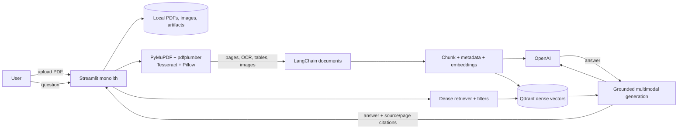

Actions: parse text/OCR/tables/images, index dense vectors, retrieve by filters,
generate an answer, and show citations. Constraints: the UI directly orchestrates
the pipeline; identity, relational metadata, durable chat, jobs, and production
telemetry do not exist. Phase 2 preserves the proven RAG behavior while adding
product and security boundaries.

## Phase 2 — secure product foundation

**Status:** Completed and accepted. Milestones 2.0.0–2.5, live multimodal model
acceptance, and authenticated visual review pass; the merged release is tagged
`mm-rag-v2.0.0`.

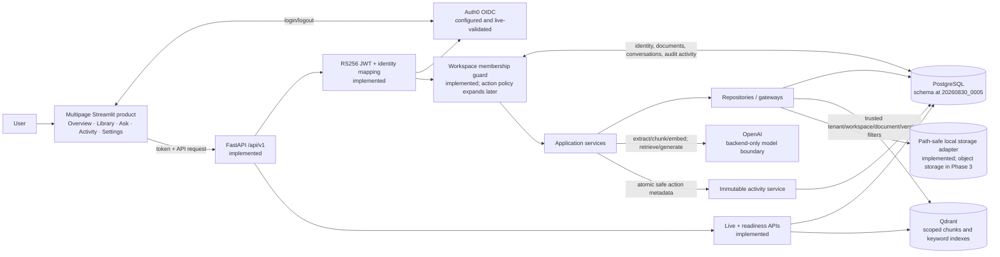

Phase actions: preserve/isolate V1; establish Python/Docker/configuration; add
FastAPI, logs, database pooling, Alembic, health APIs, Auth0/OIDC users and
workspaces; then add multi-document metadata and scoped vectors, backend-mediated RAG,
persistent conversations, multipage Streamlit, CI, negative tenant tests, and
demo hardening.

## Phase 3 — asynchronous ingestion and object storage

**Status:** Completed and accepted.
Migrations through `20260830_0008` implement durable jobs, fenced attempts,
transactional outbox events, immutable generations, and the active-generation
pointer. The streamed HTTP 202 intake, status/cancel/successor-retry API and UX,
confirmed RabbitMQ dispatcher, quorum queue/DLQ, fenced worker, heartbeat/recovery,
generation-aware Qdrant writes/retrieval, and SeaweedFS artifacts are connected.
The deterministic and local-service evidence is complete. One explicitly approved
signed-in real-OpenAI browser proof reached first-attempt immutable promotion and
returned a persisted grounded answer with a citation to that active generation.

```mermaid
flowchart LR
    client["Authorized client"] -->|"streamed upload + Idempotency-Key"| api["Async document API"]
    api --> policy["Workspace policy<br/>implemented"]
    policy -->|"verified immutable original"| objects[("S3 adapter + SeaweedFS local/CI<br/>Implemented and live-tested ADR 0011")]
    policy -->|"document version + job + event"| pg[("PostgreSQL authority<br/>implemented at 20260830_0008")]
    api -->|"HTTP 202 + stable job ID"| client
    pg --> outbox["Transactional outbox + dispatcher<br/>Implemented ADR 0009"]
    outbox --> queue["RabbitMQ quorum queue + DLQ<br/>Implemented ADR 0010"]
    queue --> worker["Fenced Python ingestion worker<br/>Implemented ADR 0012"]
    worker --> objects
    worker --> parse["Parse, OCR, extract"]
    parse --> enrich["Chunk, enrich, embed"]
    enrich -->|"attempt-scoped generation"| qdrant[("Qdrant")]
    enrich -->|"immutable manifest/artifacts"| objects
    worker -->|"progress, heartbeat, fenced promotion"| pg
    pg -->|"retry outbox event"| outbox
    queue -->|"attempts exhausted"| dead["Failed/dead-letter state"]
    client -->|"authorized status request"| api
    api --> pg
```

The API acknowledges quickly after the original and database transaction are durable.
The dispatcher publishes outside the request; workers treat messages as untrusted
wake-ups and reload/fence PostgreSQL state. A validated immutable generation becomes
visible through one active pointer, so failure or cancellation cannot expose partial
vectors. Aggregate operations, retention preview, process health, a representative
large upload, and a temporary PostgreSQL restore exercise complete Milestone 3.5's
free hardening evidence. The idle recovery loop refreshes readiness so heartbeat age
continues to detect a stalled worker even when no deliveries are in flight. The
signed-in acceptance proof additionally verifies the
live embedding, promotion, active-generation retrieval, citation, and persistence path.

## Phase 4 — fine-grained authorization and governance

**Status:** Completed and accepted. Milestones 4.0–4.5 were squash-merged through
PR #3 at `57ee453`; annotated tag `mm-rag-v4.0.0` preserves documentation closure
commit `996898e`. Phase 2 starts isolation and this phase deepens it with central policy,
ACL persistence, PostgreSQL RLS, mandatory Qdrant scope, canonical backend-mediated
object access, a fail-closed future connector permission contract, safe append-only
security review, checksummed compliance export, and tombstone-first lifecycle.

The review source is the
[Phase 4 policy matrix and threat model](PHASE4_POLICY_THREAT_MODEL.md). ADRs
0013–0017 are Accepted and implemented through migration `20260831_0013`.

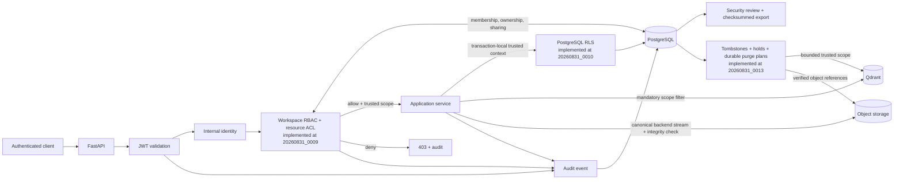

Backend-resolved identity and policy govern SQL, vectors, objects, citations,
conversations, and jobs. Negative tests must prove cross-tenant access fails.
Audit events record actor, action, resource, workspace, result, correlation ID,
and time without storing secrets or sensitive content.
Recoverable tombstones deny product access immediately. Owner-approved retention
plans remove vectors and verified object references before SQL metadata, checkpoint
partial progress, honor holds/live work, and retain a content-free completion record.

## Phase 5 — hybrid retrieval, fusion, and reranking

**Status:** Closed without acceptance under ADRs 0018–0024. The v1
through v4 paid candidates failed validation. V4 passed every evaluated validation
gate except the required 5% relative nDCG@10 gain, achieving 2.28%, so holdout and
product proof were withheld as designed. Its approval is consumed. `hybrid-v3`
remains evaluation-only and `hybrid-v1` remains default. The user approved ending
Phase 5 without promotion or another remediation cycle.

```mermaid
flowchart LR
    question["Authorized question + scope"] --> prep["Normalize query syntax"]
    prep --> route["Frozen hybrid-v3 route"]
    route --> filter["Trusted authorization filter"]
    filter --> dense["Dense semantic retrieval"]
    filter -->|exact / multi intent| sparse["Sparse lexical retrieval<br/>Qdrant BM25 implemented"]
    dense --> qdrant[("Qdrant")]
    sparse --> sindex[("Qdrant sparse vector<br/>implemented")]
    qdrant --> denseOrder["Dense order<br/>ordinary syntax"]
    qdrant --> fusion["Balanced application-owned RRF<br/>signaled syntax"]
    sindex --> fusion
    fusion --> dedupe["Deduplicate + diversify"]
    dedupe --> rerank["Bounded local cross-encoder<br/>optional profile"]
    denseOrder --> context["Token-budgeted evidence"]
    rerank --> context
    context --> generation["Grounded generation"]
    generation --> answer["Answer + ranked citations"]
    question -.-> evaluation["Retrieval evaluation"]
    fusion -.-> evaluation
    rerank -.-> evaluation
```

Authorization applies before every search. Evaluate Recall@k, MRR/nDCG,
groundedness, citation correctness, latency, and cost. Exit: the hybrid pipeline
measurably beats dense-only retrieval without weakening isolation or citations.

The implementation retains the reproducible v2 and v3 diagnostics and adds a hashed
120-chunk/80-query v4 benchmark and frozen dense profile,
the existing Qdrant 1.19 service with an IDF-enabled named BM25 sparse vector,
application-owned RRF over 30 candidates per authorized leg, a three-per-document
multi-source cap, and an optional local cross-encoder over at most 20 candidates.
Eight evidence items proceed to generation. Models are pinned and checksum-verified
before runtime; request handling never downloads artifacts. `dense-v1` is the safe
rollback, `hybrid-v1` is the default, and prior hybrid profiles remain unchanged.

The first paid candidate kept authorization and latency within bounds but could not
demonstrate the accepted relative quality gains because dense validation Recall@10
was already 1.0 on only 24 chunks. Accepted ADR 0022 preserves the thresholds,
versions a larger confounder corpus, rotates holdout evidence, and separates
out-of-scope identity safety from answer-level abstention. The implemented runner
scores validation first and produces no holdout metrics or output on failure.
Unanswerable retrieval emptiness is descriptive; grounded generation uses an
explicit insufficient-evidence result that carries no citations.

The approved 2026-09-02 v2 attempt preserved scope identity and latency but did not
improve validation quality: dense/hybrid Recall@10 was `0.9375`/`0.9375`, nDCG@10
was `0.8585`/`0.8572`, and MRR@10 was `0.8750`/`0.8542`. Since dense Recall@10 is
above `0.9091`, a 10% relative improvement is mathematically unreachable at depth
10 on this validation split. Tuning-only evidence also shows the equal-weight fused
profile helps multi-document queries but loses semantic-paraphrase recall. The next
step must be an explicit corpus/metric/candidate decision, not an automatic retry.

Accepted ADR 0023 is implemented with a ceiling-aware Recall@10 formula,
per-query-class non-regression floors, a fresh protected v3 evaluation revision, and
a deterministic `hybrid-v2` selector. The fingerprinted selector uses versioned query
syntax to choose dense-favoring or balanced RRF; it never uses judgment labels, an
LLM router, or client ranking authority. `hybrid-v1` remains the default while paid
evidence and rollout approval remain separate.

The single approved v3 run on 2026-09-02 embedded 2,516 tokens in one paid batch at
an estimated `$0.00005032`. On validation, dense/`hybrid-v2` Recall@10 was
`0.9167`/`0.9583`, nDCG@10 was `0.8667`/`0.9026`, and MRR@10 was
`0.9167`/`0.9583`. Class floors, identity safety, provider-call count, and latency
passed, but the 4.14% relative nDCG gain missed the required 5% target. The runner
therefore emitted no holdout result or end-to-end proof. The observed validation
must not become tuning evidence; any ranking or quality-contract change needs a new
versioned decision and protected evaluation revision.

Accepted ADR 0024 keeps every `phase5-quality-v2` threshold unchanged. Using only
v3 tuning evidence, it freezes `hybrid-v3-selector-v1`: ordinary query syntax keeps
dense order, while exact or multi-intent syntax selects balanced 1:1 RRF and the
pinned local cross-encoder. The selector cannot consume benchmark labels, expected
answers, client routing authority, retrieved content, or a model call. Its
fingerprint binds the syntax, fusion, 30/30/20/8 limits, diversity rule, and reranker
artifact. Missing sparse or reranker capability falls back to already authorized
dense or fused order.

The protected `phase5-retrieval-v4` fixture reuses only v3 tuning evidence under new
identities. All validation and holdout query text, judgments, and IDs are fresh and
hash-bound; validation rejects overlap with v3 protected evidence.

The single approved v4 run embedded 2,545 tokens in one paid batch for an estimated
`$0.00005090`. Validation dense/`hybrid-v3` Recall@10 was `1.0000`/`1.0000`,
nDCG@10 was `0.8439`/`0.8632`, and MRR@10 was `0.8500`/`0.8500`. Identity, class,
latency, and provider-call gates passed, but the 2.28% nDCG gain missed the required
5%. The runner emitted no holdout result or product proof, removed its temporary
collection, and did not retry. A changed candidate or contract now requires a new
reviewed ADR and fresh protected evidence.

The approved closure preserves this result as an honest failed quality gate rather
than treating the working RAG product as unsuccessful. No retrieval profile changed:
`hybrid-v1` remains default, `dense-v1` remains rollback, and `hybrid-v3` remains
evaluation-only. PR #5 was squash-merged into `main` at `5436614`; no Phase 5
release tag was created.

## Phase 6 — visual and table intelligence

**Status:** Completed and accepted. ADRs 0025–0030 and Milestones 6.0–6.5 are
implemented and verified. Signed-in application-shell/readiness/logout, corrected
representative visual retrieval, exact evidence inspection, safe abstention, and
numeric calculation pass. `visual-table-v1` is the accepted default and `disabled`
is the explicit rollback. Phase 5 text profiles remain unchanged. PR #7 was
squash-merged at `0eb0d16`, and release tagging remains a separate gate.

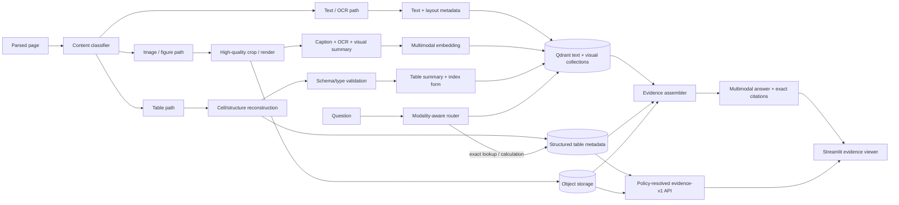

Every crop, cell, summary, and vector retains document-version, page, bounding
box, content ID, and extractor-version provenance. Exact calculations use
validated structure, not generated prose. Exit: figures and tables become
first-class retrievable, inspectable, and correctly cited evidence.

The accepted decision sequence is evaluation contract (ADR 0025), immutable
provenance (ADR 0026), local-first extraction/enrichment (ADR 0027), visual indexing
and retrieval (ADR 0028), structured tables and safe calculation (ADR 0029), then
evidence presentation and rollout (ADR 0030). All six are accepted; implementation
must follow those boundaries in milestone order.

The Milestone 6.0 corpus is a committed, synthetic public-safe benchmark with 40
regions and 80 questions divided 60/20/20 across tune, validation, and holdout.
Manifest hashes bind all inputs. The baseline exposes only tune/validation
aggregates, records zero provider calls, and enforces quality, identity, citation,
calculation, abstention, text-regression, latency, and cost gates before protected
holdout evaluation can run.

Migration `20260903_0014` makes PostgreSQL canonical for immutable, generation-
scoped region locators and artifact lineage. Normalized top-left coordinates retain
source page geometry; composite foreign keys bind workspace, document version,
generation, and creation attempt. Application/worker roles cannot mutate rows, and
API reads inherit document authorization through RLS. Binary and text artifacts
are conditionally written to both attempt and generation namespaces, verified by
size and SHA-256, and exposed only after the existing generation promotion.

The opt-in `structural-v1` adapter pins Docling `2.124.0`, Tesseract CLI English,
accurate TableFormer, and a checksum-bound local model tree. It generates page
renders, crops, captions, OCR/table text, and structured-table artifacts with remote
services and generated descriptions disabled. Standalone images use deterministic
Pillow conversion. Missing or changed model bytes fail closed before parsing.

The opt-in `visual-clip-v1` projection uses checksum-verified local FastEmbed CLIP
vision and text snapshots with fixed 512-dimensional cosine vectors. One global
visual collection remains separate from the accepted text collection. Region points
carry no object keys and include complete tenant/workspace/document/version/
generation/page/region/profile identity. Backend-built filters and returned-payload
validation enforce that scope before deterministic RRF. Text retrieval still runs
for every query; only versioned visual-intent syntax adds the visual leg, and every
visual error safely preserves the authorized text result.

Migrations `20260907_0015` and `20260907_0016` add immutable normalized tables and
calculation traces. Composite foreign keys bind each region, column, cell, and trace
to its workspace, document, version, generation, and creation attempt. PostgreSQL
RLS remains the tenant defense. Raw and normalized values, spans, headers, units,
currencies, coordinates, validation codes, and normalized JSON/CSV objects are
retained. Validation—not extractor identity—controls exact-calculation eligibility;
unusable structure keeps its visual/text evidence and is excluded from arithmetic.

The calculation route recognizes a closed intent vocabulary and resolves only
currently authorized active-generation tables. The application executes lookup,
count, sum, average, min/max, difference, or ratio with Decimal arithmetic and
versioned rounding. Ambiguous or incompatible operands, mixed units, unsupported
types, and division by zero abstain. Immutable traces record ordered cells and
results; arbitrary SQL, generated SQL, and request-time analytical engines are not
accepted.

The `evidence-v1` API resolves persisted citations through current conversation and
document policy and revalidates active generation, region/table/cell/trace identity,
plus object size, media type, and SHA-256 before streaming. It returns no bucket or
object key. The Streamlit viewer renders the page/crop, double-outlined region,
provenance-labeled text layers, semantic structured table with non-color-only cited
cells, and exact calculation details. Lifecycle inventory/purge spans both text and
visual Qdrant collections and all final/attempt artifact objects.

The frozen free synthetic candidate runs validation before holdout and passes both
with `1.0` Recall/MRR/nDCG@10, source coverage, exact calculation, and safe
abstention, zero identity/citation failures, zero provider calls, and nominal 2 ms
p95. These values prove the deterministic fixture contract only; they do not replace
signed-in browser evidence or establish production-data generalization.

The first bounded representative-product attempt stopped before Phase 6 extraction.
One tracked-PDF upload and one paid dense-embedding request exposed that Qdrant 1.19
cannot add the accepted sparse-vector name to the installation's legacy dense-only
text collection. No question call or automatic retry occurred. Runtime compatibility
now preserves that collection, emits dense-only points, and records the fallback in
the immutable generation manifest; retrieval already rejects sparse-incomplete
manifests and uses the authorized dense path. Newly created text collections still
receive both schemas. Migrating legacy vectors to a successor collection remains a
separate reviewed operation, so this fallback does not silently rewrite accepted
data or claim sparse availability. The corrected full repository and free live gates
pass with migration head `20260907_0016` and no schema drift.

The next bounded successor ingestion promoted successfully with text, visual, and
structured-table outputs. Text regression and evidence inspection passed, but an
explicit heatmap question was intercepted by the broad table lookup phrases
`which`/`what is` and safely abstained before retrieval. No third question ran.
Local CLIP/Qdrant diagnostics then returned the authorized page-12 heatmap figure
first and its companion table third, isolating the failure to routing precedence.
Conversation routing now gives explicit figure/chart/image intent priority over
generic lookup language; unsupported or ambiguous actual calculations continue to
abstain rather than fall through to generated arithmetic. This correction required
a separately authorized paid browser proof, which subsequently passed before
profile promotion.
The corrected repository and free live-service gates pass 263 and 276 tests
respectively, with no schema drift. Real-role dispatcher verification then exposed
that PostgreSQL must privilege-check the `documents` table referenced by the
`ingestion_jobs` RLS policy before evaluating its dispatcher-purpose branch.
Migration `20260907_0017` grants the dispatcher role narrow read access to satisfy
that policy dependency. Document RLS still exposes no document rows to that role,
while authorized ingestion-job selection succeeds and the dispatcher drains its
outbox normally.

The corrected signed-in browser proof then reused the promoted document and routed
the heatmap question through both authorized text and visual retrieval. It returned
Prime Friday with retention score 93, cited page 12, and resolved the exact stored
region, page crop, and structured companion table through `evidence-v1`. A final
question intentionally stopped at the safe-calculation boundary because its two
source cells contain narrative text rather than normalized numeric values; no model
provider was called for that abstention. A separate validated numeric table must be
used for the remaining exact-calculation proof.

The follow-up no-provider proof selected normalized integer cells `6904` and `1784`
from the validated page-23 amount table and returned the exact absolute difference
`5120`. `evidence-v1` marked both operand cells, resolved the stored region/page/crop,
and displayed the immutable calculation rule and rounding contract. This completed
the representative visual/table/calculation proof without an embedding or answer-
model call. The profile was subsequently promoted after explicit approval.

## Phase 7 — evaluation and observability

**Status:** Planned. Use a vendor-neutral telemetry boundary where practical.

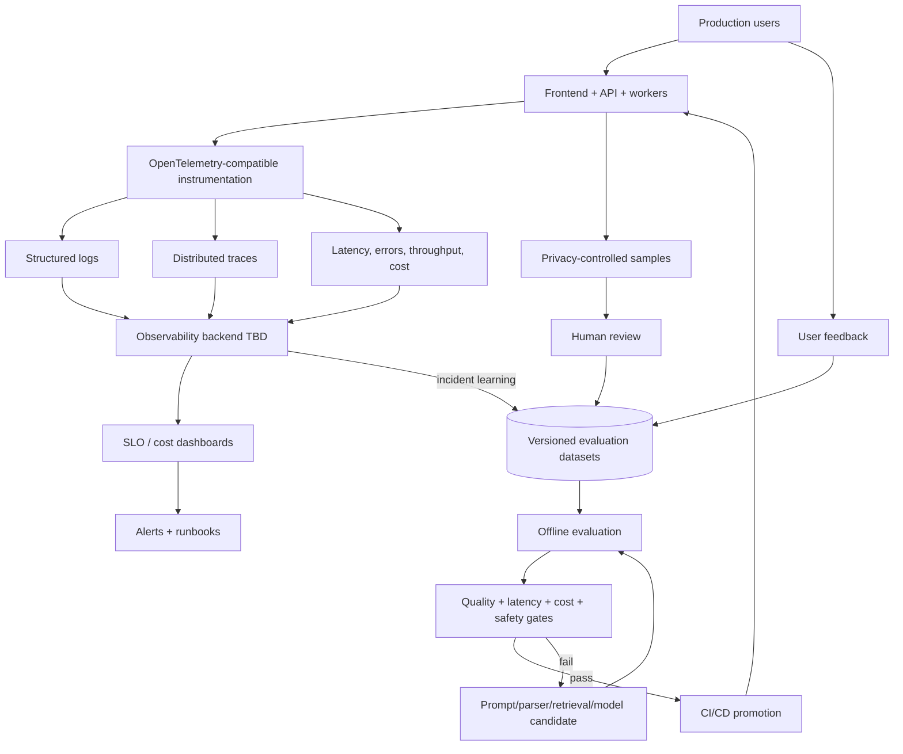

Propagate a correlation/trace ID across UI, API, jobs, retrieval, models, and
stores. Do not log tokens, secrets, raw documents, or unreviewed sensitive
content. Exit: the team can explain requests, detect failures, compare RAG
changes before release, and manage reliability, quality, latency, and cost.

## Phase 8 — scalable production platform

**Status:** Planned. Cloud, orchestration, and frontend framework are TBD.

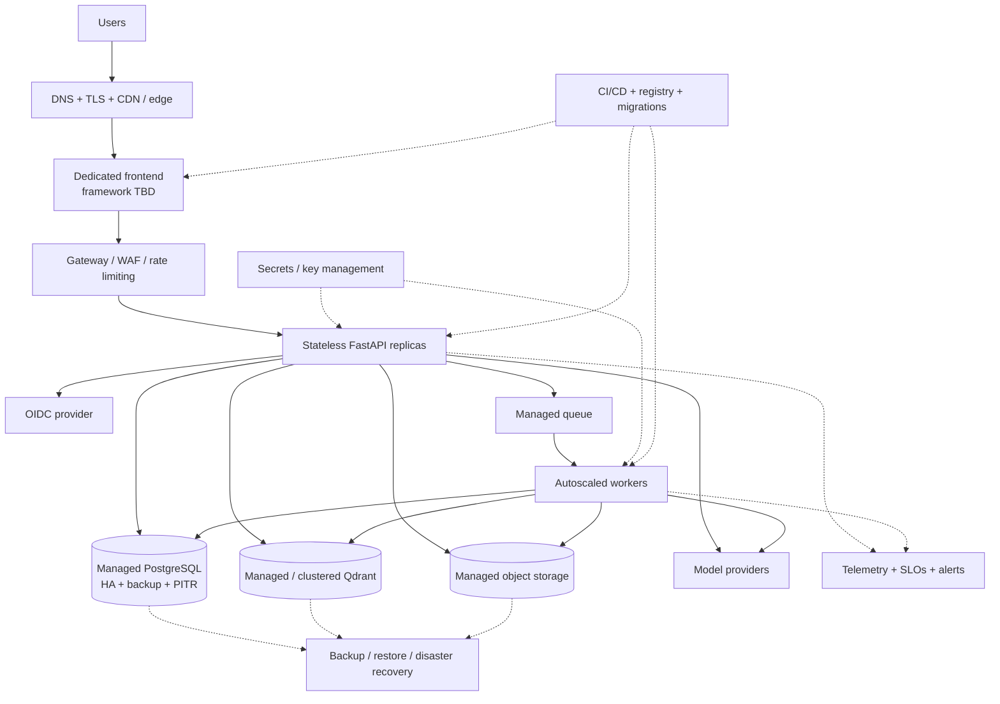

Frontend, API, and workers deploy and scale independently; durable state remains
in managed services. Timeouts, backpressure, graceful shutdown, reversible
releases, and tested restoration are mandatory. Microservices or multi-region
deployment require measured scale, reliability, ownership, or regulatory need.

## Phase 9 — enterprise integrations and commercial controls

**Status:** Planned. Connector and billing providers are TBD.

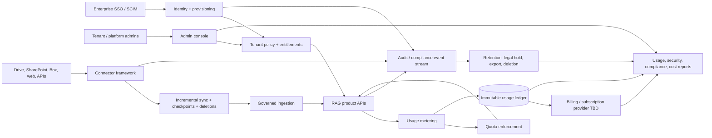

Connector credentials are tenant-isolated, least-privilege, rotated, and
revocable. Source permissions and deletions propagate into search. Metering is
immutable and quota enforcement is concurrency-safe. Subscription, entitlement,
and usage accounting remain separate. Exit: enterprises can provision users,
connect governed sources, control/audit usage, apply lifecycle policy, and
reconcile commercial usage.

## Architecture invariants

- FastAPI, never the frontend, is the authorization boundary.
- Tenant/workspace filters come only from authenticated backend context.
- PostgreSQL owns relational truth; Qdrant owns vectors/search payload; object
  storage owns original and derived binaries.
- Stable UUIDs and explicit document/index versions replace filenames as identity.
- Ingestion is idempotent, retryable, observable, and safe to resume.
- Repository/gateway interfaces isolate databases, storage, search, identity,
  and model providers from application services.
- Every answer is traceable to authorized source/page evidence.
- Alembic versions database schema; versioned routes protect API evolution.
- Security, accessibility, testing, telemetry, cost, and failure behavior apply
  in every phase.
- A modular monolith remains the default until evidence justifies another service.

## Open technology decisions

| Topic | Current position |
| --- | --- |
| Phase 2 UI | Streamlit multipage application |
| Dedicated Phase 8 UI | Candidate only; framework not selected |
| Queue / broker | Open-source RabbitMQ quorum queue/DLQ implemented under ADR 0010; production hosting deferred |
| Object storage | S3-compatible adapter plus open-source SeaweedFS local/CI implemented under ADR 0011; production provider deferred |
| Transactional outbox | PostgreSQL events plus confirmed leased dispatcher, retry/alert/retention operations implemented under ADR 0009 |
| Worker runtime | Purpose-built Python dispatcher/worker implemented under ADR 0012; one in-flight job per process |
| Fine-grained authorization | Central RBAC ceiling plus positive in-workspace user ACLs implemented under ADR 0013 at `20260831_0009` |
| PostgreSQL tenant defense | RLS beneath application policy implemented under ADR 0014 at `20260831_0010`; live role and pooled-tenant tests pass |
| Vector/object/async policy | Bounded Qdrant scope, returned-point validation, canonical object resolution, membership-removal behavior, and future connector permission snapshots implemented under ADR 0015 through `20260831_0011` |
| Security audit/export | Versioned safe events, runtime append-only enforcement, owner/admin review, and private checksummed export implemented under ADR 0016 at `20260831_0012` |
| Retention/deletion | Tombstone/restore, holds, exact preview/apply, checkpointed cross-store purge, and orphan reconciliation implemented under ADR 0017 at `20260831_0013`; automatic scheduling remains disabled |
| Retrieval evaluation | V2/v3 remain diagnostic; hashed v4 has 120 chunks/80 queries and fresh protected evidence. Its single paid validation missed only nDCG; holdout/proof were withheld and no retry is authorized |
| Sparse search | Qdrant named IDF-enabled BM25 vector with pinned local FastEmbed implemented under ADR 0019 |
| Fusion | Deterministic application-owned RRF, deduplication, diversification, and content-free traces implemented under ADR 0020 |
| Reranker | Pinned bounded local FastEmbed cross-encoder implemented as an opt-in profile with fused-order fallback under ADR 0021 |
| Phase 5 benchmark remediation | Larger v2 confounder corpus, rotated holdout, strict holdout sequencing, and clarified negative metrics implemented under ADR 0022; paid validation exposed a remaining quality/ceiling decision |
| Phase 5 quality/candidate follow-up | ADR 0023 remains diagnostic; ADR 0024's v4 candidate achieved 2.28% against the preserved 5% gate, and Phase 5 is closed without promotion |
| Phase 6 evaluation | ADR 0025 implemented with protected splits, deterministic validation-before-holdout gates, and a frozen free `visual-table-v1` candidate; paid/provider work remains explicit |
| Region/artifact provenance | ADR 0026 implemented at `20260903_0014`; PostgreSQL is canonical for immutable region/artifact lineage while binaries remain in object storage |
| Visual extraction/enrichment | ADR 0027 implemented local-first with pinned verified Docling/Tesseract/TableFormer and non-authoritative generated descriptions disabled |
| Visual embeddings/retrieval | ADR 0028 implemented opt-in: pinned checksum-bound FastEmbed CLIP pair, isolated global visual collection, complete scope validation, deterministic routing/RRF, and text fallback |
| Structured tables/calculation | ADR 0029 implemented at `20260907_0015`/`0016`: normalized validated cells, immutable traces, and a closed Decimal calculation allowlist; no generated SQL |
| Region evidence/viewer/rollout | ADR 0030 implementation adds backend-mediated `evidence-v1`, integrity-checked streaming, accessible inspection, and a disabled versioned profile; browser/promotion/release gates remain |
| Observability backend | OpenTelemetry-compatible boundary; vendor not selected |
| Deployment platform | Containerized and horizontally scalable; provider not selected |

Accepted Phase 2 decisions are recorded in
[`docs/architecture/decisions`](decisions/):

- [ADR 0001 — Auth0 through OpenID Connect](decisions/0001-auth0-oidc.md)
- [ADR 0002 — Initial workspace role model](decisions/0002-workspace-roles.md)
- [ADR 0003 — Local storage behind an object-storage interface](decisions/0003-local-storage-adapter.md)
- [ADR 0004 — Workspace-scoped document library and vector identity](decisions/0004-document-library-tenancy.md)
- [ADR 0005 — Backend-mediated RAG and scoped persistent conversations](decisions/0005-backend-rag-conversations.md)
- [ADR 0006 — Immutable workspace activity and automated release gates](decisions/0006-audit-and-release-gates.md)

Accepted Phase 3 decisions are:

- [ADR 0007 — Durable ingestion job and attempt state contract](decisions/0007-durable-ingestion-job-attempt-contract.md)
- [ADR 0008 — Ingestion idempotency and immutable output promotion](decisions/0008-ingestion-idempotency-output-promotion.md)
- [ADR 0009 — Transactional outbox dispatch and recovery boundary](decisions/0009-transactional-outbox-dispatch-boundary.md)
- [ADR 0010 — RabbitMQ ingestion broker](decisions/0010-rabbitmq-ingestion-broker.md)
- [ADR 0011 — S3-compatible object storage with SeaweedFS for local development](decisions/0011-s3-compatible-object-storage-seaweedfs.md)
- [ADR 0012 — Purpose-built Python dispatcher and ingestion worker runtime](decisions/0012-python-dispatcher-worker-runtime.md)

Accepted Phase 4 decisions are:

- [ADR 0013 — Central RBAC and resource ACL policy](decisions/0013-central-rbac-resource-acl-policy.md)
- [ADR 0014 — PostgreSQL row-level-security defense](decisions/0014-postgresql-row-level-security.md)
- [ADR 0015 — Authorized vector, object, and asynchronous access](decisions/0015-authorized-vector-object-async-access.md)
- [ADR 0016 — Security audit and compliance export](decisions/0016-security-audit-compliance-export.md)
- [ADR 0017 — Governed retention, deletion, encryption, and incident controls](decisions/0017-governed-retention-deletion-incident-controls.md)

Accepted Phase 5 decisions are:

- [ADR 0018 — Versioned retrieval evaluation and dense baseline](decisions/0018-retrieval-evaluation-dense-baseline.md)
- [ADR 0019 — Qdrant-native sparse retrieval](decisions/0019-qdrant-sparse-bm25-retrieval.md)
- [ADR 0020 — Deterministic reciprocal-rank fusion](decisions/0020-deterministic-rrf-fusion.md)
- [ADR 0021 — Bounded local cross-encoder reranking](decisions/0021-bounded-local-reranking.md)

Accepted Phase 5 follow-ups:

- [ADR 0022 — Phase 5 benchmark remediation and negative-query contract](decisions/0022-phase5-benchmark-remediation.md)
- [ADR 0023 — Ceiling-aware retrieval quality and deterministic candidate selection](decisions/0023-ceiling-aware-quality-and-candidate-selection.md)
- [ADR 0024 — Adaptive retrieval and fresh protected evidence](decisions/0024-adaptive-retrieval-and-fresh-protected-evidence.md)

Accepted Phase 6 decisions are:

- [ADR 0025 — Phase 6 visual and table evaluation contract](decisions/0025-phase6-visual-table-evaluation-contract.md)
- [ADR 0026 — Immutable region and derived-artifact provenance](decisions/0026-immutable-region-artifact-provenance.md)
- [ADR 0027 — Local-first visual extraction and enrichment](decisions/0027-local-first-visual-extraction-enrichment.md)
- [ADR 0028 — Visual embeddings, indexing, and modality-aware retrieval](decisions/0028-visual-embedding-index-retrieval.md)
- [ADR 0029 — Structured tables and safe exact calculation](decisions/0029-structured-tables-safe-calculation.md)
- [ADR 0030 — Region evidence, viewer, and Phase 6 rollout](decisions/0030-region-evidence-viewer-rollout.md)

## Maintenance checklist

1. Update the affected phase, diagram, status, and technology table.
2. Update the whole-system diagram when a cross-phase boundary or flow changes.
3. Record consequential Phase 6 decisions and rationale in the ignored
   `Phase6_context.md` active context document; keep earlier phase contexts historical.
4. Keep unapproved technologies labeled **Proposed / TBD**.
5. Verify Mermaid fences and links before committing.
6. Never place credentials, tokens, private URLs, customer data, or other secrets
   in this version-controlled document.
