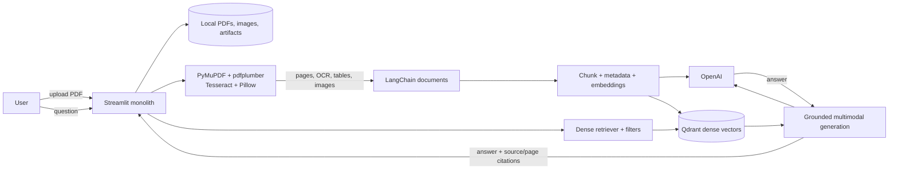
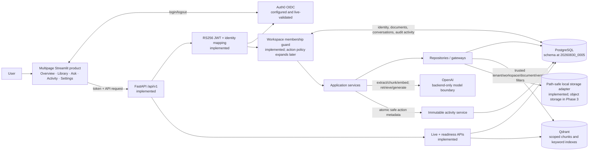
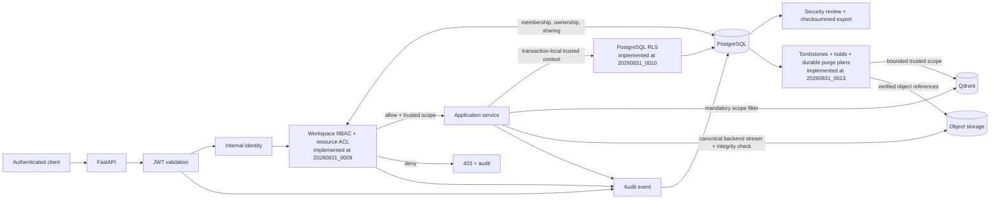
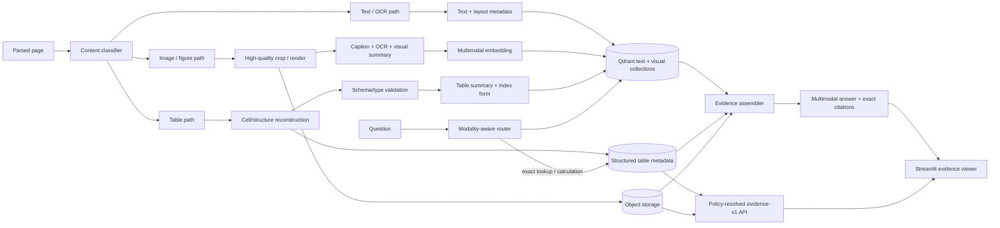
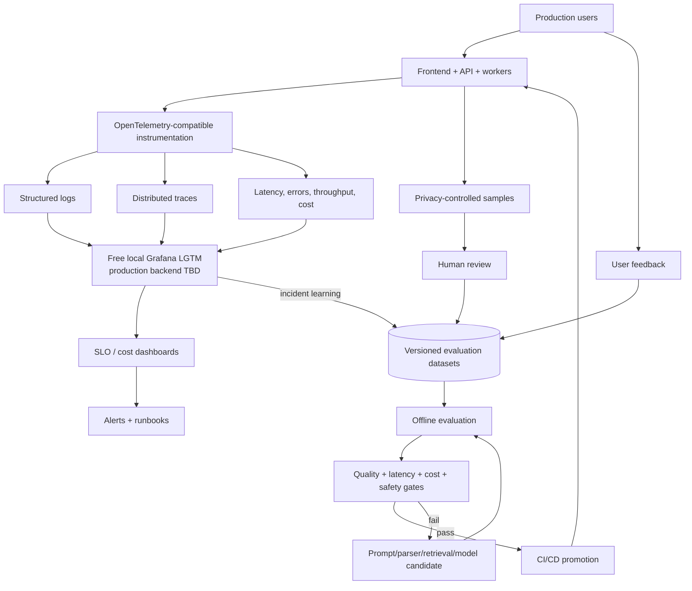
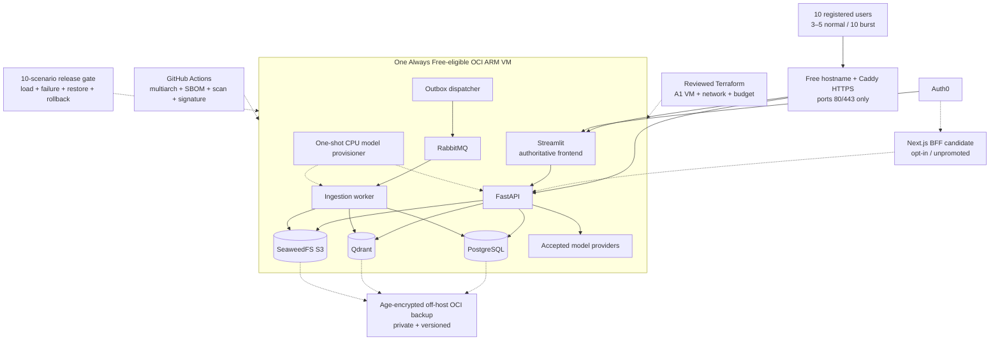
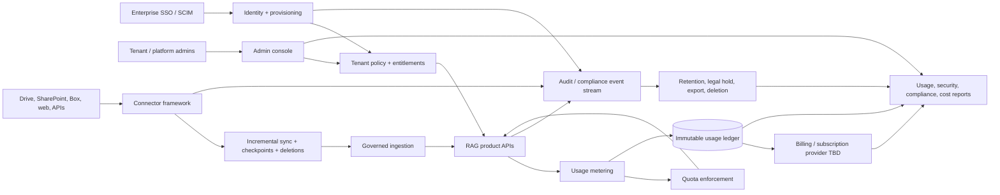
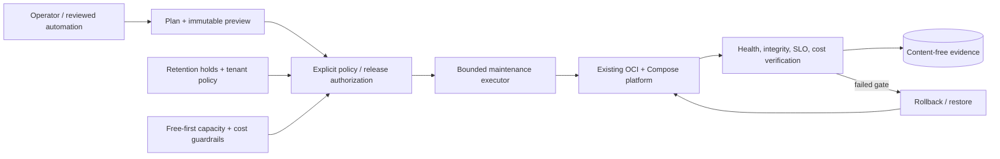
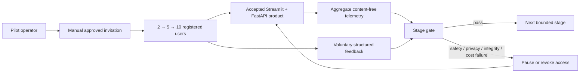

# Multimodal RAG architecture handbook

> Living architecture baseline — updated 2026-09-20

This document is the version-controlled architecture source of truth for the
complete system and Phases 1–11. Update it whenever a component, boundary, data
flow, technology decision, or phase status changes.

The companion [project plan](../PROJECT_PLAN.md) owns delivery sequence,
milestones, dependencies, completion gates, risks, and immediate next actions.

## Rendered architecture posters

Presentation-ready rendered diagrams are maintained in the
[architecture poster gallery](ARCHITECTURE_POSTERS.md). The gallery records the
accepted architecture through Phase 10. The Mermaid diagrams in this handbook are the
editable source of truth and now include the accepted Phase 11 pilot-control boundary;
rendered Phase 11 artwork remains future work.

The [current workflow and DEV architecture](current/mm-rag-current-workflow-dev-architecture.svg)
records the accepted Phase 6 product path plus the implemented Phase 7 evaluation
and observability layer. `visual-table-v1` remains the accepted product default and
`disabled` remains its explicit rollback. ADRs 0031–0036 are Accepted; Phase 7 is
accepted with its approved numeric pilot SLOs and complete seven-day representative
baseline. Two pre-fix days reproduced a duration/cardinality routing defect and are
retained as diagnostic history. The corrected route passed a post-merge browser proof
with the grounded 30-day answer and page-4 evidence; the post-fix baseline restarted
on 2026-09-08 with Day 1 of 7 recorded. The 2026-09-09 functional sample passed but is
not baseline evidence because its API process had telemetry disabled; export was enabled
and verified before the remaining scheduled days. The 2026-09-10 scheduled run paused
for renewed authentication, then resumed successfully and recorded post-fix Day 2 of 7.
The 2026-09-11 attempt passed service and telemetry preflight but stopped before paid
work because the browser session was invalid after an API restart. After renewed sign-in,
the same-day session passed visual, exact-table, and corrected duration checks without
upload or retry. Post-fix Day 3 of 7 is recorded; four valid daily records remain.
The 2026-09-12 attempt passed service and telemetry preflight but stopped before paid
work when the authoritative Overview check rejected the expired browser session. After
renewed sign-in, the same-day session passed visual, exact-table, and corrected duration
checks without upload or retry. Post-fix Day 4 of 7 is recorded; three valid days remain.
The 2026-09-13 attempt passed service and telemetry preflight but stopped before paid
work when the authoritative Overview check rejected the expired browser session. After
renewed sign-in, the same-day session passed visual, exact-table, and corrected duration
checks without upload or retry. Post-fix Day 5 of 7 is recorded; two valid days remain.

## Status legend

| Status | Meaning |
| --- | --- |
| Implemented | Present and verified in the current application lineage |
| In progress | Approved decision or implementation work has started but its phase gate has not passed |
| Planned | Intended capability or boundary that is not implemented yet |
| Proposed / TBD | Candidate design or technology requiring a decision |
| Closed without acceptance | Implementation ended without satisfying the phase gate or promoting its candidate |

The diagrams describe both current and target states. A displayed component is
not necessarily implemented; each phase states its status explicitly.

## Whole-system target architecture

```mermaid
flowchart LR
    user["End user"]
    admin["Workspace / platform admin"]
    sources["PDFs and enterprise sources"]

    subgraph access["Experience and access"]
        web["Web application<br/>Streamlit now; dedicated UI later"]
        edge["Gateway / load balancer<br/>Phase 8"]
        api["Versioned FastAPI API"]
        oidc["Auth0<br/>Managed OIDC identity provider"]
    end

    subgraph product["Identity, policy, and product services"]
        identity["JWT validation and identity mapping"]
        policy["Workspace RBAC / ACL policy"]
        documents["Documents and collections"]
        conversations["Conversations and RAG chat"]
        enterprise["Connectors, usage, quota, billing, audit"]
    end

    subgraph ingestion["Asynchronous ingestion"]
        intake["Upload / connector intake"]
        jobs["Durable job orchestration"]
        outbox["PostgreSQL outbox + confirmed dispatcher<br/>Implemented ADRs 0009/0012"]
        queue["RabbitMQ quorum queue + DLQ<br/>Implemented ADR 0010"]
        workers["Fenced Python ingestion workers<br/>Implemented ADR 0012"]
        parse["PyMuPDF + pdfplumber<br/>Tesseract + Pillow"]
        enrich["Text, table, and visual enrichment"]
        indexer["Embedding and index writer"]
    end

    subgraph rag["Retrieval and generation"]
        query["Authorized query orchestration"]
        dense["Dense / multimodal search"]
        sparse["Sparse / lexical search<br/>Qdrant BM25 accepted"]
        fusion["Deterministic RRF<br/>accepted"]
        rerank["Bounded local reranker<br/>accepted"]
        context["Evidence and citation builder"]
        model["OpenAI / governed model provider"]
    end

    subgraph stores["Persistent data services"]
        pg[("PostgreSQL<br/>identity, metadata, jobs, chat, audit")]
        qdrant[("Qdrant<br/>vectors + tenant-scoped payload")]
        objects[("S3-compatible object storage<br/>SeaweedFS local/CI implemented ADR 0011")]
    end

    subgraph ops["Quality, security, and operations"]
        telemetry["Logs, metrics, traces, cost"]
        evaluation["Datasets, feedback, evaluations"]
        cicd["CI/CD, migrations, security gates"]
        dashboards["SLO dashboards, alerts, runbooks"]
    end

    user -->|"sign in, upload, search, chat"| web
    admin -->|"members, policy, operations"| web
    web <-->|"OIDC authorization-code flow"| oidc
    web -->|"access token + request"| edge
    edge --> api
    api -->|"validate token"| identity
    identity --> oidc
    identity --> policy
    policy <-->|"trusted user/workspace context"| pg
    api --> documents
    api --> conversations
    api --> enterprise
    sources --> enterprise
    enterprise --> intake
    web -->|"upload"| intake
    intake -->|"store immutable original"| objects
    intake -->|"create document version + job"| jobs
    jobs <-->|"state, attempt, idempotency"| pg
    jobs --> outbox
    outbox --> queue
    queue --> workers
    workers --> parse
    parse --> enrich
    enrich -->|"derived visual/table artifacts"| objects
    enrich --> indexer
    indexer -->|"scoped vectors"| qdrant
    indexer -->|"version and index status"| pg
    conversations -->|"authorized scope"| query
    query --> policy
    query --> dense
    query --> sparse
    dense --> qdrant
    dense --> fusion
    sparse --> fusion
    fusion --> rerank
    rerank --> context
    context -->|"permitted grounded evidence"| model
    model -->|"streamed answer"| conversations
    conversations -->|"messages, citations, feedback"| pg
    conversations -->|"answer + source/page evidence"| api
    documents <-->|"metadata and lifecycle"| pg
    documents <-->|"authorized artifact access"| objects
    enterprise --> pg
    api -.-> telemetry
    workers -.-> telemetry
    model -.-> telemetry
    telemetry --> dashboards
    pg --> evaluation
    telemetry --> evaluation
    evaluation -->|"quality and release gates"| cicd
    cicd -->|"deploy and migrate"| api
    cicd -->|"deploy"| workers
```

### End-to-end actions and data flows

1. **Authenticate:** the frontend completes OIDC login and sends an access token;
   FastAPI validates it and resolves trusted user, workspace, and role context.
2. **Ingest:** upload or connector intake stores an immutable original, creates an
   idempotent job, parses and enriches content, and writes versioned metadata to
   PostgreSQL and scoped vectors to Qdrant.
3. **Answer:** FastAPI authorizes scope, runs dense and later sparse retrieval,
   fuses and reranks evidence, sends permitted context to the model, and persists
   the grounded answer and citations.
4. **Govern:** authorization, audit, quota, retention, and observability apply to
   both ingestion and query paths rather than being frontend-only checks.
5. **Improve:** traces, feedback, and curated datasets feed repeatable evaluation
   and CI/CD release gates.

## Phase map

```mermaid
flowchart LR
    p1["Phase 1<br/>Prototype<br/>Implemented"] -->
    p2["Phase 2<br/>Product foundation<br/>Completed"] -->
    p3["Phase 3<br/>Async ingestion<br/>Completed"] -->
    p4["Phase 4<br/>Governance foundation<br/>Completed / v4.0.0"] -->
    p5["Phase 5<br/>Hybrid retrieval<br/>Closed / gate not met"] -->
    p6["Phase 6<br/>Visual/table intelligence<br/>Completed / accepted"] -->
    p7["Phase 7<br/>Evaluation/observability<br/>Accepted"] -->
    p8["Phase 8<br/>Scalable platform<br/>Accepted"] -->
    p9["Phase 9<br/>Enterprise platform<br/>Accepted"] -->
    p10["Phase 10<br/>Operational hardening<br/>Completed / v10.0.0"] -->
    p11["Phase 11<br/>Invitation-only pilot<br/>In progress"]
```

| Phase | Capability | Main technologies/components | Stores | Status |
| --- | --- | --- | --- | --- |
| 1 | Working multimodal RAG prototype | Streamlit, LangChain, PyMuPDF, Tesseract, pdfplumber, OpenAI | Qdrant, local files | Implemented and frozen |
| 2 | Backend, identity, workspaces, multi-document product | FastAPI, Pydantic, SQLAlchemy, psycopg, Alembic, Auth0/OIDC, Streamlit | PostgreSQL, Qdrant, temporary files | Completed and accepted; live multimodal model and visual acceptance passed |
| 3 | Durable asynchronous processing | Streamed async API, durable jobs/outbox, RabbitMQ, dispatcher, fenced worker, immutable generations, progress/control UX | PostgreSQL, S3-compatible SeaweedFS, generation-scoped Qdrant | Completed and accepted at `20260830_0008`; signed-in paid promotion/retrieval proof passed |
| 4 | Fine-grained isolation and governance | Central RBAC/ACL, RLS, vector/object enforcement, permission snapshots, security audit/export, and durable lifecycle | PostgreSQL, Qdrant, object storage | Completed and preserved at `mm-rag-v4.0.0` |
| 5 | Higher-quality retrieval | Versioned evaluation, dense baseline, sparse BM25, deterministic RRF, bounded reranker | Qdrant plus pinned local FastEmbed inference | Closed without acceptance; v4 nDCG gate missed and no candidate was promoted |
| 6 | Native image and table understanding | Local-first region extraction, visual retrieval, structured tables, safe calculation, and evidence viewer | Qdrant, PostgreSQL, object storage | Completed and accepted; `visual-table-v1` promoted after free/live and signed-in candidate proof |
| 7 | Measurable quality and reliability | OpenTelemetry-compatible boundary, eval harness, dashboards | Local telemetry and protected evaluation evidence | Completed and accepted |
| 8 | Production-shaped learning deployment | Caddy, Streamlit, API/workers, private Compose services | Self-hosted PostgreSQL/Qdrant/SeaweedFS/RabbitMQ; encrypted OCI backup | Completed and accepted on the free-first Phoenix learning deployment |
| 9 | Enterprise and commercial controls | Connectors, metering, billing, SSO/SCIM, compliance | PostgreSQL and provider systems | Completed and accepted at the provider-neutral learning boundary; bounded Google Drive proof passes |
| 10 | Operational hardening and lifecycle operations | Backup verification, retention orchestration, maintenance gates, capacity/cost controls, recovery automation | Existing OCI/Compose platform and content-free operational evidence | Completed and accepted; all eight evidence scenarios pass |
| 11 | Invitation-only product pilot | Controlled onboarding, measured product journeys, voluntary feedback, support and staged rollout | Existing product and content-free/consented pilot evidence | In progress; two-account technical rehearsal authorized, formal user validation blocked |

## Phase 1 — working prototype

**Status:** Implemented, tagged, and frozen as the V1 recovery baseline.

```mermaid
flowchart LR
    user["User"] -->|"upload PDF"| ui["Streamlit monolith"]
    ui --> files[("Local PDFs, images, artifacts")]
    ui --> parse["PyMuPDF + pdfplumber<br/>Tesseract + Pillow"]
    parse -->|"pages, OCR, tables, images"| langchain["LangChain documents"]
    langchain --> ingest["Chunk + metadata + embeddings"]
    ingest --> openai["OpenAI"]
    ingest --> qdrant[("Qdrant dense vectors")]
    user -->|"question"| ui
    ui --> retrieve["Dense retriever + filters"]
    retrieve --> qdrant
    qdrant --> generate["Grounded multimodal generation"]
    generate --> openai
    openai -->|"answer"| generate
    generate -->|"answer + source/page citations"| ui
```

Actions: parse text/OCR/tables/images, index dense vectors, retrieve by filters,
generate an answer, and show citations. Constraints: the UI directly orchestrates
the pipeline; identity, relational metadata, durable chat, jobs, and production
telemetry do not exist. Phase 2 preserves the proven RAG behavior while adding
product and security boundaries.

## Phase 2 — secure product foundation

**Status:** Completed and accepted. Milestones 2.0.0–2.5, live multimodal model
acceptance, and authenticated visual review pass; the merged release is tagged
`mm-rag-v2.0.0`.

```mermaid
flowchart LR
    user["User"] --> st["Multipage Streamlit product<br/>Overview · Library · Ask · Activity · Settings"]
    st <-->|"login/logout"| idp["Auth0 OIDC<br/>configured and live-validated"]
    st -->|"token + API request"| routes["FastAPI /api/v1<br/>implemented"]
    routes --> authn["RS256 JWT + identity mapping<br/>implemented"]
    authn --> idp
    authn --> authz["Workspace membership guard<br/>implemented; action policy expands later"]
    authz <-->|"identity, documents, conversations, audit activity"| pg[("PostgreSQL<br/>schema at 20260830_0005")]
    authz --> services["Application services"]
    services --> repos["Repositories / gateways"]
    repos --> pg
    repos -->|"trusted tenant/workspace/document/version filters"| qd[("Qdrant<br/>scoped chunks and keyword indexes")]
    repos --> files[("Path-safe local storage adapter<br/>implemented; object storage in Phase 3")]
    services -->|"extract/chunk/embed; retrieve/generate"| openai["OpenAI<br/>backend-only model boundary"]
    health["Live + readiness APIs<br/>implemented"] --> pg
    health --> qd
    routes --> health
    services -->|"atomic safe action metadata"| audit["Immutable activity service"]
    audit --> pg
```

Phase actions: preserve/isolate V1; establish Python/Docker/configuration; add
FastAPI, logs, database pooling, Alembic, health APIs, Auth0/OIDC users and
workspaces; then add multi-document metadata and scoped vectors, backend-mediated RAG,
persistent conversations, multipage Streamlit, CI, negative tenant tests, and
demo hardening.

## Phase 3 — asynchronous ingestion and object storage

**Status:** Completed and accepted.
Migrations through `20260830_0008` implement durable jobs, fenced attempts,
transactional outbox events, immutable generations, and the active-generation
pointer. The streamed HTTP 202 intake, status/cancel/successor-retry API and UX,
confirmed RabbitMQ dispatcher, quorum queue/DLQ, fenced worker, heartbeat/recovery,
generation-aware Qdrant writes/retrieval, and SeaweedFS artifacts are connected.
The deterministic and local-service evidence is complete. One explicitly approved
signed-in real-OpenAI browser proof reached first-attempt immutable promotion and
returned a persisted grounded answer with a citation to that active generation.

```mermaid
flowchart LR
    client["Authorized client"] -->|"streamed upload + Idempotency-Key"| api["Async document API"]
    api --> policy["Workspace policy<br/>implemented"]
    policy -->|"verified immutable original"| objects[("S3 adapter + SeaweedFS local/CI<br/>Implemented and live-tested ADR 0011")]
    policy -->|"document version + job + event"| pg[("PostgreSQL authority<br/>implemented at 20260830_0008")]
    api -->|"HTTP 202 + stable job ID"| client
    pg --> outbox["Transactional outbox + dispatcher<br/>Implemented ADR 0009"]
    outbox --> queue["RabbitMQ quorum queue + DLQ<br/>Implemented ADR 0010"]
    queue --> worker["Fenced Python ingestion worker<br/>Implemented ADR 0012"]
    worker --> objects
    worker --> parse["Parse, OCR, extract"]
    parse --> enrich["Chunk, enrich, embed"]
    enrich -->|"attempt-scoped generation"| qdrant[("Qdrant")]
    enrich -->|"immutable manifest/artifacts"| objects
    worker -->|"progress, heartbeat, fenced promotion"| pg
    pg -->|"retry outbox event"| outbox
    queue -->|"attempts exhausted"| dead["Failed/dead-letter state"]
    client -->|"authorized status request"| api
    api --> pg
```

The API acknowledges quickly after the original and database transaction are durable.
The dispatcher publishes outside the request; workers treat messages as untrusted
wake-ups and reload/fence PostgreSQL state. A validated immutable generation becomes
visible through one active pointer, so failure or cancellation cannot expose partial
vectors. Aggregate operations, retention preview, process health, a representative
large upload, and a temporary PostgreSQL restore exercise complete Milestone 3.5's
free hardening evidence. The idle recovery loop refreshes readiness so heartbeat age
continues to detect a stalled worker even when no deliveries are in flight. The
signed-in acceptance proof additionally verifies the
live embedding, promotion, active-generation retrieval, citation, and persistence path.

## Phase 4 — fine-grained authorization and governance

**Status:** Completed and accepted. Milestones 4.0–4.5 were squash-merged through
PR #3 at `57ee453`; annotated tag `mm-rag-v4.0.0` preserves documentation closure
commit `996898e`. Phase 2 starts isolation and this phase deepens it with central policy,
ACL persistence, PostgreSQL RLS, mandatory Qdrant scope, canonical backend-mediated
object access, a fail-closed future connector permission contract, safe append-only
security review, checksummed compliance export, and tombstone-first lifecycle.

The review source is the
[Phase 4 policy matrix and threat model](PHASE4_POLICY_THREAT_MODEL.md). ADRs
0013–0017 are Accepted and implemented through migration `20260831_0013`.

```mermaid
flowchart LR
    client["Authenticated client"] --> api["FastAPI"]
    api --> jwt["JWT validation"]
    jwt --> identity["Internal identity"]
    identity --> policy["Workspace RBAC + resource ACL<br/>implemented at 20260831_0009"]
    policy <-->|"membership, ownership, sharing"| pg[("PostgreSQL")]
    policy -->|"allow + trusted scope"| service["Application service"]
    policy -->|"deny"| denied["403 + audit"]
    service -->|"transaction-local trusted context"| rls["PostgreSQL RLS<br/>implemented at 20260831_0010"]
    rls --> pg
    service -->|"mandatory scope filter"| qdrant[("Qdrant")]
    service -->|"canonical backend stream + integrity check"| objects[("Object storage")]
    jwt --> audit["Audit event"]
    policy --> audit
    service --> audit
    audit --> pg
    pg --> compliance["Security review + checksummed export"]
    pg --> lifecycle["Tombstones + holds + durable purge plans<br/>implemented at 20260831_0013"]
    lifecycle -->|"bounded trusted scope"| qdrant
    lifecycle -->|"verified object references"| objects
```

Backend-resolved identity and policy govern SQL, vectors, objects, citations,
conversations, and jobs. Negative tests must prove cross-tenant access fails.
Audit events record actor, action, resource, workspace, result, correlation ID,
and time without storing secrets or sensitive content.
Recoverable tombstones deny product access immediately. Owner-approved retention
plans remove vectors and verified object references before SQL metadata, checkpoint
partial progress, honor holds/live work, and retain a content-free completion record.

## Phase 5 — hybrid retrieval, fusion, and reranking

**Status:** Closed without acceptance under ADRs 0018–0024. The v1
through v4 paid candidates failed validation. V4 passed every evaluated validation
gate except the required 5% relative nDCG@10 gain, achieving 2.28%, so holdout and
product proof were withheld as designed. Its approval is consumed. `hybrid-v3`
remains evaluation-only and `hybrid-v1` remains default. The user approved ending
Phase 5 without promotion or another remediation cycle.

```mermaid
flowchart LR
    question["Authorized question + scope"] --> prep["Normalize query syntax"]
    prep --> route["Frozen hybrid-v3 route"]
    route --> filter["Trusted authorization filter"]
    filter --> dense["Dense semantic retrieval"]
    filter -->|exact / multi intent| sparse["Sparse lexical retrieval<br/>Qdrant BM25 implemented"]
    dense --> qdrant[("Qdrant")]
    sparse --> sindex[("Qdrant sparse vector<br/>implemented")]
    qdrant --> denseOrder["Dense order<br/>ordinary syntax"]
    qdrant --> fusion["Balanced application-owned RRF<br/>signaled syntax"]
    sindex --> fusion
    fusion --> dedupe["Deduplicate + diversify"]
    dedupe --> rerank["Bounded local cross-encoder<br/>optional profile"]
    denseOrder --> context["Token-budgeted evidence"]
    rerank --> context
    context --> generation["Grounded generation"]
    generation --> answer["Answer + ranked citations"]
    question -.-> evaluation["Retrieval evaluation"]
    fusion -.-> evaluation
    rerank -.-> evaluation
```

Authorization applies before every search. Evaluate Recall@k, MRR/nDCG,
groundedness, citation correctness, latency, and cost. Exit: the hybrid pipeline
measurably beats dense-only retrieval without weakening isolation or citations.

The implementation retains the reproducible v2 and v3 diagnostics and adds a hashed
120-chunk/80-query v4 benchmark and frozen dense profile,
the existing Qdrant 1.19 service with an IDF-enabled named BM25 sparse vector,
application-owned RRF over 30 candidates per authorized leg, a three-per-document
multi-source cap, and an optional local cross-encoder over at most 20 candidates.
Eight evidence items proceed to generation. Models are pinned and checksum-verified
before runtime; request handling never downloads artifacts. `dense-v1` is the safe
rollback, `hybrid-v1` is the default, and prior hybrid profiles remain unchanged.

The first paid candidate kept authorization and latency within bounds but could not
demonstrate the accepted relative quality gains because dense validation Recall@10
was already 1.0 on only 24 chunks. Accepted ADR 0022 preserves the thresholds,
versions a larger confounder corpus, rotates holdout evidence, and separates
out-of-scope identity safety from answer-level abstention. The implemented runner
scores validation first and produces no holdout metrics or output on failure.
Unanswerable retrieval emptiness is descriptive; grounded generation uses an
explicit insufficient-evidence result that carries no citations.

The approved 2026-09-02 v2 attempt preserved scope identity and latency but did not
improve validation quality: dense/hybrid Recall@10 was `0.9375`/`0.9375`, nDCG@10
was `0.8585`/`0.8572`, and MRR@10 was `0.8750`/`0.8542`. Since dense Recall@10 is
above `0.9091`, a 10% relative improvement is mathematically unreachable at depth
10 on this validation split. Tuning-only evidence also shows the equal-weight fused
profile helps multi-document queries but loses semantic-paraphrase recall. The next
step must be an explicit corpus/metric/candidate decision, not an automatic retry.

Accepted ADR 0023 is implemented with a ceiling-aware Recall@10 formula,
per-query-class non-regression floors, a fresh protected v3 evaluation revision, and
a deterministic `hybrid-v2` selector. The fingerprinted selector uses versioned query
syntax to choose dense-favoring or balanced RRF; it never uses judgment labels, an
LLM router, or client ranking authority. `hybrid-v1` remains the default while paid
evidence and rollout approval remain separate.

The single approved v3 run on 2026-09-02 embedded 2,516 tokens in one paid batch at
an estimated `$0.00005032`. On validation, dense/`hybrid-v2` Recall@10 was
`0.9167`/`0.9583`, nDCG@10 was `0.8667`/`0.9026`, and MRR@10 was
`0.9167`/`0.9583`. Class floors, identity safety, provider-call count, and latency
passed, but the 4.14% relative nDCG gain missed the required 5% target. The runner
therefore emitted no holdout result or end-to-end proof. The observed validation
must not become tuning evidence; any ranking or quality-contract change needs a new
versioned decision and protected evaluation revision.

Accepted ADR 0024 keeps every `phase5-quality-v2` threshold unchanged. Using only
v3 tuning evidence, it freezes `hybrid-v3-selector-v1`: ordinary query syntax keeps
dense order, while exact or multi-intent syntax selects balanced 1:1 RRF and the
pinned local cross-encoder. The selector cannot consume benchmark labels, expected
answers, client routing authority, retrieved content, or a model call. Its
fingerprint binds the syntax, fusion, 30/30/20/8 limits, diversity rule, and reranker
artifact. Missing sparse or reranker capability falls back to already authorized
dense or fused order.

The protected `phase5-retrieval-v4` fixture reuses only v3 tuning evidence under new
identities. All validation and holdout query text, judgments, and IDs are fresh and
hash-bound; validation rejects overlap with v3 protected evidence.

The single approved v4 run embedded 2,545 tokens in one paid batch for an estimated
`$0.00005090`. Validation dense/`hybrid-v3` Recall@10 was `1.0000`/`1.0000`,
nDCG@10 was `0.8439`/`0.8632`, and MRR@10 was `0.8500`/`0.8500`. Identity, class,
latency, and provider-call gates passed, but the 2.28% nDCG gain missed the required
5%. The runner emitted no holdout result or product proof, removed its temporary
collection, and did not retry. A changed candidate or contract now requires a new
reviewed ADR and fresh protected evidence.

The approved closure preserves this result as an honest failed quality gate rather
than treating the working RAG product as unsuccessful. No retrieval profile changed:
`hybrid-v1` remains default, `dense-v1` remains rollback, and `hybrid-v3` remains
evaluation-only. PR #5 was squash-merged into `main` at `5436614`; no Phase 5
release tag was created.

## Phase 6 — visual and table intelligence

**Status:** Completed and accepted. ADRs 0025–0030 and Milestones 6.0–6.5 are
implemented and verified. Signed-in application-shell/readiness/logout, corrected
representative visual retrieval, exact evidence inspection, safe abstention, and
numeric calculation pass. `visual-table-v1` is the accepted default and `disabled`
is the explicit rollback. Phase 5 text profiles remain unchanged. PR #7 was
squash-merged at `0eb0d16`; annotated tag `mm-rag-v6.0.0` marks verified closure
commit `d97e8e8`.

```mermaid
flowchart LR
    page["Parsed page"] --> classify["Content classifier"]
    classify --> text["Text / OCR path"]
    classify --> image["Image / figure path"]
    classify --> table["Table path"]
    text --> chunks["Text + layout metadata"]
    image --> crop["High-quality crop / render"]
    crop --> vision["Caption + OCR + visual summary"]
    vision --> ivec["Multimodal embedding"]
    table --> structure["Cell/structure reconstruction"]
    structure --> validate["Schema/type validation"]
    validate --> tsummary["Table summary + index form"]
    chunks --> qdrant[("Qdrant text + visual collections")]
    ivec --> qdrant
    tsummary --> qdrant
    crop --> objects[("Object storage")]
    structure --> pg[("Structured table metadata")]
    query["Question"] --> route["Modality-aware router"]
    route --> qdrant
    route -->|"exact lookup / calculation"| pg
    qdrant --> evidence["Evidence assembler"]
    pg --> evidence
    objects --> evidence
    evidence --> answer["Multimodal answer + exact citations"]
    answer --> viewer["Streamlit evidence viewer"]
    pg --> evidenceApi["Policy-resolved evidence-v1 API"]
    objects --> evidenceApi
    evidenceApi --> viewer
```

Every crop, cell, summary, and vector retains document-version, page, bounding
box, content ID, and extractor-version provenance. Exact calculations use
validated structure, not generated prose. Exit: figures and tables become
first-class retrievable, inspectable, and correctly cited evidence.

The accepted decision sequence is evaluation contract (ADR 0025), immutable
provenance (ADR 0026), local-first extraction/enrichment (ADR 0027), visual indexing
and retrieval (ADR 0028), structured tables and safe calculation (ADR 0029), then
evidence presentation and rollout (ADR 0030). All six are accepted; implementation
must follow those boundaries in milestone order.

The Milestone 6.0 corpus is a committed, synthetic public-safe benchmark with 40
regions and 80 questions divided 60/20/20 across tune, validation, and holdout.
Manifest hashes bind all inputs. The baseline exposes only tune/validation
aggregates, records zero provider calls, and enforces quality, identity, citation,
calculation, abstention, text-regression, latency, and cost gates before protected
holdout evaluation can run.

Migration `20260903_0014` makes PostgreSQL canonical for immutable, generation-
scoped region locators and artifact lineage. Normalized top-left coordinates retain
source page geometry; composite foreign keys bind workspace, document version,
generation, and creation attempt. Application/worker roles cannot mutate rows, and
API reads inherit document authorization through RLS. Binary and text artifacts
are conditionally written to both attempt and generation namespaces, verified by
size and SHA-256, and exposed only after the existing generation promotion.

The opt-in `structural-v1` adapter pins Docling `2.124.0`, Tesseract CLI English,
accurate TableFormer, and a checksum-bound local model tree. It generates page
renders, crops, captions, OCR/table text, and structured-table artifacts with remote
services and generated descriptions disabled. Standalone images use deterministic
Pillow conversion. Missing or changed model bytes fail closed before parsing.

The opt-in `visual-clip-v1` projection uses checksum-verified local FastEmbed CLIP
vision and text snapshots with fixed 512-dimensional cosine vectors. One global
visual collection remains separate from the accepted text collection. Region points
carry no object keys and include complete tenant/workspace/document/version/
generation/page/region/profile identity. Backend-built filters and returned-payload
validation enforce that scope before deterministic RRF. Text retrieval still runs
for every query; only versioned visual-intent syntax adds the visual leg, and every
visual error safely preserves the authorized text result.

Migrations `20260907_0015` and `20260907_0016` add immutable normalized tables and
calculation traces. Composite foreign keys bind each region, column, cell, and trace
to its workspace, document, version, generation, and creation attempt. PostgreSQL
RLS remains the tenant defense. Raw and normalized values, spans, headers, units,
currencies, coordinates, validation codes, and normalized JSON/CSV objects are
retained. Validation—not extractor identity—controls exact-calculation eligibility;
unusable structure keeps its visual/text evidence and is excluded from arithmetic.

The calculation route recognizes a closed intent vocabulary and resolves only
currently authorized active-generation tables. The application executes lookup,
count, sum, average, min/max, difference, or ratio with Decimal arithmetic and
versioned rounding. Ambiguous or incompatible operands, mixed units, unsupported
types, and division by zero abstain. Immutable traces record ordered cells and
results; arbitrary SQL, generated SQL, and request-time analytical engines are not
accepted.

The `evidence-v1` API resolves persisted citations through current conversation and
document policy and revalidates active generation, region/table/cell/trace identity,
plus object size, media type, and SHA-256 before streaming. It returns no bucket or
object key. The Streamlit viewer renders the page/crop, double-outlined region,
provenance-labeled text layers, semantic structured table with non-color-only cited
cells, and exact calculation details. Lifecycle inventory/purge spans both text and
visual Qdrant collections and all final/attempt artifact objects.

The frozen free synthetic candidate runs validation before holdout and passes both
with `1.0` Recall/MRR/nDCG@10, source coverage, exact calculation, and safe
abstention, zero identity/citation failures, zero provider calls, and nominal 2 ms
p95. These values prove the deterministic fixture contract only; they do not replace
signed-in browser evidence or establish production-data generalization.

The first bounded representative-product attempt stopped before Phase 6 extraction.
One tracked-PDF upload and one paid dense-embedding request exposed that Qdrant 1.19
cannot add the accepted sparse-vector name to the installation's legacy dense-only
text collection. No question call or automatic retry occurred. Runtime compatibility
now preserves that collection, emits dense-only points, and records the fallback in
the immutable generation manifest; retrieval already rejects sparse-incomplete
manifests and uses the authorized dense path. Newly created text collections still
receive both schemas. Migrating legacy vectors to a successor collection remains a
separate reviewed operation, so this fallback does not silently rewrite accepted
data or claim sparse availability. The corrected full repository and free live gates
pass with migration head `20260907_0016` and no schema drift.

The next bounded successor ingestion promoted successfully with text, visual, and
structured-table outputs. Text regression and evidence inspection passed, but an
explicit heatmap question was intercepted by the broad table lookup phrases
`which`/`what is` and safely abstained before retrieval. No third question ran.
Local CLIP/Qdrant diagnostics then returned the authorized page-12 heatmap figure
first and its companion table third, isolating the failure to routing precedence.
Conversation routing now gives explicit figure/chart/image intent priority over
generic lookup language; unsupported or ambiguous actual calculations continue to
abstain rather than fall through to generated arithmetic. This correction required
a separately authorized paid browser proof, which subsequently passed before
profile promotion.
The corrected repository and free live-service gates pass 263 and 276 tests
respectively, with no schema drift. Real-role dispatcher verification then exposed
that PostgreSQL must privilege-check the `documents` table referenced by the
`ingestion_jobs` RLS policy before evaluating its dispatcher-purpose branch.
Migration `20260907_0017` grants the dispatcher role narrow read access to satisfy
that policy dependency. Document RLS still exposes no document rows to that role,
while authorized ingestion-job selection succeeds and the dispatcher drains its
outbox normally.

The corrected signed-in browser proof then reused the promoted document and routed
the heatmap question through both authorized text and visual retrieval. It returned
Prime Friday with retention score 93, cited page 12, and resolved the exact stored
region, page crop, and structured companion table through `evidence-v1`. A final
question intentionally stopped at the safe-calculation boundary because its two
source cells contain narrative text rather than normalized numeric values; no model
provider was called for that abstention. A separate validated numeric table must be
used for the remaining exact-calculation proof.

The follow-up no-provider proof selected normalized integer cells `6904` and `1784`
from the validated page-23 amount table and returned the exact absolute difference
`5120`. `evidence-v1` marked both operand cells, resolved the stored region/page/crop,
and displayed the immutable calculation rule and rounding contract. This completed
the representative visual/table/calculation proof without an embedding or answer-
model call. The profile was subsequently promoted after explicit approval.

## Phase 7 — evaluation and observability

**Status:** Completed and accepted — ADRs 0031–0036, implementation, the seven-day
baseline, approved numeric pilot SLOs, and final free gate pass. Diagnostic baseline
days 1–2 showed healthy infrastructure,
content-free telemetry, correct visual evidence, and correct exact table calculation,
but exposed an incorrect `3`-day answer for a `30`-day Clause 11.4 value. Conversation
routing now distinguishes duration-value wording from table cardinality without changing
the accepted calculation engine. A post-merge browser proof returned the correct 30-day
answer with authorized page-4 evidence. The pre-fix records remain diagnostic, and the
post-fix acceptance baseline restarted on 2026-09-08 with Day 1 of 7 recorded.
The next scheduled functional sample passed all three representative checks on
2026-09-09 but was excluded from the numeric window because the API process had
telemetry disabled. The API now exports metadata-only signals through the Collector,
verified by a Prometheus metric-flow check; no paid question was repeated.
The 2026-09-10 run initially stopped safely before paid work because the Auth0 browser
session had expired. After renewed authentication, all three representative checks
passed and live metadata-only measurements recorded post-fix Day 2 of 7.
The 2026-09-11 attempt again stopped before document access or paid work when an API
restart invalidated the browser session. After renewed sign-in, all three representative
checks passed without upload or retry. Post-fix Day 3 of 7 recorded zero operational
and telemetry-export failures; four valid daily records remain scheduled.
The 2026-09-12 attempt likewise stopped before document access or paid work because
the authoritative Overview check rejected the expired browser session. After renewed
sign-in, all three representative checks passed without upload or retry. Post-fix Day 4
of 7 recorded zero operational and telemetry-export failures; three valid days remain.
The 2026-09-13 attempt likewise stopped before document access or paid work because
the authoritative Overview check rejected the expired browser session. Infrastructure
and telemetry preflight passed. After renewed sign-in, all three representative checks
passed without upload or retry. Post-fix Day 5 of 7 recorded zero operational and
telemetry-export failures; two valid days remain.
The 2026-09-14 attempt passed infrastructure and telemetry preflight but initially
stopped before paid work when chat navigation rejected the expired browser session.
After renewed sign-in, all three representative checks passed with authorized evidence
and no upload or retry. Post-fix Day 6 of 7 recorded zero operational and telemetry-
export failures; one valid day remained at that checkpoint.
The 2026-09-15 final-day attempt first paused before paid work because the restarted
API exported no application metrics. After telemetry-enabled startup and renewed
authentication, live count/latency series appeared and all three bounded checks passed
with authorized evidence. No upload or retry occurred. Post-fix Day 7 of 7 recorded
zero operational and telemetry-export failures. The user approved the numeric SLO
amendment and Phase 7 acceptance after the final free gate passed.

```mermaid
flowchart TB
    users["Production users"] --> app["Frontend + API + workers"]
    app --> telemetry["OpenTelemetry-compatible instrumentation"]
    telemetry --> logs["Structured logs"]
    telemetry --> traces["Distributed traces"]
    telemetry --> metrics["Latency, errors, throughput, cost"]
    logs --> backend["Free local Grafana LGTM<br/>production backend TBD"]
    traces --> backend
    metrics --> backend
    backend --> dashboards["SLO / cost dashboards"]
    dashboards --> alerts["Alerts + runbooks"]
    users --> feedback["User feedback"]
    app --> samples["Privacy-controlled samples"]
    feedback --> evals[("Versioned evaluation datasets")]
    samples --> review["Human review"]
    review --> evals
    candidate["Prompt/parser/retrieval/model candidate"] --> offline["Offline evaluation"]
    evals --> offline
    offline --> gates["Quality + latency + cost + safety gates"]
    gates -->|"pass"| cicd["CI/CD promotion"]
    gates -->|"fail"| candidate
    cicd --> app
    backend -->|"incident learning"| evals
```

Propagate a correlation/trace ID across UI, API, jobs, retrieval, models, and
stores. Do not log tokens, secrets, raw documents, or unreviewed sensitive
content. Exit: the team can explain requests, detect failures, compare RAG
changes before release, and manage reliability, quality, latency, and cost.

## Phase 8 — production-shaped learning platform

**Status:** Completed and accepted. Milestones 8.1–8.5 are implemented and evidenced.
The reviewed Phoenix plan provisioned the single A1 host, network,
private versioned backup bucket, and budget alerts. Clean cloud-init, host services,
firewall policy, and zero Terraform drift are verified. The protected publisher has
produced and deployed the corrected signed, scanned, SBOM-attested AMD64/ARM64 image by
immutable digest. Public HTTPS, migration/model provisioning, API readiness,
authenticated identity, Personal workspace, Library, logout, and first-attempt
ingestion pass. Reversible rollback to the prior signed release and roll-forward to the
current release preserve readiness and tenant-data integrity. Authenticated progressive
capacity passes at 1/3/5/10 concurrent sessions with zero errors and a maximum observed
p95 of 300.721 ms. All ten release-evidence scenarios pass. Streamlit is accepted;
the Next.js candidate is deferred, unpublished, and unpromoted.

The replacement bounded upload succeeded on attempt 1 and promoted 31 text vectors and
33 visual regions. Its initial three-question check safely abstained before retrieval because
ordinary text questions matched the closed table-calculation vocabulary and an
unsupported calculation returned an evidence verdict instead of falling through to
authorized RAG. The correction preserves exact answers when validated table cells exist
and otherwise continues through the normal scoped retrieval path. Focused regression
tests, protected publication, immutable-digest deployment, and a separately approved
paid recheck pass. The accepted recheck reused the existing PDF and returned grounded,
page-cited answers for the refund window, data-residency clause, and P1 response target.

The first public-readiness 1/3/5/10-user observation has zero errors. The final
authenticated probe also has zero errors across 30 readiness/current-user requests at
each 1/3/5/10-user stage; observed p95 values are 300.721, 145.225, 267.64, and
217.697 ms, all below the accepted 5-second objective. Worker restart,
broker loss, fail-closed PostgreSQL/Qdrant/object-store loss and recovery,
telemetry-disabled operation, and bounded disk pressure pass. These checks establish
infrastructure and authenticated read-capacity behavior without making paid model calls.
The first real quiesced backup contains a PostgreSQL custom dump, one Qdrant collection
snapshot, and the stored original object. Its age-encrypted bundle is retained in the
private versioned OCI bucket without the key or plaintext. Provider download, safe
decrypt, manifest/checksum validation, and isolated PostgreSQL/Qdrant/SeaweedFS restore
pass inside the accepted RPO/RTO targets.

The bounded-load, seven resilience, backup/restore, and rollback records satisfy all ten
required Phase 8 release-evidence scenarios. The token used for the authenticated probe
was short-lived, stored only in a protected temporary file, and securely removed after
the run; response bodies and identity values were not retained.

Local hardening now also proves fixable high/critical vulnerability scans for both app
images, tracked-source secret and OCI configuration scans, automated candidate
accessibility/non-disclosure behavior, fail-closed malformed-origin handling, and a real synthetic age-encrypted backup/restore
round trip. GitHub Actions are commit-pinned and repeat these checks. The
[OCI onboarding checklist](../PHASE8_OCI_ONBOARDING.md) keeps remaining account inputs and
explicit mutation approvals separate from code readiness.

Multi-architecture validation fans out application and Next.js builds across native
AMD64 and ARM64 runners and folds them into one stable required result. Native execution
keeps architecture-specific Node and image dependencies out of QEMU emulation while the
manual publication boundary remains unchanged. Candidate dependency installation does
not invoke npm's audit service implicitly. A pinned Trivy filesystem scan covers the
candidate lockfile and a separate native-image scan covers the deployable artifact; both
reject fixable high/critical findings. The Next.js candidate remains opt-in, unpromoted,
and unpublished; its artifact requires a separate reviewed publication and parity proof
before the candidate profile can be enabled.

The first OCI release is represented explicitly as an initial baseline with no invented
predecessor. All subsequent manifests must name a real previous manifest, and Phase 8
acceptance requires an exercised follow-up rollback to that baseline. That drill now
passes: only API, dispatcher, and Streamlit were switched from `3de5b3c` to `f5af5a1`
and back; durable services remained in place, the worker remained stopped, all readiness
checks passed, and aggregate PostgreSQL, Qdrant, and object counts and fingerprints were
unchanged before, during, and after the transition.

The private application network receives the approved Auth0 issuer and audience through
the shared API/worker environment. Streamlit keeps the browser client secret in its
read-only secrets mount; FastAPI remains the final token-validation authority.

```mermaid
flowchart TB
    user["10 registered users<br/>3–5 normal / 10 burst"] --> edge["Free hostname + Caddy HTTPS<br/>ports 80/443 only"]
    edge --> ui["Streamlit<br/>authoritative frontend"]
    edge --> api["FastAPI"]
    auth["Auth0"] --> ui
    candidate["Next.js BFF candidate<br/>opt-in / unpromoted"] -.-> api
    auth -.-> candidate
    subgraph vm["One Always Free-eligible OCI ARM VM"]
        ui --> api
        api --> pg[("PostgreSQL")]
        api --> qd[("Qdrant")]
        api --> objects[("SeaweedFS S3")]
        api --> models["Accepted model providers"]
        dispatcher["Outbox dispatcher"] --> queue["RabbitMQ"]
        queue --> worker["Ingestion worker"]
        worker --> pg
        worker --> qd
        worker --> objects
        provision["One-shot CPU model provisioner"] -.-> api
        provision -.-> worker
    end
    terraform["Reviewed Terraform<br/>A1 VM + network + budget"] -.-> vm
    delivery["GitHub Actions<br/>multiarch + SBOM + scan + signature"] -.-> vm
    pg -.-> backup["Age-encrypted off-host OCI backup<br/>private + versioned"]
    qd -.-> backup
    objects -.-> backup
    evidence["10-scenario release gate<br/>load + failure + restore + rollback"] -.-> vm
```

The learning topology targets ten registered users, normal concurrency of three to five,
and a measured burst of ten simultaneous users. It intentionally preserves independently runnable application roles
inside one Compose host; it does not claim high availability or horizontal scaling.
Managed services, Kubernetes, multiple VMs, and a Next.js promotion require measured
need and later evidence. Digest-pinned releases, secret-safe configuration, migration
ordering, timeouts, backpressure, rollback, and tested restoration remain mandatory.
Terraform state remains local and ignored until a reviewed remote-state boundary exists;
runtime secrets never enter Terraform or cloud-init. The candidate frontend uses an
allowlisted same-origin BFF and disables browser access-token delivery.

OCI treats instance `user_data` as create-only. Terraform therefore ignores implicit
`user_data` updates so a documentation/bootstrap adjustment cannot silently replace the
only A1 host; a rebuild requires an explicit reviewed replacement plan. The first live
bootstrap exposed an early `opc` ownership dependency, now fixed by staging files as
root and promoting them during `runcmd`. A controlled clean/reboot verified the host at
clean cloud-init status with Docker, Compose, firewalld, HTTP/HTTPS rules, and 65% free
root-disk headroom.

## Phase 9 — enterprise integrations and commercial controls

**Status:** Completed and accepted. ADRs 0043–0050 are accepted. The bounded live
Google Drive connector gate passes; optional external identity and billing providers
remain deliberately unselected.

The Milestone 9.0 threat model and provider scorecard are tracked in
[`PHASE9_ENTERPRISE_KICKOFF.md`](../PHASE9_ENTERPRISE_KICKOFF.md). The first Milestone
9.1 slice adds a provider-neutral connector protocol, canonical discovery/change/version/
permission values, explicit adapter registry, and a tenant/connector-bound credential
reference resolved only inside a short-lived runtime context. ADR 0050 adds a read-only
Google Drive API v3 adapter with deterministic mocked coverage. Its private learning
bootstrap uses a Desktop OAuth client, loopback PKCE/state validation, mode-`0600`
ignored credential files, runtime token refresh, and an aggregate-only metadata probe.
The bounded live probes pass provider health, initial checkpoint, discovery sampling,
opaque permission counting, permission expansion and contraction, deletion change-feed
delivery, and post-deletion discovery denial without content download or identifier
disclosure.
Migration
`20260919_0019` and tenant-scoped services add fenced delta sync, deny-first source
visibility, ordered SCIM-compatible lifecycle records, immutable usage and reservations,
simulated signed billing reconciliation, and stable-scope compliance workflows. A live
credential store/provider call is not configured.

```mermaid
flowchart LR
    directory["Enterprise SSO / SCIM"] --> identity["Identity + provisioning"]
    admins["Tenant / platform admins"] --> admin["Admin console"]
    systems["Drive, SharePoint, Box, web, APIs"] --> connectors["Connector framework"]
    connectors --> sync["Incremental sync + checkpoints + deletions"]
    sync --> ingestion["Governed ingestion"]
    identity --> policy["Tenant policy + entitlements"]
    admin --> policy
    policy --> product["RAG product APIs"]
    ingestion --> product
    product --> meter["Usage metering"]
    meter --> quota["Quota enforcement"]
    quota --> product
    meter --> ledger[("Immutable usage ledger")]
    ledger --> billing["Billing / subscription provider TBD"]
    product --> audit["Audit / compliance event stream"]
    connectors --> audit
    identity --> audit
    audit --> lifecycle["Retention, legal hold, export, deletion"]
    admin --> reports["Usage, security, compliance, cost reports"]
    ledger --> reports
    lifecycle --> reports
    billing --> reports
```

Connector credentials are tenant-isolated, least-privilege, rotated, and
revocable. Source permissions and deletions propagate into search. Metering is
immutable and quota enforcement is concurrency-safe. Subscription, entitlement,
and usage accounting remain separate. Exit: enterprises can provision users,
connect governed sources, control/audit usage, apply lifecycle policy, and
reconcile commercial usage.

## Phase 10 — operational hardening and lifecycle operations

**Status:** ADRs 0051–0056 Accepted on 2026-09-20; implementation and validation are
complete, including authenticated retention preview and a temporary clean-host recovery
drill. All eight content-free scenarios pass, and Phase 10 is accepted.
Automatic retention apply, unattended upgrades, destructive host actions, temporary
cloud resources, paid capacity/services, and production-SLA claims remain separately gated.

Phase 10 does not add a new user-facing data path. It wraps the accepted platform with
reviewable operational control loops while PostgreSQL remains relational truth and the
existing authorization, provenance, tenant, retrieval, and evidence boundaries remain
unchanged.

```mermaid
flowchart LR
    operator["Operator / reviewed automation"] --> preview["Plan + immutable preview"]
    preview --> authorize["Explicit policy / release authorization"]
    authorize --> execute["Bounded maintenance executor"]
    execute --> platform["Existing OCI + Compose platform"]
    platform --> verify["Health, integrity, SLO, cost verification"]
    verify --> evidence[("Content-free evidence")]
    verify -->|"failed gate"| rollback["Rollback / restore"]
    rollback --> platform
    holds["Retention holds + tenant policy"] --> authorize
    budget["Free-first capacity + cost guardrails"] --> authorize
```

The implementation order is: scope/evidence (ADR 0051), backup/restore drills
(ADR 0052), retention scheduling (ADR 0053), dependency/supply-chain maintenance
(ADR 0054), capacity/cost guardrails (ADR 0055), then upgrade/rollback/DR automation
(ADR 0056). ADR 0053 authorizes preview-only reporting; automatic retention apply
remains disabled pending a separate policy decision.

The implementation adds one tracked free-first policy, strict content-free evidence
validators, a lease-bounded encrypted backup cycle, an internal-network restore-drill
Compose project, a five-minute Linux/Compose capacity collector, monthly grouped
Dependabot candidates, durable authorized preview audits surfaced in Settings, and an
exact-plan-hash release executor. A supervised host backup/private-bucket upload and
isolated restore now pass, and the aggregate host snapshot is healthy. Example systemd
units now carry the approved 15-minute queue and 14-day certificate critical thresholds.
Daily backup upload uses an instance principal restricted to creating objects in the
exact private bucket; no static OCI API key belongs on the host. The reviewed IAM plan,
one supervised scheduled cycle, and healthy capacity snapshot pass; daily backup and
five-minute capacity timers are enabled. Automatic retention apply remains disabled.
The exact release executor upgraded to migration `20260919_0019`, rolled application code
back while preserving that forward schema, and rolled forward to the signed target. A
rollback uses `--no-deps` so Compose cannot invoke an older migration dependency, while
restore execution remains isolated in the dedicated restore runbook. No operational tool receives product authorization from a
backup name, host coordinate, queue message, or provider resource identifier.

## Phase 11 — invitation-only product pilot

**Status:** In progress. The accepted architecture adds no new provider or data plane.
It places a staged pilot-control boundary around the accepted Streamlit/FastAPI product.

Current checkpoint: recovery and the permanent backup-resume fix are verified, while
the two-person canary remains paused for bounded retry controls and formal workflow
evidence. Worker stop, participant pause and separate merge/paid-execution approvals
remain binding. The recovery narrative below records historical checkpoints, not
instructions to repeat them or evidence of Phase 11 acceptance.

The local `EXECUTION_RETRY_PROFILE` execution boundary defaults to `standard`, preserving
the accepted retry behavior. Opt-in `pilot-single-attempt-v1` stores one attempt on new
ingestion jobs and sets embedding/chat SDK retries to zero. Failure and lease recovery
cannot reschedule these jobs even after profile rollback; authorization precedes
successor/re-enqueue rejection. Worker preflight and fenced claim checks reject an
incompatible job/profile before paid work. No new schema, provider, pipeline fingerprint,
tenant authority or historical-job rewrite is introduced. A content-free configuration
report is not live readiness or execution authority. Participant/PDF/question limits
remain separately supervised, not automated counters or a spending guarantee. PR #27
publishes the prior recovery checkpoint. Source commit/push for this control is separately
approved; reviewed deployment and operational preflight are still required before the
paused pilot can proceed.

Draft PR #28 also carries a separately approved source-only candidate security patch:
Next.js 16.3.5 to 16.3.6 and its matching runtime/compiler lock entries address
[GHSA-vcvr-r3jv-pc5j](https://github.com/advisories/GHSA-vcvr-r3jv-pc5j). The candidate
contains no `next/og` or `ImageResponse` usage; the dependency finding alone does not
establish exploitability or affect the authoritative deployed Streamlit frontend.
Free candidate tests, type-checking, production compilation and a clean npm audit
verify the patch locally, not frontend promotion or authenticated browser acceptance.
No OCI runtime, container base image, provider, retry policy or deployment authority
changes with this patch.

The separately approved Python security candidate locks PyJWT 2.15.0, pypdf 6.19.0
and urllib3 2.8.0; uv imposes an urllib3 security floor without broad resolution upgrades.
PyJWT now normalizes deeply nested malformed payloads into the verifier's existing
non-disclosing rejection path before JWKS access. RS256, issuer, audience and required
claims remain mandatory; synthetic JWKS tests verify signature resolution, key caching
and redirect refusal. PDF extraction retains original page locators without provider calls.
Because every ingestion manifest records the pypdf version, all future ingestion formats
receive updated fingerprints. Existing stored manifests, document/version/generation
identity and protected evidence are not rewritten, and no automatic reindex is enabled.
Local free checks are compatibility evidence, not a replacement for fresh native-image
security gates. No provider, retry-policy, deployed runtime or operational authority changes.

```mermaid
flowchart LR
    operator["Pilot operator"] --> invite["Manual approved invitation"]
    invite --> users["2 → 5 → 10 registered users"]
    users --> product["Accepted Streamlit + FastAPI product"]
    product --> evidence["Aggregate content-free telemetry"]
    users --> feedback["Voluntary structured feedback"]
    evidence --> gate["Stage gate"]
    feedback --> gate
    gate -->|"pass"| expand["Next bounded stage"]
    gate -->|"safety / privacy / integrity / cost failure"| pause["Pause or revoke access"]
    pause --> product
```

The accepted decision keeps Streamlit authoritative, existing Auth0/manual access,
the free-first OCI topology, and current operational controls. No raw prompts, documents,
identities, or provider identifiers enter pilot evidence. Public signup, external
notifications, Next.js promotion, paid capacity, and production-SLA claims remain out
of scope until separately decided.

The accepted live defaults designate the workspace Owner as access approver, target
best-effort support within one business day, retain aggregate evidence for 30 days after
closure, and require staged 2/5/10-user gates over 3/7/14 days with 2/3/5 active users.
Core-journey completion must reach 90%; every safeguard gate must remain at 100%.
Consent and bounded live execution are approved. Two private accounts are activated and
covered by one human's consent. ADR 0063 permits a bounded, explicitly non-validating
two-account technical rehearsal. That rehearsal passes all ten aggregate technical
scenarios, including access revocation, a bounded ingestion retry, grounded citations,
and structured feedback. On September 30 Pacific, verified independent-participant
activation and operator-confirmed cloud Personal-workspace access satisfied the
second-human onboarding boundary. A bounded two-person observation window started at
`2026-10-01T02:10:47Z`; its earliest three-day review is `2026-10-04T02:10:47Z`.
Formal workflow, activity, accessibility, and current operational safeguard evidence
remain pending. The technical readiness command retains its frozen rehearsal scope;
manual observation records do not pass either existing evidence gate. No new provider,
paid call, worker start, automatic acceptance, or five-/ten-user expansion is authorized.

A subsequent explicit approval permits one bounded independent-user workflow: one PDF
and up to one question per participant, required embeddings, optional feedback, no
automatic retries, and no new resources. Host preflight is paused for existing-key SSH
access. The product's three-attempt ingestion default and embedding-client retry default
must not be used unchecked under this single-attempt approval. Execution stays paused
until retry controls and current operational safeguards are verified; no paid execution
or product retry-contract change has occurred.

An explicitly approved temporary IAM policy permits the existing exact-host instance
principal to consume only its own Run Command executions in the existing compartment.
It does not grant OS administrator privileges or alter the backup-upload policy. The
read-only recovery diagnostic succeeded with exit code zero, but did not establish
privileged access to the SSH key file. SSH recovery remains blocked. SSH repair,
credential changes and reboot remain separate from the paid pilot authorization.
Separately approved cleanup deleted the temporary policy and verified the original
backup-upload policy remains object-create-only. The IAM policy configuration baseline is restored;
the earlier successful command does not imply continued command-agent authorization.

Read-only OCI inspection on October 1 confirms the existing VM Running, serial-console
setup controls, and a recent encrypted backup object with upload checksum headers.
Object-list/header metadata does not establish recoverability, current quiescence,
queue state, or operational readiness. The operator subsequently approved dedicated
key/temporary-console setup only. On October 3 the operator-created RSA 4096-bit key
and owner-only permissions were verified without reading private contents. The
operator-created console connection is verified Active with a matching public-key
fingerprint; operator-provided serial-banner/OS-prompt evidence now supports attachment,
not authenticated host access. Fresh October 3 backup upload metadata is not a restore
or quiescence pass. Proposed supervised maintenance must preserve existing keys and gate
worker/application startup; current runtime safeguards remain unverified. Maintenance
recovery was subsequently approved conditionally, but both-user activity-pause
confirmation remains outstanding and the operator reports the serial session closed.
Reconnect before maintenance; no reboot, SSH repair, or additional IAM change occurred.

The operator subsequently confirms pause/reconnection, while OCI reports Running/Active.
The unsubmitted reboot confirmation reveals the default 15-minute shutdown/power-cycle
fallback; a specific risk acknowledgement is still required. Direct Terminal control
is blocked by the product safety boundary, so boot interception and credential entry
remain operator-controlled. No reboot, temporary boot edit, or SSH repair has occurred.

The operator subsequently acknowledged the reboot fallback risk and confirmed console
readiness. One supervised attempt is approved with Force reboot unchecked; the final
click and boot interception are operator handoff. No reboot execution or SSH repair is
yet verified, and paid work/current operational safeguards remain paused. Stop at the
first boot menu for actual-screen inspection; do not automatically retry maintenance.

The operator subsequently reports reboot submission and serial reconnection to the OS
login prompt, without a captured recovery menu. OCI reports Running/Active; an empty
Work requests view does not independently certify reboot completion. The attempt is
stopped without automatic retry, and another reboot requires fresh explicit approval.
No SSH repair or current operational pass is evidenced; paid execution remains paused.

Read-only recovery resumed after an operator pause. Local recovery-key metadata remains
correct, but OCI requires operator reauthentication before current VM/connection
verification. No second reboot is authorized by the resume request; host repair and
paid execution remain paused without new cloud mutation.

Reauthentication subsequently restored read-only OCI access. Fresh inspection verifies
Running and the existing matching-key console connection Active; serial attachment
remains operator handoff. No second reboot, SSH repair, worker start, or paid call occurred.

The subsequent operator transcript evidences serial attachment at the OS login prompt.
The additional reboot confirmation is unsubmitted with Force reboot unchecked; fresh
approval and operator pause/readiness confirmation remain required. No second reboot,
SSH repair, worker start, or paid call has occurred.

The operator subsequently approved exactly one additional supervised reboot after the
fallback-risk and pause/readiness review. Final submission and boot interception are
operator handoff with Force reboot unchecked; stop at the first boot menu for inspection.
No third attempt or automatic retry is authorized. Execution/repair remain unverified,
and paid work/application startup remain gated on actual current safeguards.

The additional approved attempt produced operator-reported normal boot/cloud-init
completion, not a maintenance shell or SSH repair; OCI reports Running/Active. Container
networking restarted, but actual worker/job/provider and application state are unverified.
The additional approval is consumed; no third reboot is authorized. Review earliest
firmware/GRUB output and the A1/OL9-specific procedure before another recovery decision.
Do not enable the OS-banner Cockpit suggestion or broaden access; retain pilot pause.

Full operator scrollback subsequently evidences the firmware boot-device menu and
GRUB 2.06 with an unpaused five-second countdown. This supersedes the incomplete-snippet
menu-absence inference, not the normal-boot/SSH-unrepaired result. Any further explicitly
approved attempt must stop Esc at the first menu for inspection, then pause GRUB before
editing. No further reboot or security-setting change occurred; retain pilot pause.

The operator subsequently approved exactly one further supervised reboot using the
corrected first-menu/Up-Down handling. Current serial OS login and the unchecked Force
reboot dialog are evidenced; submission/interception remain operator handoff, not yet
verified. No retry loop, SSH repair, worker start, or paid execution is claimed.

The subsequent operator screenshot evidences GRUB command-line interception, not a
Linux recovery shell, boot edit, or SSH repair. Menu return/inspection is operator
handoff; no further reboot or paid processing is authorized by this checkpoint.

Esc subsequently left the plain GRUB prompt active. Read-only root/prefix/device
inspection is the next operator handoff, not an inferred configuration failure, further
reboot, or unreviewed config/kernel load. SSH repair/current safeguards remain unverified.

Read-only operator screenshots subsequently verify the saved normal kernel/initramfs,
boot partition and root-volume arguments, with both referenced tuning variables empty
in the current GRUB session. Reviewed recovery handoff stages the verified kernel with
a temporary maintenance-shell argument only, preserving original arguments/security
settings. No saved boot configuration change, kernel load success, OS recovery access
or SSH repair is yet evidenced; normal application/worker startup remains gated.

The complete temporary arguments were subsequently verified through operator echo
output; short normal-kernel and matching-initramfs loads returned without visible GRUB
errors. Boot handoff remains within the current approved recovery attempt, with no
persistent configuration change or further OCI reboot. OS recovery access and SSH
repair remain unverified; application/worker and paid-work safeguards remain gated.

Subsequent operator boot output evidences root-volume mount and switch-root into
the temporary maintenance Bash prompt, despite initramfs iSCSI discovery warnings.
This is not full integrity/readiness evidence. Verify PID 1 and root mount mode
before any filesystem/key modification; SSH repair and normal-service startup
safeguards remain pending, with participants and paid workflows paused.

Operator checks now confirm Bash as PID 1, the expected read-only XFS root and successful
initial SELinux policy loading. Root read/write remount is the next approved handoff,
followed by exact SSH-path metadata inspection. Existing keys, permissions/ownership
and SELinux protections must be preserved; no key repair or service start is evidenced.

Operator output subsequently verifies writable root with SELinux labeling and expected
SSH-directory/regular-key-file ownership, modes and labels. The next approved handoff
creates a unique preserving backup before append-only public-key repair. No key append,
restored SSH or normal-service startup is yet evidenced.

Operator unique-backup comparison returned zero, the public-key fingerprint matches
locally/remotely and exact-line presence check confirms it is absent. Approved append
handoff preserves original bytes and requires post-write verification. No append,
restored SSH or normal-service startup is yet evidenced; private-key material was not
read or transferred.

Subsequent operator append verification confirms original-prefix preservation and
unchanged key-file ownership/mode/SELinux label, but detects two recovery-key lines.
Before narrow duplicate correction, verify the entire file against the preserved backup
plus two approved append payloads. Preserve all original keys; restored SSH and normal
startup remain unverified and paid workflows remain gated.

Whole-file comparison subsequently confirmed the backup plus two exact approved append
payloads. Operator tail correction reported zero and the key-line count is now one;
original backup remains. Final whole-file and metadata verification precede controlled
SSH startup. Gate Docker autostart; historical worker stopped state is not current proof.

Final whole-file comparison confirms original backup plus exactly one approved recovery
key, with ownership/mode/SSH-home label intact. File repair is verified; SSH connectivity
is not. Next flush and inspect offline Docker startup settings before reviewing temporary
autostart protection and controlled init. Containers/worker/paid workflows remain gated.

Operator flush returned zero and offline Docker service/socket states are enabled/disabled.
Reviewed startup handoff verifies runtime storage and stages/verifies runtime-only masks
for both units before normal init, preserving persistent enablement. This barrier prevents
ordinary systemd activation, not a future reboot or deliberate alternate daemon launch;
live SSH and actual host/worker readiness remain pending.

Operator verifies tmpfs runtime storage and both successful Docker masks as masked-runtime,
with persistent enablement unchanged. Verify public SSH host-key metadata before controlled
normal init and recheck the barrier afterward. No additional reboot, live SSH pass or
container/worker/paid-work startup is evidenced.

Public SSH host-key metadata matches local trust and controlled normal init was handed
off without another reboot. Subsequent partial logs evidence audit-service SELinux
denials with tmpfs labeling, unavailable journal socket and OCI service restart loops.
Runtime labeling is a suspected cause, not a verified diagnosis or authorization to
bypass SELinux/relabel globally/reboot. Bounded SSH TCP reachability passes, but a strict
public-identity/agent authentication probe has no usable signing identity. Operator
private key loading/login, post-init runtime-mask verification and readiness are pending.

Live SSH is subsequently verified after private operator key reload; read-only root
checks confirm Docker masked/inactive and failed/restarting core services. Policy
validation plus non-mutating dry-run identifies eight runtime-label mismatches, including
core runtime directories, systemd private socket and both mask links. Separate approval
is requested for their default label-type restoration and journald/D-Bus restart only,
then audit/OCI verification. Preserve enforcement, masks, data and persistent settings;
no global relabel, policy change, reboot, Docker start or paid workflow is included.

Explicitly approved eight-object repair succeeds after fresh safeguard checks: all
non-recursive default-type validations pass with enforcing SELinux, unchanged Docker
mask targets and inactive units. Approved journald/D-Bus restart reports journald
failure; follow-up read-only diagnostics stall and only the verified agent-owned local
SSH connection is closed. Existing operator SSH is the next diagnostic handoff. No
broader label/security/data changes, restart retry, reboot, Docker start or paid run
occurs; post-restart service state and complete operational recovery remain unverified.

Read-only operator diagnostics list D-Bus/auditd processes while journald remains failed
with exit status one. Policy validation confirms the journald streams directory is an
additional type mismatch outside the eight approved targets. Proposed separate approval
covers only that directory's non-recursive default-type correction and one bounded
journald restart; full recovery is not accepted and no additional change has occurred.

The one-directory correction/restart is subsequently approved, but the strict SSH
connection times out with no remote command output. Execution remains unverified; no
blind repeat is performed. Existing operator SSH must inspect label/unit state and
lingering repair processes before further handoff. No broader correction, reboot,
Docker start or operational acceptance is authorized by the connection failure.

Operator metadata subsequently separates the remaining agent/sudo/runcommand tree from
the diagnostic SSH session. The available journald unit log is historical, not a current
failure trace. A supervised bounded correction of the streams directory returns status
137, with its policy mismatch unchanged. No subsequent journald restart occurs; the
timeout does not establish that privileged children exited. Keep the recovery gate
closed pending read-only process inspection and a reviewed next step. No automatic
sudo retry, wider relabel, reboot, mask removal, Docker start or paid work follows.

Follow-up inspection lists no diagnostic timeout/restorecon/systemctl, only the prior
agent-owned sudo tree. Reported shell/init/SSH contexts and sudo-directory metadata
do not identify the privileged-command hang's cause. A supervised normal boot with
one-boot Docker masks is a proposed alternative, not an implemented change. It requires
preflight, console readiness and fresh risk-reviewed approval: existing runtime masks
expire on reboot, missed interception can start Docker, and OCI shutdown may fall back
to power cycling. No reboot, security bypass or paid work follows from these checks.

Operator preflight subsequently confirms both Docker units inactive/runtime-masked
and the debug generator executable. Recovery is explicitly paused for intermittent
operator availability before any new reboot approval. SSH is restored, not OS or
application readiness; journald and privileged-command recovery remain unresolved.
No further repair, restart, reboot, Docker activation or paid processing is performed
while paused. Revalidate key/console readiness and runtime safeguards on explicit
resume; masks expire on reboot and no additional reboot is authorized.

October 4 resumption permits read-only prerequisite checks, not new host mutations.
Local recovery-key permissions/public fingerprint match; the agent has no loaded
identities. Operator private reload and current host/console/Docker verification are
pending. Yesterday's runtime state is not a current pass, and no further reboot,
repair, service start or paid execution is authorized by the resume request.

Operator key loading is reported for two hours, but the prior SSH session is
disconnected and one new strict connection times out before authentication. HTTPS
connection and agent browser inspection also do not verify current readiness. This
does not establish key failure or instance state; Docker was intentionally blocked.
Existing instance/serial-console verification moves to operator read-only handoff;
no retry, reboot, new connection, permission/network change or paid execution occurs.

Operator October 4 checks report the same VM Running, unchanged public IP and existing
console Active; serial reconnection evidences attachment and ongoing journal failure /
repository-service restarts, not privileged access or OS readiness. Proposed normal-boot
review requires an unsubmitted dialog, current operator/participant readiness and fresh
approval of incomplete preflight, runtime-mask expiry, interception/autostart and
shutdown/power-cycle risks. No additional reboot, boot edit, service change or paid work.

October 4 agent browser inspection confirms the existing-VM reboot dialog is unsubmitted
with Force unchecked. A partly obscured red instance-health warning requires inspection
before any new reboot approval; operational readiness remains unverified.

Subsequent inspection reads the unresponsive-instance warning and verifies zero
infrastructure/maintenance status for the displayed hour, not guest health. Operator
confirms 90 minutes availability. Proposed normal boot requires fresh exact-one-boot
approval, current participant pause and temporary Docker service/socket masks staged
before startup. Current backup/quiescence checks are incomplete; mask expiry, missed
interception/autostart and OCI's 15-minute fallback remain explicit risks. The reviewed
reboot confirmation is unsubmitted with Force unchecked; no host mutation occurred.

Operator approval now covers exactly one supervised normal reboot with temporary
Docker boot masks, with both participants paused and serial Terminal connected. Fresh
verification shows Force unchecked and no submission. Final click/interception remain
operator handoff; execution and new mask staging are unverified, not readiness evidence.

Subsequent inspection shows OCI Stopping after operator handoff while serial output
still reflects the old long-uptime boot. Shutdown transition is evidenced, not completed
recovery or new boot masks. Exact click time is unrecorded; no additional reboot, force
action, Docker start or paid processing is authorized or performed.

The subsequent operator screenshot evidences intercepted GRUB, rescue selected and the
normal UEK entry second. Inspect the normal entry's temporary editor before one-boot
Docker masks and startup; no saved boot change or recovered OS readiness is yet evidenced.

The normal-entry editor is now verified: original kernel/initramfs and root/storage/
console arguments are retained without a maintenance Bash override. Only the two
approved main-system Docker unit masks may be appended; visual verification must precede
boot. No persistent boot, debug-shell or security-policy change is authorized.

Both exact Docker boot-mask arguments are visually verified on the normal kernel
line, preserving original arguments and initramfs. Boot remains the existing approved
attempt's temporary handoff, not a saved change or another reboot. Verify live masks
and OS/core-service/SSH/SELinux health before any container or paid-work activation.

Subsequent strict SSH and bounded privileged checks verify normal OS recovery with
SELinux Enforcing, core services healthy, matching runtime labels and no failed units.
Docker remains inactive/generator-masked and the saved worker manually stopped; accepted
phase10 operational timers are enabled/waiting. Proposed runtime-only debug-generator
masking and one daemon-reload require fresh approval before existing Docker/services
start. Preserve other generators, persistent boot configuration, images/data and worker
stop. No further reboot, recreation/migration or paid work; participants remain paused.
Application/data-plane readiness and Phase 11 acceptance remain unverified.

Subsequent approved runtime-only debug-generator override and one reload release the
generated Docker masks. Verified vendor-unit startup restores eight existing services
without pull/recreation/migration or further reboot. Health/TLS/readiness/anonymous denial
pass, revision/schema retained, worker/one-shots stopped, no active job/queue backlog.
Both enabled timers failed while Docker was masked; recovery/catch-up backup needs review.
Capacity evidence stale, newest encrypted bundle approximately 36.6 hours old without
renewed integrity proof. Application startup passes; full readiness/pilot acceptance
pending, participants paused, no paid calls/upgrades/new resources. Runtime override
expires next boot; retain it while current kernel mask arguments remain.

Subsequent approved timer recovery completes one encrypted/checksum-verified uploaded
backup and restores original schedules, with fresh passing capacity evidence, healthy
services and no failed units. Compose dependency startup unexpectedly reruns existing
migrate/models one-shots; schema/image unchanged, both now stopped, worker never started.
A tested direct-existing-container current-boot guard contains resume behavior; review
permanent remediation before another reboot or pilot resumption. No second backup/new
restore proof, paid calls/image upgrades/new resources/additional reboot. Participants
remain paused; current-boot recovery is verified, Phase 11 is not accepted.

Subsequent approved permanent backup remediation snapshots validated full running IDs
before quiescence, directly stops/resumes only those containers and preserves storage-
before-application restoration and plaintext cleanup on failure. Compose dependency
startup is removed from backup authority; originally stopped worker/storage and setup
jobs stay stopped. Twenty focused tests, complete free gate (398 passed/16 expected
skips), live gate (413 passed/one expected skip) and five synthetic host cases pass.
The backup-only source patch is checksum verified with rollback source retained, the
temporary backup guard removed and protected canonical unit restored. Current-boot
Docker override remains. An installer timer assertion stops final validation, followed
by independent passing checks of original timers, fresh capacity, readiness/TLS and
empty queues. Worker/setup-job start times and schema/image are unchanged. No extra
real backup/reboot, paid call, image upgrade/new resource, Git publication or Phase 11
acceptance; both participants remain paused.

## Architecture invariants

- FastAPI, never the frontend, is the authorization boundary.
- Tenant/workspace filters come only from authenticated backend context.
- PostgreSQL owns relational truth; Qdrant owns vectors/search payload; object
  storage owns original and derived binaries.
- Stable UUIDs and explicit document/index versions replace filenames as identity.
- Ingestion is idempotent, retryable, observable, and safe to resume.
- Repository/gateway interfaces isolate databases, storage, search, identity,
  and model providers from application services.
- Every answer is traceable to authorized source/page evidence.
- Alembic versions database schema; versioned routes protect API evolution.
- Security, accessibility, testing, telemetry, cost, and failure behavior apply
  in every phase.
- A modular monolith remains the default until evidence justifies another service.

## Open technology decisions

| Topic | Current position |
| --- | --- |
| Phase 2 UI | Streamlit multipage application |
| Dedicated Phase 8 UI | Accepted Streamlit-first path with a bounded Next.js/TypeScript candidate under ADR 0040; Next.js is not promoted |
| Queue / broker | Open-source RabbitMQ quorum queue/DLQ implemented under ADR 0010; production hosting deferred |
| Object storage | S3-compatible adapter plus open-source SeaweedFS local/CI implemented under ADR 0011; production provider deferred |
| Transactional outbox | PostgreSQL events plus confirmed leased dispatcher, retry/alert/retention operations implemented under ADR 0009 |
| Worker runtime | Purpose-built Python dispatcher/worker implemented under ADR 0012; one in-flight job per process |
| Fine-grained authorization | Central RBAC ceiling plus positive in-workspace user ACLs implemented under ADR 0013 at `20260831_0009` |
| PostgreSQL tenant defense | RLS beneath application policy implemented under ADR 0014 at `20260831_0010`; live role and pooled-tenant tests pass |
| Vector/object/async policy | Bounded Qdrant scope, returned-point validation, canonical object resolution, membership-removal behavior, and future connector permission snapshots implemented under ADR 0015 through `20260831_0011` |
| Security audit/export | Versioned safe events, runtime append-only enforcement, owner/admin review, and private checksummed export implemented under ADR 0016 at `20260831_0012` |
| Retention/deletion | Tombstone/restore, holds, exact preview/apply, checkpointed cross-store purge, and orphan reconciliation implemented under ADR 0017 at `20260831_0013`; automatic scheduling remains disabled |
| Retrieval evaluation | V2/v3 remain diagnostic; hashed v4 has 120 chunks/80 queries and fresh protected evidence. Its single paid validation missed only nDCG; holdout/proof were withheld and no retry is authorized |
| Sparse search | Qdrant named IDF-enabled BM25 vector with pinned local FastEmbed implemented under ADR 0019 |
| Fusion | Deterministic application-owned RRF, deduplication, diversification, and content-free traces implemented under ADR 0020 |
| Reranker | Pinned bounded local FastEmbed cross-encoder implemented as an opt-in profile with fused-order fallback under ADR 0021 |
| Phase 5 benchmark remediation | Larger v2 confounder corpus, rotated holdout, strict holdout sequencing, and clarified negative metrics implemented under ADR 0022; paid validation exposed a remaining quality/ceiling decision |
| Phase 5 quality/candidate follow-up | ADR 0023 remains diagnostic; ADR 0024's v4 candidate achieved 2.28% against the preserved 5% gate, and Phase 5 is closed without promotion |
| Phase 6 evaluation | ADR 0025 implemented with protected splits, deterministic validation-before-holdout gates, and a frozen free `visual-table-v1` candidate; paid/provider work remains explicit |
| Region/artifact provenance | ADR 0026 implemented at `20260903_0014`; PostgreSQL is canonical for immutable region/artifact lineage while binaries remain in object storage |
| Visual extraction/enrichment | ADR 0027 implemented local-first with pinned verified Docling/Tesseract/TableFormer and non-authoritative generated descriptions disabled |
| Visual embeddings/retrieval | ADR 0028 implemented opt-in: pinned checksum-bound FastEmbed CLIP pair, isolated global visual collection, complete scope validation, deterministic routing/RRF, and text fallback |
| Structured tables/calculation | ADR 0029 implemented at `20260907_0015`/`0016`: normalized validated cells, immutable traces, and a closed Decimal calculation allowlist; no generated SQL |
| Region evidence/viewer/rollout | ADR 0030 implementation adds backend-mediated `evidence-v1`, integrity-checked streaming, accessible inspection, and accepted `visual-table-v1`; Phase 6 browser, promotion, and release gates pass |
| Observability backend | Accepted ADRs 0031–0032: OTLP through an OpenTelemetry Collector to optional free local Grafana LGTM; production provider remains TBD |
| Deployment platform | Accepted OCI learning path with one Always Free-eligible ARM VM and Docker Compose under ADRs 0037–0038; Phoenix deployment and Phase 8 evidence pass |
| First enterprise connector | Accepted read-only Google Drive API v3 under ADR 0050; secret-safe OAuth and bounded permission/deletion propagation evidence pass |
| Phase 10 operational boundary | Accepted in ADR 0051; existing trust boundaries and free-first target remain binding |
| Backup/restore automation | Lease-bounded daily encrypted backup and internal-network restore-drill tooling implemented under ADR 0052; instance-principal upload, restore, cleanup, service recovery, and 05:30 PT scheduling pass |
| Automatic retention | Owner/admin reminder, token-safe preview report and durable preview audit implemented under ADR 0053; automatic apply remains disabled |
| Dependency maintenance | Monthly grouped uv/npm/Actions/container candidates implemented under ADR 0054; first lockfile/test/scan/SBOM/provenance/ARM64/signing/rollback gate passes with no auto-merge or paid acceptance |
| OCI capacity/cost guardrails | Five-minute collector under ADR 0055 is enabled; live free-first inventory and host metrics are healthy, 15-minute queue and 14-day certificate thresholds pass, and no auto-scale or paid capacity is authorized |
| Upgrade/rollback/DR automation | Exact-hash executor under ADR 0056 passes upgrade, forward-schema-safe rollback, roll-forward, and clean-host recovery with runtime-only secrets and verified cleanup |
| Phase 11 pilot boundary | Accepted in ADR 0057; invitation-only, ten-user maximum, free-first, content-free evidence |
| Pilot frontend | Accepted in ADR 0059; Streamlit authoritative and Next.js unpromoted |
| Pilot feedback | Accepted in ADR 0060; voluntary structured feedback plus aggregate telemetry, no raw-content evidence |

Accepted Phase 2 decisions are recorded in
[`docs/architecture/decisions`](decisions/):

- [ADR 0001 — Auth0 through OpenID Connect](decisions/0001-auth0-oidc.md)
- [ADR 0002 — Initial workspace role model](decisions/0002-workspace-roles.md)
- [ADR 0003 — Local storage behind an object-storage interface](decisions/0003-local-storage-adapter.md)
- [ADR 0004 — Workspace-scoped document library and vector identity](decisions/0004-document-library-tenancy.md)
- [ADR 0005 — Backend-mediated RAG and scoped persistent conversations](decisions/0005-backend-rag-conversations.md)
- [ADR 0006 — Immutable workspace activity and automated release gates](decisions/0006-audit-and-release-gates.md)

Accepted Phase 3 decisions are:

- [ADR 0007 — Durable ingestion job and attempt state contract](decisions/0007-durable-ingestion-job-attempt-contract.md)
- [ADR 0008 — Ingestion idempotency and immutable output promotion](decisions/0008-ingestion-idempotency-output-promotion.md)
- [ADR 0009 — Transactional outbox dispatch and recovery boundary](decisions/0009-transactional-outbox-dispatch-boundary.md)
- [ADR 0010 — RabbitMQ ingestion broker](decisions/0010-rabbitmq-ingestion-broker.md)
- [ADR 0011 — S3-compatible object storage with SeaweedFS for local development](decisions/0011-s3-compatible-object-storage-seaweedfs.md)
- [ADR 0012 — Purpose-built Python dispatcher and ingestion worker runtime](decisions/0012-python-dispatcher-worker-runtime.md)

Accepted Phase 4 decisions are:

- [ADR 0013 — Central RBAC and resource ACL policy](decisions/0013-central-rbac-resource-acl-policy.md)
- [ADR 0014 — PostgreSQL row-level-security defense](decisions/0014-postgresql-row-level-security.md)
- [ADR 0015 — Authorized vector, object, and asynchronous access](decisions/0015-authorized-vector-object-async-access.md)
- [ADR 0016 — Security audit and compliance export](decisions/0016-security-audit-compliance-export.md)
- [ADR 0017 — Governed retention, deletion, encryption, and incident controls](decisions/0017-governed-retention-deletion-incident-controls.md)

Accepted Phase 5 decisions are:

- [ADR 0018 — Versioned retrieval evaluation and dense baseline](decisions/0018-retrieval-evaluation-dense-baseline.md)
- [ADR 0019 — Qdrant-native sparse retrieval](decisions/0019-qdrant-sparse-bm25-retrieval.md)
- [ADR 0020 — Deterministic reciprocal-rank fusion](decisions/0020-deterministic-rrf-fusion.md)
- [ADR 0021 — Bounded local cross-encoder reranking](decisions/0021-bounded-local-reranking.md)

Accepted Phase 5 follow-ups:

- [ADR 0022 — Phase 5 benchmark remediation and negative-query contract](decisions/0022-phase5-benchmark-remediation.md)
- [ADR 0023 — Ceiling-aware retrieval quality and deterministic candidate selection](decisions/0023-ceiling-aware-quality-and-candidate-selection.md)
- [ADR 0024 — Adaptive retrieval and fresh protected evidence](decisions/0024-adaptive-retrieval-and-fresh-protected-evidence.md)

Accepted Phase 6 decisions are:

- [ADR 0025 — Phase 6 visual and table evaluation contract](decisions/0025-phase6-visual-table-evaluation-contract.md)
- [ADR 0026 — Immutable region and derived-artifact provenance](decisions/0026-immutable-region-artifact-provenance.md)
- [ADR 0027 — Local-first visual extraction and enrichment](decisions/0027-local-first-visual-extraction-enrichment.md)
- [ADR 0028 — Visual embeddings, indexing, and modality-aware retrieval](decisions/0028-visual-embedding-index-retrieval.md)
- [ADR 0029 — Structured tables and safe exact calculation](decisions/0029-structured-tables-safe-calculation.md)
- [ADR 0030 — Region evidence, viewer, and Phase 6 rollout](decisions/0030-region-evidence-viewer-rollout.md)

Accepted Phase 7 decisions are:

- [ADR 0031 — Telemetry correlation and privacy contract](decisions/0031-telemetry-correlation-privacy-contract.md)
- [ADR 0032 — Observability backend and free local stack](decisions/0032-observability-backend-local-stack.md)
- [ADR 0033 — SLI, SLO, and error-budget contract](decisions/0033-sli-slo-error-budget-contract.md)
- [ADR 0034 — Unified RAG evaluation and release gates](decisions/0034-unified-rag-evaluation-release-gates.md)
- [ADR 0035 — User feedback and review governance](decisions/0035-user-feedback-review-governance.md)
- [ADR 0036 — Dashboards, alerts, runbooks, and incident learning](decisions/0036-dashboards-alerts-runbooks-incident-learning.md)

Accepted Phase 8 decisions are:

- [ADR 0037 — OCI learning deployment constraints](decisions/0037-oci-learning-deployment-constraints.md)
- [ADR 0038 — OCI container runtime boundary](decisions/0038-oci-container-runtime-boundary.md)
- [ADR 0039 — OCI learning data plane and backups](decisions/0039-oci-learning-data-plane.md)
- [ADR 0040 — Dedicated frontend and edge boundary](decisions/0040-dedicated-frontend-edge-boundary.md)
- [ADR 0041 — Immutable delivery, secrets, and migrations](decisions/0041-immutable-delivery-secrets-migrations.md)
- [ADR 0042 — Scaling, recovery, and release evidence](decisions/0042-scaling-recovery-release-evidence.md)

Accepted Phase 9 decisions are:

- [ADR 0043 — Phase 9 enterprise scope and trust boundaries](decisions/0043-phase9-enterprise-scope-trust-boundaries.md)
- [ADR 0044 — Connector SDK and credential envelope](decisions/0044-connector-sdk-credential-envelope.md)
- [ADR 0045 — Incremental sync, source ACL, and deletion contract](decisions/0045-incremental-sync-acl-deletion-contract.md)
- [ADR 0046 — Enterprise identity lifecycle and group mapping](decisions/0046-enterprise-identity-lifecycle.md)
- [ADR 0047 — Immutable usage ledger, quotas, and entitlements](decisions/0047-usage-ledger-quotas-entitlements.md)
- [ADR 0048 — Billing, subscription, and reconciliation boundary](decisions/0048-billing-subscription-reconciliation.md)
- [ADR 0049 — Compliance lifecycle and administrative evidence](decisions/0049-compliance-lifecycle-admin-evidence.md)
- [ADR 0050 — Google Drive as the first enterprise connector](decisions/0050-google-drive-first-connector.md)

Accepted Phase 10 decisions are:

- [ADR 0051 — Phase 10 operational scope and evidence boundary](decisions/0051-phase10-operational-scope-evidence-boundary.md)
- [ADR 0052 — Automated backup verification and isolated restore drills](decisions/0052-backup-verification-restore-drills.md)
- [ADR 0053 — Governed retention scheduling and safe deletion execution](decisions/0053-retention-scheduling-safe-deletion.md)
- [ADR 0054 — Dependency and supply-chain maintenance](decisions/0054-dependency-supply-chain-maintenance.md)
- [ADR 0055 — OCI capacity, monitoring, and cost guardrails](decisions/0055-oci-capacity-monitoring-cost-guardrails.md)
- [ADR 0056 — Upgrade, rollback, and disaster-recovery automation](decisions/0056-upgrade-rollback-disaster-recovery-automation.md)

Accepted Phase 11 decisions are:

- [ADR 0057 — Phase 11 pilot scope and evidence boundary](decisions/0057-phase11-pilot-scope-evidence.md)
- [ADR 0058 — Pilot onboarding, account lifecycle, and support](decisions/0058-pilot-onboarding-account-support.md)
- [ADR 0059 — Pilot frontend and product experience](decisions/0059-pilot-frontend-product-experience.md)
- [ADR 0060 — Pilot consent, privacy, and feedback](decisions/0060-pilot-consent-privacy-feedback.md)
- [ADR 0061 — Pilot reliability, support, capacity, and cost](decisions/0061-pilot-reliability-support-cost.md)
- [ADR 0062 — Pilot rollout, acceptance, and rollback](decisions/0062-pilot-rollout-acceptance-rollback.md)
- [ADR 0063 — Two-account technical rehearsal boundary](decisions/0063-two-account-technical-rehearsal.md)

## Maintenance checklist

1. Update the affected phase, diagram, status, and technology table.
2. Update the whole-system diagram when a cross-phase boundary or flow changes.
3. Record consequential active-phase decisions and rationale in the ignored active-phase
   context; keep earlier phase contexts historical.
4. Keep unapproved technologies labeled **Proposed / TBD**.
5. Verify Mermaid fences and links before committing.
6. Never place credentials, tokens, private URLs, customer data, or other secrets
   in this version-controlled document.
