# Multimodal RAG architecture posters

> Rendered visual companions to the canonical [architecture handbook](ARCHITECTURE.md).
> The handbook remains the editable source of truth; regenerate these posters
> whenever architecture, data flow, technology, or phase status changes.

## Current Phase 3 workflow and DEV architecture

This Milestone 3.2 checkpoint distinguishes verified behavior—including the S3
adapter, SeaweedFS provider, and transactional outbox—from accepted-but-pending
Phase 3 components.

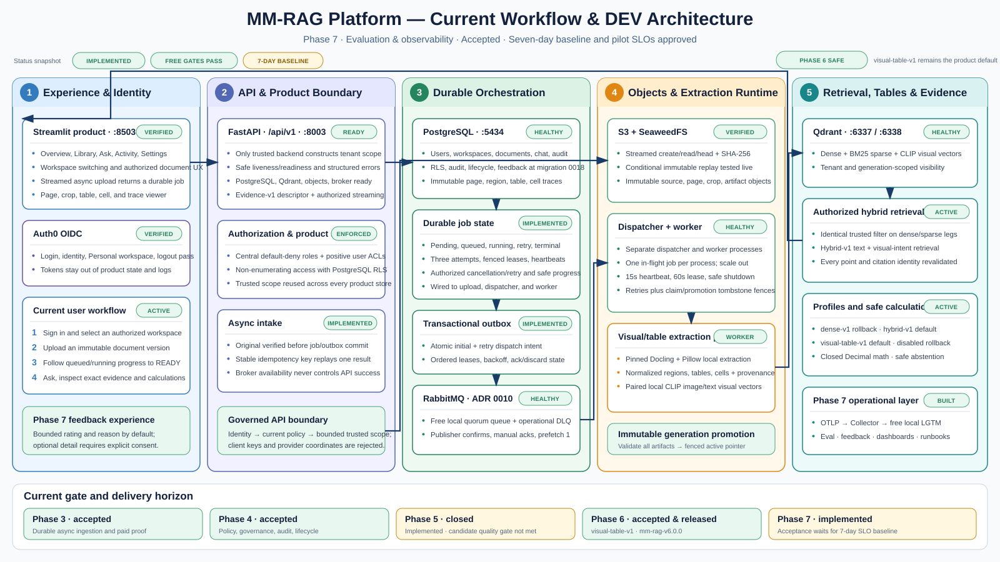

## Final production architecture

This is the target production system without phase or roadmap labels.

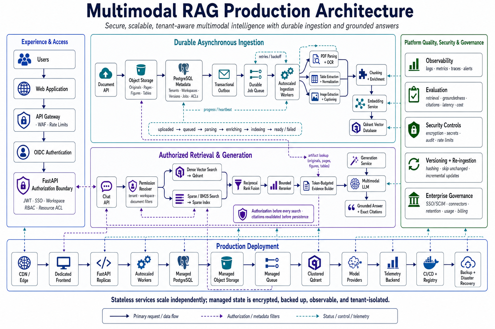

## Complete system and evolution roadmap

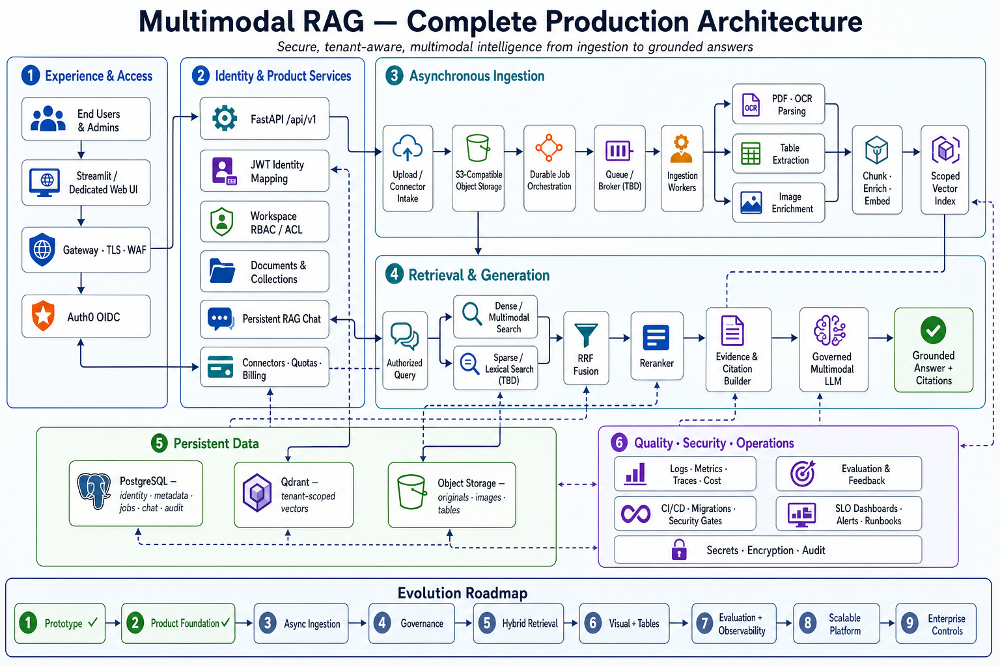

## Phase 1 — Working prototype

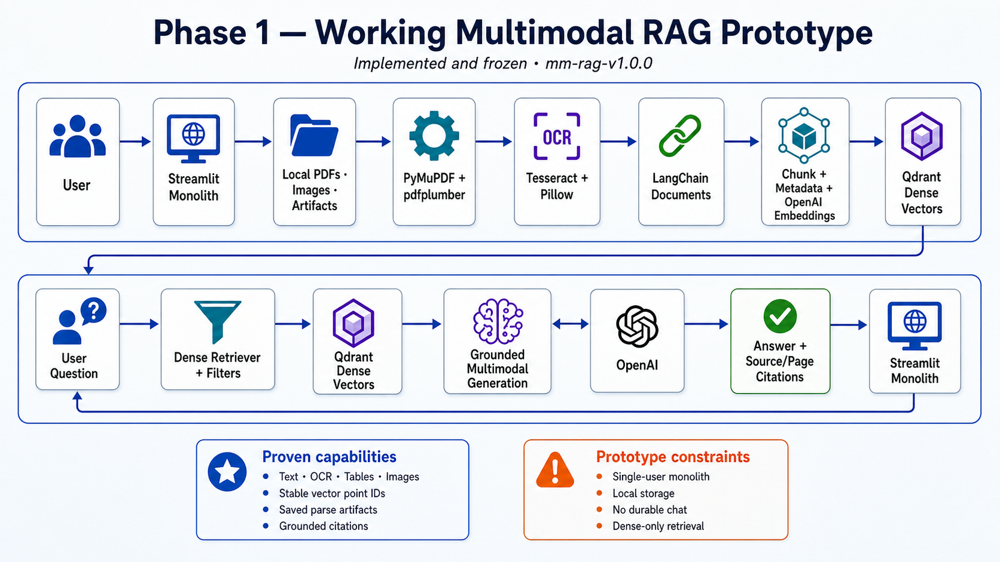

## Phase 2 — Secure product foundation

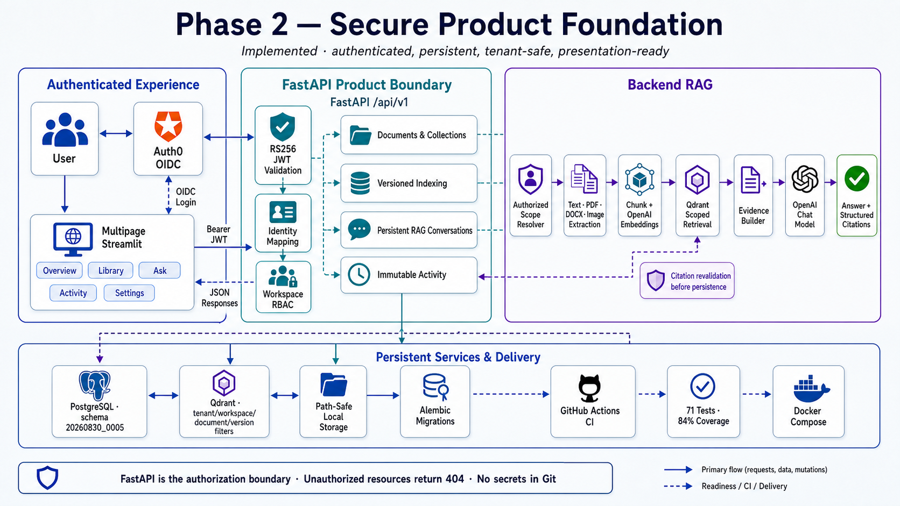

## Phase 3 — Durable asynchronous ingestion

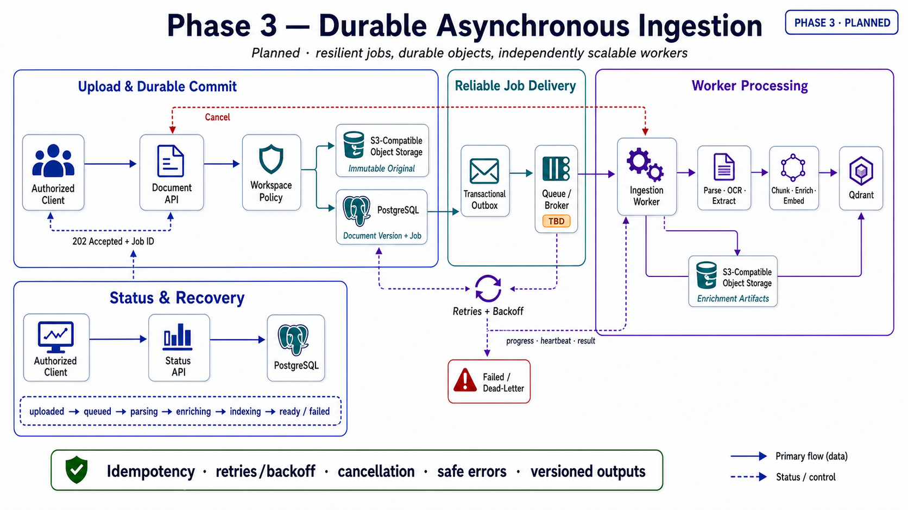

## Phase 4 — Fine-grained authorization and governance

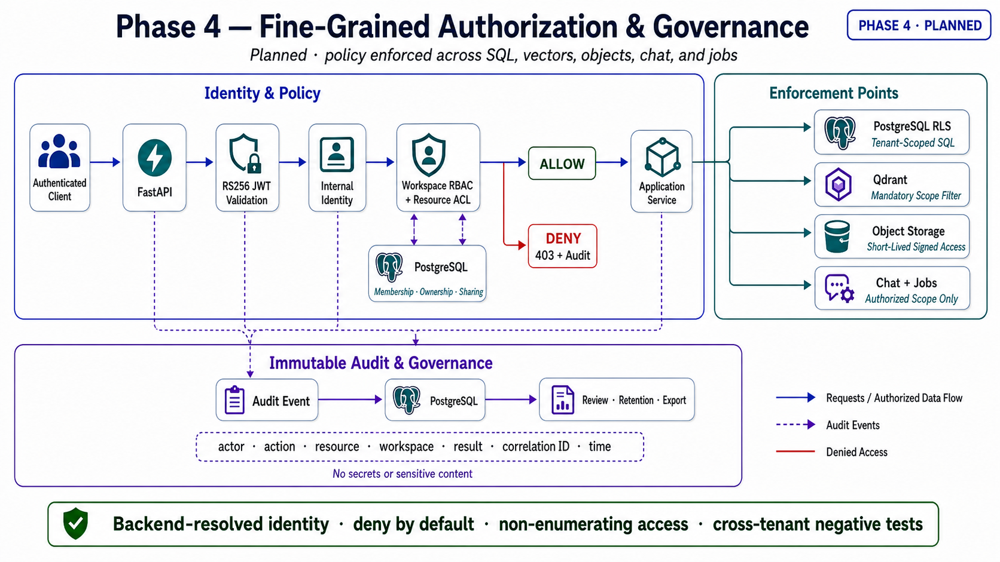

## Phase 5 — Hybrid retrieval, fusion, and reranking

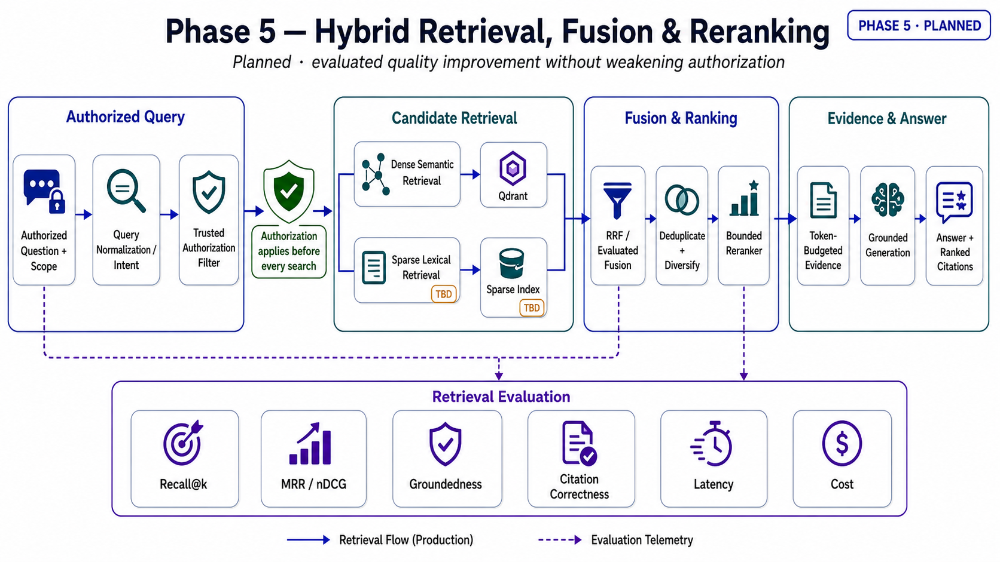

## Phase 6 — Visual and table intelligence

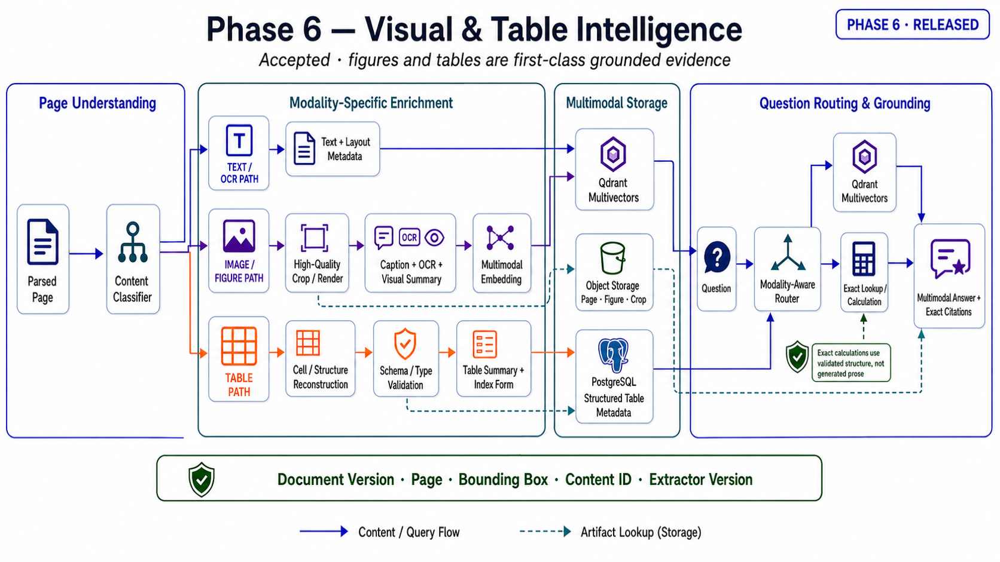

## Phase 7 — Evaluation and observability

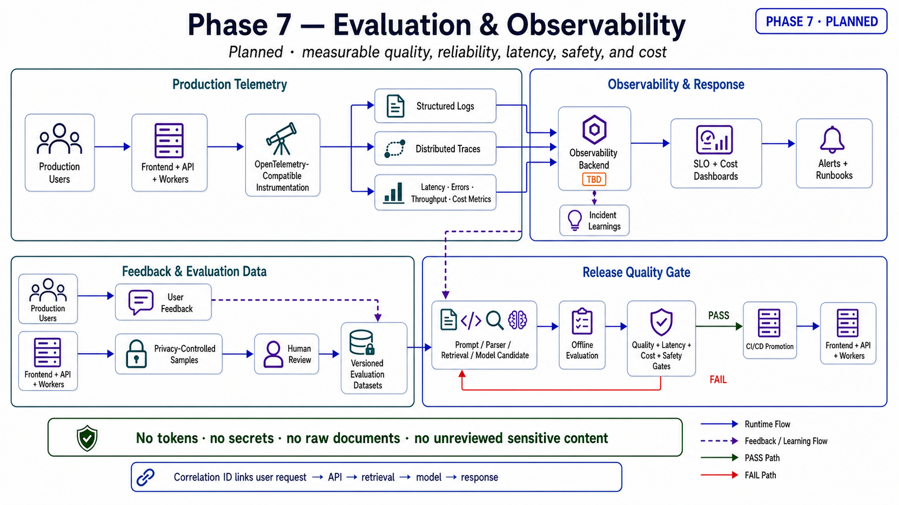

## Phase 8 — Scalable production platform

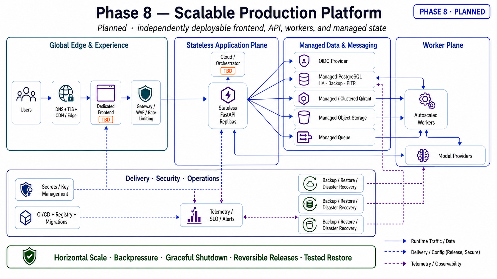

## Phase 9 — Enterprise integrations and commercial controls

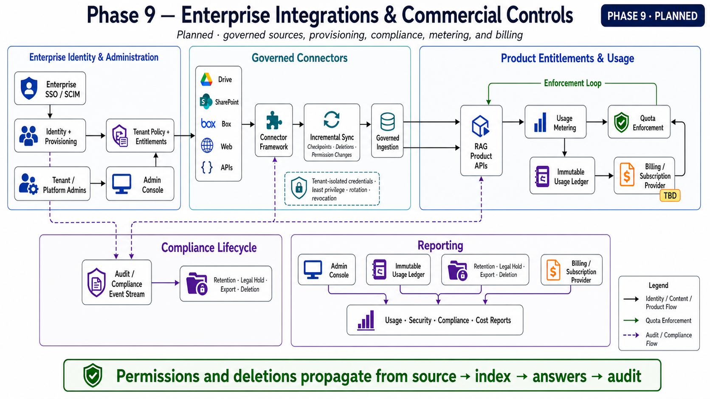

## Maintenance rule

1. Update `ARCHITECTURE.md` first.
2. Regenerate the affected poster using the shared visual specification in
   [`images/README.md`](images/README.md).
3. Verify technical labels and flows against the handbook.
4. Replace the existing image while preserving its stable filename.
